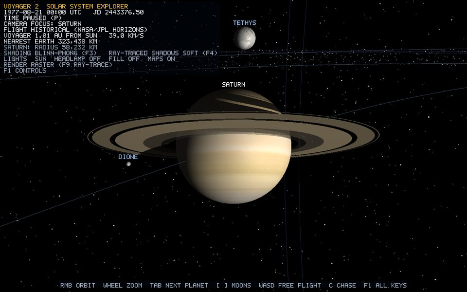
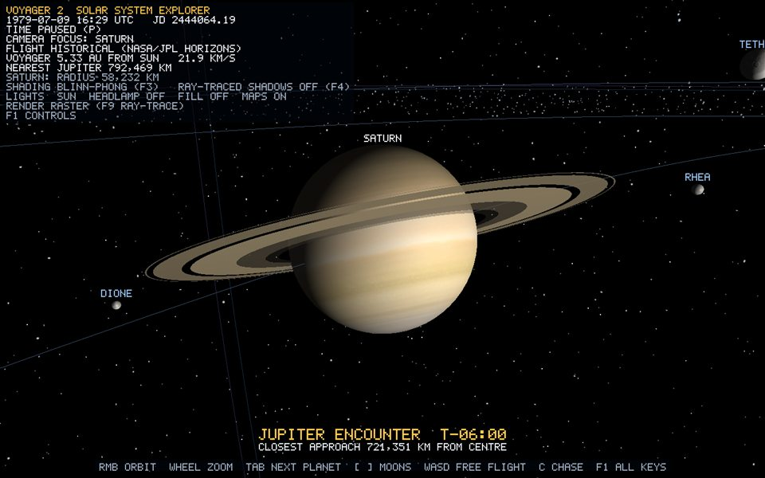
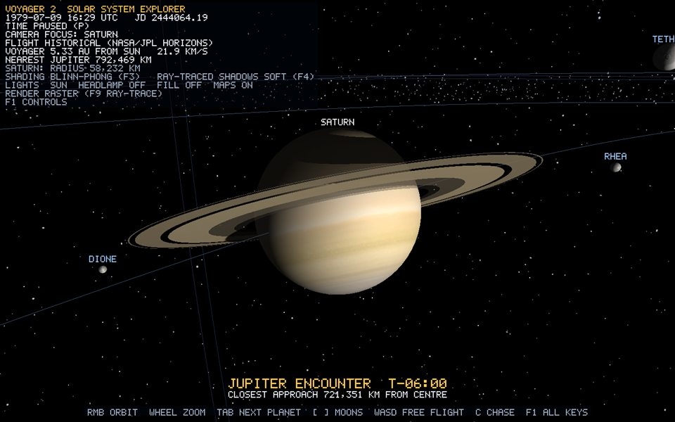

# 7. Ray tracing

[Guide index](README.md) · previous: [Shading techniques](06-shading-techniques.md) · next: [The Voyager 2 spacecraft](08-voyager.md)

**Rasterisation** (chapters 1–6) goes *from objects to pixels*: take each triangle and find the pixels it covers. **Ray tracing** goes *from pixels to objects*: for each pixel, shoot a ray from the eye and find the first thing it hits. It is slower, but a ray can keep going. It can go toward the light (shadows), bounce off a mirror (reflections), or pass through glass or rings (transparency).

The project uses ray tracing in **two places**:

1. **Ray-traced shadows inside the normal raster view.** Every lit pixel fires one *shadow ray* toward the Sun (`sunVisibility` in raytrace.glsl, called from scene.frag). This is always on unless F4 turns it off.
2. **A full ray-traced view (F9).** A Whitted-style ray tracer draws every planet, moon, ring and Voyager itself, with shadows, rays through translucent rings, and one reflection bounce.

| Raster (F9 off) | Ray-traced (F9 on) |
| --- | --- |
|  |  |
|  |  |

All ray code is GLSL. It runs on the GPU in a fragment shader, one invocation per pixel.

## 7.1 A ray

```text
P(t) = origin + t · direction        (direction unit length, t = distance along the ray)
```

"Intersecting" an object means solving for the smallest **t > tMin** at which P(t) lies on its surface. `tMin` (the *epsilon*) stops a ray that starts on a surface from immediately hitting that same surface because of rounding.

### The primary ray through a pixel

Chapter 3.4 gave the camera's forward, right and up vectors and its field of view. For a pixel at normalised device coordinates (x, y) in [−1, 1]:

```glsl
// raytrace.frag
vec2 ndc = screenUv * 2.0 - 1.0;
vec3 direction = normalize(cameraForward
                         + ndc.x * tanHalfFov * aspectRatio * cameraRight
                         + ndc.y * tanHalfFov * cameraUp);
RayResult primary = castRay(vec3(0.0), direction);      // eye at the origin (floating origin!)
```

The image plane sits one unit in front of the eye. Its half-height is `tan(fov/2)` and its half-width is that times the aspect ratio. This is exactly the frustum of the raster projection matrix, so the traced and rasterised images line up pixel for pixel. The same formula runs on the CPU in `CameraController::pickAt` to find what you clicked.

### One shader run per pixel: the full-screen triangle

`RayTracer::render` draws a single triangle with no vertex buffer. `raytrace.vert` makes its corners from `gl_VertexID`: (−1,−1), (3,−1), (−1,3). It is large enough to cover the whole screen, so `raytrace.frag` runs exactly once per pixel. One triangle is used instead of a quad because a quad's diagonal makes the GPU shade some pixels twice.

## 7.2 Ray-sphere intersection

Every planet, moon and the Sun is traced as a *perfect* sphere. A sphere with centre C and radius r is every point with |P − C|² = r². Substitute the ray:

```text
|O + tD − C|² = r²
let oc = O − C:
t²(D·D) + 2t(oc·D) + (oc·oc − r²) = 0
D is unit length, so D·D = 1.  Let b = oc·D, c = oc·oc − r²:
t² + 2bt + c = 0   ->   t = −b ± sqrt(b² − c)
```

```glsl
float intersectSphere(vec3 origin, vec3 direction, vec4 sphere, float tMin)
{
    vec3 oc = origin - sphere.xyz;
    float b = dot(oc, direction);
    float c = dot(oc, oc) - sphere.w * sphere.w;
    float discriminant = b * b - c;
    if (discriminant < 0.0) return -1.0;      // no real root: the ray misses
    float root = sqrt(discriminant);
    float t = -b - root;                        // the nearer root: where the ray enters
    if (t > tMin) return t;
    t = -b + root;                              // origin inside the sphere: use the exit
    return t > tMin ? t : -1.0;
}
```

At the hit point p the **normal is `normalize(p − C)`**, which is exact. A traced sphere has no facets at all, unlike the 64×32 raster mesh.

**Texturing a traced sphere.** The ray tracer has no vertices, so no UVs are interpolated. It turns the hit normal into latitude and longitude with *the same convention as the UV sphere generator*:

```glsl
vec3 local = sphereRotation[index] * worldNormal;           // undo the body's tilt and spin
float azimuth = atan(local.z, local.x);  if (azimuth < 0) azimuth += 2π;
vec2 uv = vec2(1.0 - azimuth / 2π, 1.0 - acos(local.y) / π);
```

`sphereRotation` is the inverse of the body's `surfaceMatrix` rotation, built in `SolarSystem::buildTraceScene`. So a traced Earth spins exactly like the rasterised one.

## 7.3 Ray-ring (annulus) intersection

A ring band is a flat washer: a plane (centre C, normal N) limited to inner radius ≤ |P − C| ≤ outer radius.

```text
Plane: (P − C)·N = 0.   Substitute P = O + tD:   t = ((C − O)·N) / (D·N)
```

```glsl
float denominator = dot(direction, normal);
if (abs(denominator) < 1e-7) return -1.0;          // ray parallel to the plane
float t = dot(ringCenters[ring].xyz - origin, normal) / denominator;
if (t <= tMin) return -1.0;
float radius = length(origin + direction * t - ringCenters[ring].xyz);
return (radius >= inner && radius <= outer) ? t : -1.0;
```

Rings are translucent. When a ray hits one, the band's colour is added, weighted by its opacity, and the ray **continues** behind it (up to 4 layers):

```glsl
result.color         += result.transmittance * opacity * shaded;
result.transmittance *= 1.0 - opacity;          // light still getting through
rayOrigin = p;  continue;                       // keep tracing from the ring
```

This is correct front-to-back compositing, so the planet is visible *through* Saturn's C ring and Cassini Division.

## 7.4 Shadow rays

A point is in shadow if something lies between it and the light. From a surface point p, shoot a ray toward the Sun. If it hits an opaque object before reaching the Sun, the point is in shadow. `sunVisibility(p, testMesh)` returns the fraction of sunlight that arrives: 1 is fully lit and 0 is umbra.

```glsl
vec3 toSun = sunCenter - p;  float sunDistance = length(toSun);  vec3 direction = toSun / sunDistance;
for every non-emissive sphere i:
    if p is on/inside sphere i: skip        // its own night side is Lambert's job, not a shadow
    if the sphere is behind p or beyond the Sun: skip
    ... hard or soft test (below)
for every ring band: visibility *= 1 − opacity when the shadow ray crosses it
```

This is why Saturn's rings cast a striped shadow on the planet and the planet casts a shadow across the rings. It also gives moon shadows on Jupiter's cloud tops and eclipses.

| Off | Hard | Soft |
| --- | --- | --- |
|  |  |  |

### Hard shadows (F4 → HARD)

The Sun is treated as a point, and one ray is shot at its centre. The answer is yes or no, so the shadow edge is razor sharp.

### Soft shadows (F4 → SOFT, default): an analytic area light

The real Sun is a **disc** in the sky. Part of it can be hidden by an occluder, which gives a **penumbra** (partial shadow) around the **umbra** (full shadow). A path tracer would average many random rays for this. Because both the Sun and the occluder are spheres, the project computes the exact answer in closed form:

1. The Sun's angular radius as seen from p: `sunAngle = asin(sunLightRadius / sunDistance)`. `sunLightRadius = 0.6` (RayTraceScene.h) is the light's size; larger means softer shadows.
2. The occluder's angular radius: `occluderAngle = asin(radius / centreDistance)`.
3. The angular separation of the two centres: `acos(dot(toCentre, direction))`.
4. The **area of overlap of two circles** (`discCoverage`, the standard circle-circle lens formula), divided by the Sun disc's area, is the fraction of the Sun that is hidden.

```glsl
visibility *= 1.0 - discCoverage(sunAngle, occluderAngle, separation);
```

With many occluders the visibilities multiply.

### Shadow acne and the bias

A shadow ray starts exactly *on* a surface. Rounding can place its origin a hair *below* the surface, so the ray hits the surface it started from and the point shadows itself. The result is speckled "shadow acne". The fixes used here:

- Spheres: skip the sphere the point lies on (`centreDistance <= radius * 1.001`).
- Rings: start the ray a little off the ring plane (`tMin = outer radius × 1e-4`).
- Voyager's triangles: move the start point along the normal, `p + n × 2e-5` (the **shadow bias**).

## 7.5 The Whitted ray tracer (F9)

Turner Whitted's 1980 algorithm: for each pixel, find the nearest hit. Shade it with direct lighting plus a shadow ray. If the surface is a mirror, *recursively* trace a reflected ray and add what it sees. `raytrace.frag`:

```text
main():
    primary = castRay(eye, pixel direction)
    if primary hit something reflective and maxBounces > 0 (F10):
        bounce = castRay(hit point + normal·bias, reflect(direction, normal))
        colour += opaqueWeight × reflectivity × bounce.colour
    add solar glow; write colour + depth

castRay(origin, direction):             // loops through up to 4 translucent ring layers
    nearest sphere   (intersectSphere, all spheres)
    nearest ring     (intersectRing, nearer than that sphere)
    nearest triangle (intersectMesh, Voyager's BVH, nearer than both)
    triangle hit:   shade (atlas texture, material palette), stop
    ring hit:       shade, weight by opacity, CONTINUE behind it
    sphere hit:     Sun -> emissive colour; else texture + lightSurface(), stop

lightSurface(albedo, p, n, v, ...):
    terms = evaluateLights(n, v, p, ..., SHADING_BLINN_PHONG, ...)   // the SAME lighting.glsl
    sunlight = sunVisibility(p + n·2e-5, true)                          // shadow ray
    return albedo·(ambient + sunDiffuse·sunlight + otherDiffuse) + sunSpecular·sunlight + otherSpecular
```

GLSL has no recursion, so the single bounce is written as a second call. Reflectivity: ocean worlds 0.12, icy worlds 0.06 (`SolarSystem::buildTraceScene`), Voyager parts `specularStrength × 0.3`.

### The glow

The Sun's halo in the traced view is not geometry. For each primary ray, the shader measures how close the ray passes to the Sun's centre (`missDistance`) and adds `0.85 × exp(−(missDistance − R) / 0.45R)` of warm colour.

### Hybrid compositing: writing depth

The traced pass is drawn *after* the raster pass, which still draws the orbit guides, trajectory, belts, stars and heliosphere. So traced pixels must be depth-tested against raster pixels. The shader writes the **same logarithmic depth** the raster shader writes (chapter 3.6):

```glsl
float viewDepth = primary.firstT * dot(direction, cameraForward);   // distance along the view axis, not along the ray
gl_FragDepth = log2(1.0 + viewDepth) * logDepthCoefficient * 0.5;
```

Multiplying by `dot(direction, forward)` converts ray distance into view-axis depth, which is what the raster `w` is. Without it, traced spheres would sort wrongly near the screen edges. Pixels whose ray hits nothing are discarded, which leaves the stars behind them untouched. In `Application::render`, the `bodies` and `spacecraft` groups are hidden during the raster pass when F9 is on, because the tracer draws them.

### The albedo texture array

Every body's photo is resampled to 1024×512 and stacked into one `GL_TEXTURE_2D_ARRAY` (`RayTracer::buildAtlas`), so one shader can texture any sphere by `sphereLayer[i]`. The gradient fix at the seam:

```glsl
vec2 dx = dFdx(uv);  dx.x -= round(dx.x);    // u jumps 1 -> 0 at the seam: remove the jump
return textureGrad(albedoAtlas, vec3(uv, layer), dx, dy).rgb;
```

## 7.6 Ray tracing triangles: Voyager's BVH

Spheres and rings have tiny exact formulas. Voyager is **11,652 triangles**. Testing every triangle for every pixel would be 11,652 tests × 2 million pixels × (primary + shadow + reflection rays) per frame, which is far too slow. A **bounding volume hierarchy** (BVH) makes it roughly log₂ instead.

### Ray-triangle: Möller–Trumbore

Any point in triangle (p0, p1, p2) can be written as p0 + u·(p1 − p0) + v·(p2 − p0), with u ≥ 0, v ≥ 0 and u + v ≤ 1 (barycentric coordinates). Setting that equal to the ray, O + tD, gives three equations in three unknowns (t, u, v), which Cramer's rule solves with cross and dot products:

```glsl
vec3 edge1 = p1 - p0, edge2 = p2 - p0;
vec3 pVector = cross(direction, edge2);
float determinant = dot(edge1, pVector);
if (abs(determinant) < 1e-20) return -1.0;            // parallel
float inv = 1.0 / determinant;
vec3 tVector = origin - p0;
float u = dot(tVector, pVector) * inv;      if (u < 0 || u > 1) miss;
vec3 qVector = cross(tVector, edge1);
float v = dot(direction, qVector) * inv;    if (v < 0 || u + v > 1) miss;
t = dot(edge2, qVector) * inv;
```

The same (u, v) then interpolate the triangle's three normals and UVs at the hit point, exactly as the rasteriser interpolates varyings: `w0 = 1 − u − v`.

### Building the tree (CPU, TriangleBvh.cpp)

1. `VoyagerModelBuilder`'s `add(...)` sends every part's triangles, in **Voyager's local frame**, to `TriangleBvh::addMesh`, together with a material index. Each distinct material becomes one palette slot, up to 16.
2. `buildNode(begin, end)` computes the box around all those triangles. If there are **4 or fewer**, it becomes a **leaf**. Otherwise it picks the **longest axis** of the triangle centroids, splits at the **median** centroid (`std::nth_element`), and recurses on each half. Median splits keep the tree balanced: the depth is about log₂(n/4). The log reads `BVH built: 11652 triangles, 8191 nodes, depth 12, 12 materials`.
3. The nodes and triangles are packed into `RGBA32F` texels and uploaded as **texture buffers** (`GL_TEXTURE_BUFFER`). GLSL 3.30 reads them with `texelFetch(samplerBuffer, index)`:

```text
node      (2 texels): (min.xyz, first) (max.xyz, second)
                      second < 0 -> leaf with −second triangles starting at `first`
                      second ≥ 0 -> internal node, children `first` and `second`
triangle  (7 texels): (p0, material) (p1, −) (p2, −) (n0, u0) (n1, v0) (n2, u1) (v1, u2, v2, −)
```

The tree is built once. Voyager moves and turns, but its shape never changes. So each frame the **ray** is moved into Voyager's frame instead of moving 11,652 triangles into the world.

### Traversing (GPU, raytrace_mesh.glsl)

```glsl
// cheap reject: does the ray pass through Voyager's bounding sphere at all?
origin    = meshWorldToLocal * (worldOrigin − meshPosition);    // into the mesh frame
direction = meshWorldToLocal * worldDirection;                    // rotation only, so t is unchanged
stack = [root]
while stack not empty:
    node = pop
    if the ray misses node's box, or the box starts beyond the closest hit so far: continue   // slab test
    if leaf: Möller–Trumbore each triangle, keep the closest (a shadow ray stops at the FIRST hit)
    else: push both children
```

The **slab test** intersects the ray with the three pairs of parallel planes that bound the box. The ray is inside the box during the overlap of the three [tNear, tFar] intervals:

```glsl
vec3 t0 = (boxMin - origin) * inverseDirection;
vec3 t1 = (boxMax - origin) * inverseDirection;
float tNear = max3(min(t0, t1));
float tFar  = min3(max(t0, t1));
hit = tFar >= max(tNear, 0) && tNear < closestSoFar;
```

GLSL has no recursion, so an explicit stack of 32 ints stands in for it. The tree depth is 12, well under that.

### Where Voyager's BVH is used

| Pass | What the BVH does |
| --- | --- |
| Raster, spacecraft parts (`selfShadowing` material flag) | Shadow rays from each Voyager pixel through its own triangles: the dish shades the bus, and the booms cast thin shadows. `sunVisibility(p + n·2e-5, true)` |
| Raster, every other surface | Not used, so planets pay nothing for it |
| Ray-traced view (F9) | Primary rays hit Voyager's triangles (textured through the atlas palette), shadow rays test them, and reflections off foil and metal see the rest of the scene |

`TriangleBvh::bind` uploads the per-frame data: `meshPosition` (camera-relative), `meshWorldToLocal` (the transpose of Voyager's rotation), `meshBoundingRadius`, the material palette (`meshMaterialColor`, `meshMaterialSpecular`, `meshMaterialUv`, `meshMaterialTextured`), and the atlas on unit 5.

## 7.7 Controls and limits

| Key | Effect |
| --- | --- |
| F9 | ray-traced view on/off |
| F10 | reflection bounce on/off (`maxBounces` 1 or 0) |
| F4 | shadows off / hard / soft (applies to both views) |

Limits, stated honestly:

- Only the Sun casts shadows, and only spheres, rings and Voyager occlude. Belts, the comet and orbit lines are not in the trace scene.
- There is one reflection bounce, no refraction and no indirect (bounced) diffuse light. It is Whitted ray tracing, not path tracing.
- Voyager's shadows are hard. It is so small next to the Sun's angular size that its penumbra would be much less than a pixel at any viewing distance.
- The limits are 32 spheres, 16 ring bands and 16 Voyager materials (`MAX_SPHERES`, `MAX_RINGS`, `MAX_MESH_MATERIALS`).

Full reference: [ray-tracing.md](../objects/ray-tracing.md).
