# 8. The Voyager 2 spacecraft

[Guide index](README.md) · previous: [Ray tracing](07-ray-tracing.md) · next: [Data, time and the mission](09-mission-data.md)


Voyager 2 is the project's main object. This chapter covers how it is built from the chapter 2 generators, textured with NASA photographs (chapter 4), lit and shaded (chapters 5–6), ray-traced (chapter 7), flown, and inspected. Code: `src/scene/VoyagerModelBuilder.cpp` (geometry and materials) and `src/scene/Voyager2.cpp` (flight and components).

At start-up it logs: `procedural spacecraft built (82 visible assemblies, 11652 rendered triangles)` and `BVH built: 11652 triangles, 8191 nodes, depth 12, 12 materials`.

## 8.1 Frame and scale

- **Spacecraft frame**: the dish boresight (the direction the antenna points) is **−Z**. The bus is a decagon in the XY plane. The magnetometer boom goes out toward +X, the RTG boom toward −X, the science boom toward +X/+Y, and the radio antennas down (−Y).
- **Scale**: `ScaleManager::kSpacecraftUnitsPerMetre = 0.006`. The builder writes every dimension in **real metres** through `units(metres)`, so the 3.7 m dish and the 13 m magnetometer boom keep their real proportions. At this scale the craft is about 0.1 render units across: small next to a planet, but big enough that Inspect mode can orbit a 5 cm lens.
- Every part is a child `SceneObject` of the `Voyager2` object, so moving or turning Voyager moves all 82 parts together (chapter 3.3).

## 8.2 How the model is assembled

The builder follows one pattern for every part:

```cpp
const MeshData data = CylinderGenerator::generate(...);         // 1. generate geometry (chapter 2)
add(makePart(name, upload(data), material, position, rotation), data);   // 2. make a child, 3. register
```

`add` does three jobs in one place, so nothing can get out of sync:

```cpp
auto add = [&](std::unique_ptr<SceneObject> part, const MeshData& data)
{
    result.traceMesh->addMesh(data, part->transform().localMatrix(), part->material());  // ray tracer (7.6)
    voyager.addChild(std::move(part));                                                   // raster scene graph
    ++result.visiblePartCount;
    result.renderedTriangleCount += data.indices.size() / 3;
};
```

Helper lambdas: `addBox(name, position, dimensions, material, rotation)` (one shared unit cube, scaled per part) and `addCylinder(name, centre, axis, bottomRadius, topRadius, length, segments, material)` (turns +Y onto `axis` with `rotateYTo`). Rods and trusses are `appendRod` and `buildTriangularTruss` (chapter 2.8).

## 8.3 The components

Each `component(...)` call registers one inspectable component: a name, a one-line fact, a centre in the spacecraft frame and a size (`Voyager2::Component`). Inspect mode steps through them and the HUD labels them.

| # | Component | Geometry | Finish |
| --- | --- | --- | --- |
| 1 | **Electronics bus** | 10-segment cylinder (decagonal prism) 1.78 m × 0.47 m; 10 bay blankets (thin boxes at the apothem R·cos 18°, rotated to each face); 2 louvre strips on each gold bay; 3 launch-adapter feet (rods) | darkMetal; gold / dark-gold / black blankets; louvres; aluminium |
| 2 | **High-gain antenna** | `ParabolicDishGenerator(1.85 m, 0.38 m, 0.045 m, 64, 12)`; 12 bent ribs × 6 rods following the back surface; 4 feed struts | whitePaint; aluminium |
| 3 | **Feed stack and low-gain antenna** | frustums along −Z: X-band feed, subreflector disc, S-band feed, LGA cone | darkMetal, whitePaint, aluminium |
| 4 | **Sun sensor** | box + lens cylinder on the dish rim | darkMetal, lens |
| 5 | **Golden Record** | 30 cm disc (32-segment thin cylinder) + hub on a bus face | recordGold, aluminium |
| 6 | **Optical calibration target** | thin box on a bus face | calibrationPanel |
| — | Shunt radiator | thin box on a bus face | radiatorBlue |
| 7 | **Magnetometer boom** | canister + 13 m triangular truss, 26 bays | darkGoldFoil, aluminium |
| 8 | **Low-field magnetometer (tip)** | box at 13 m (plus one at 10 m, and high-field sensors at 0.9 m and 1.4 m) | whitePaint |
| 9 | **Radioisotope generators** | 3.7 m truss; 3 RTG cylinders (0.58 m × 0.20 m) with 6 fins each (unit boxes with a hand-built basis matrix) and end flanges | darkMetal, aluminium |
| 10 | **Plasma science instrument** | cylinder + 3 Faraday cups (frustums) on the science boom | goldFoil, lens |
| 11 | **Cosmic ray subsystem** | box + 2 telescope cylinders | goldFoil, darkMetal |
| 12 | **Low-energy charged particles** | drum + stepper platform | darkGoldFoil, aluminium |
| 13 | **Scan platform** | box + actuator at the 3 m science-boom tip; ultraviolet spectrometer box; photopolarimeter | darkGoldFoil, blackBlanket, aluminium |
| 14 | **Narrow-angle camera** | 0.95 m cylinder + lens disc | whitePaint, lens |
| 15 | **Wide-angle camera** | 0.50 m cylinder + lens disc | whitePaint, lens |
| 16 | **IRIS telescope** | 0.52 m-wide cylinder + mirror disc | goldFoil, lens |
| 17 | **Radio and plasma wave antennas** | two 10 m rods in a V + root box | aluminium, goldFoil |
| 18 | **Attitude thrusters** | 4 blocks × 4 copper nozzles (frustums) | darkMetal, copper |

Close-ups of every component, from `--capture-voyager`:

| | | |
| --- | --- | --- |
| 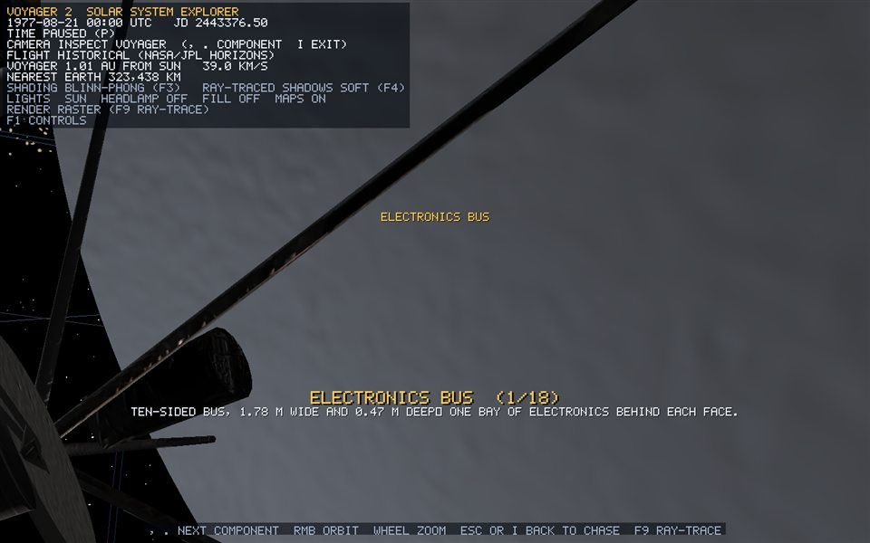 | 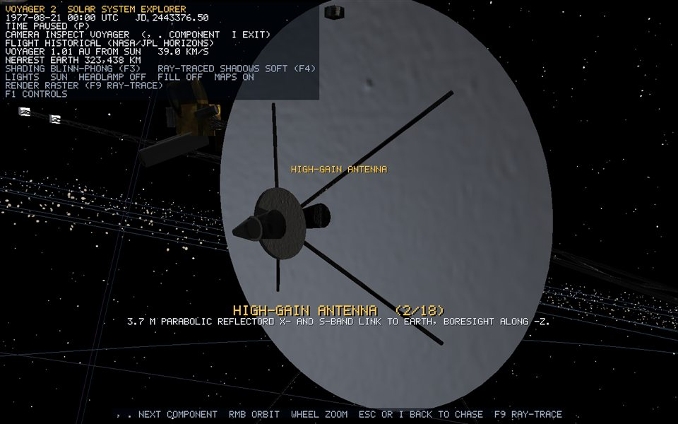 | 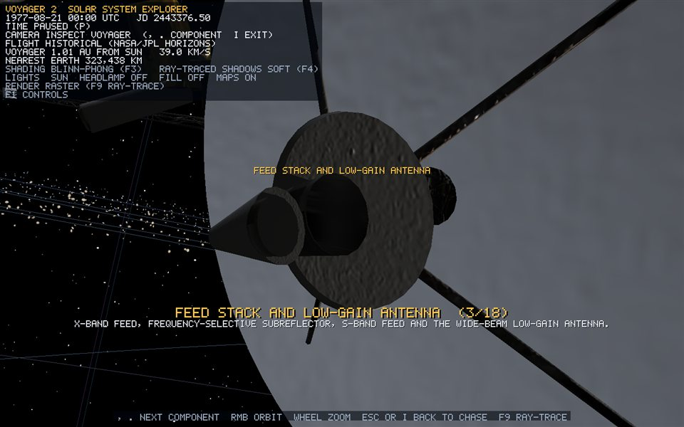 |
| 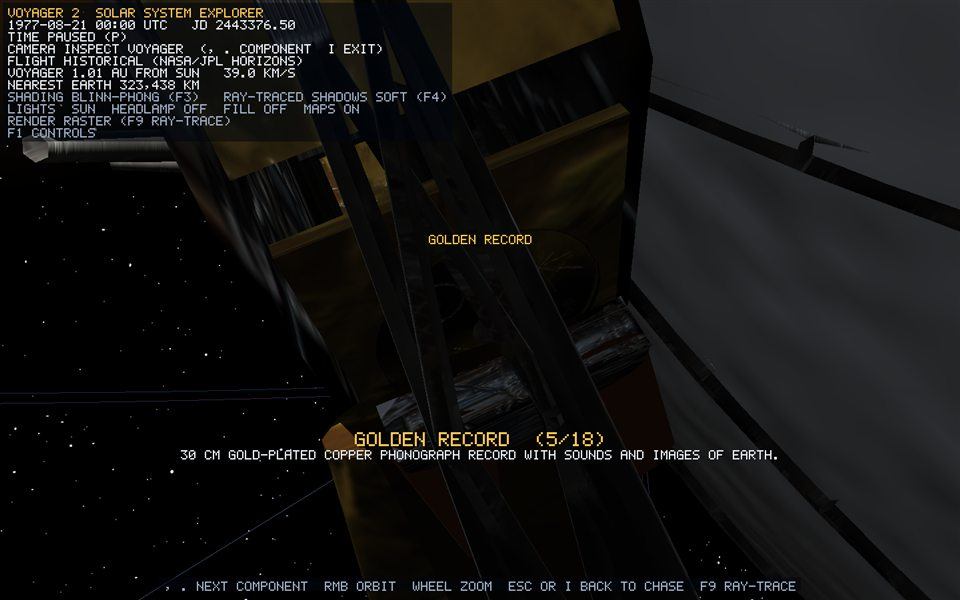 | 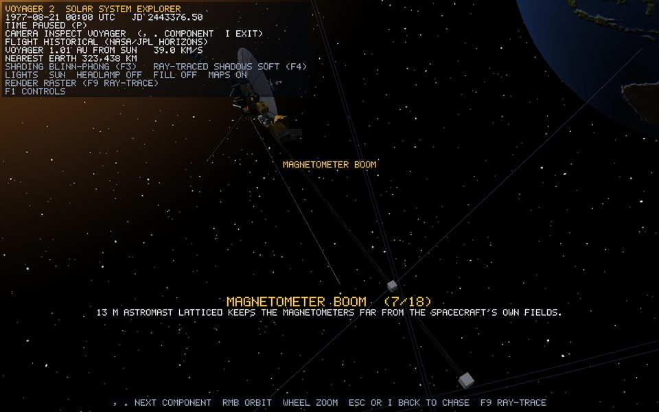 | 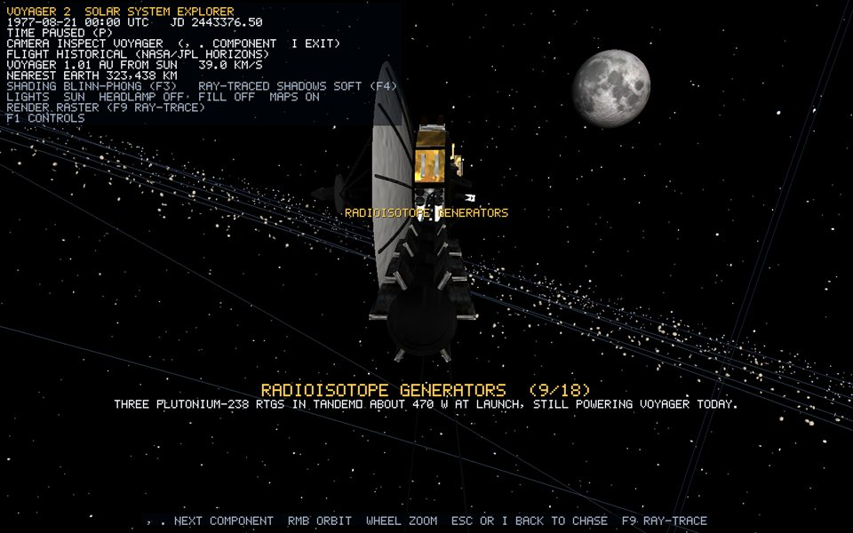 |
| 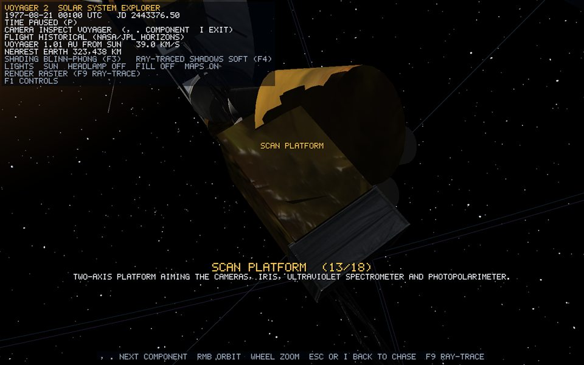 | 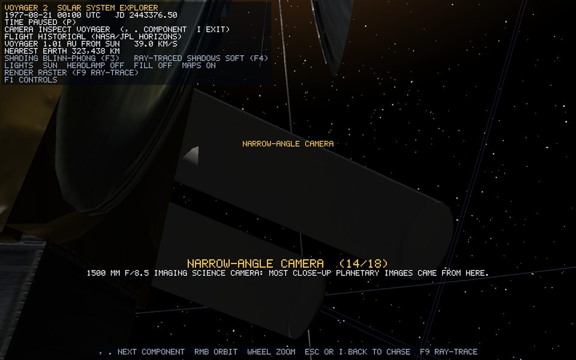 | 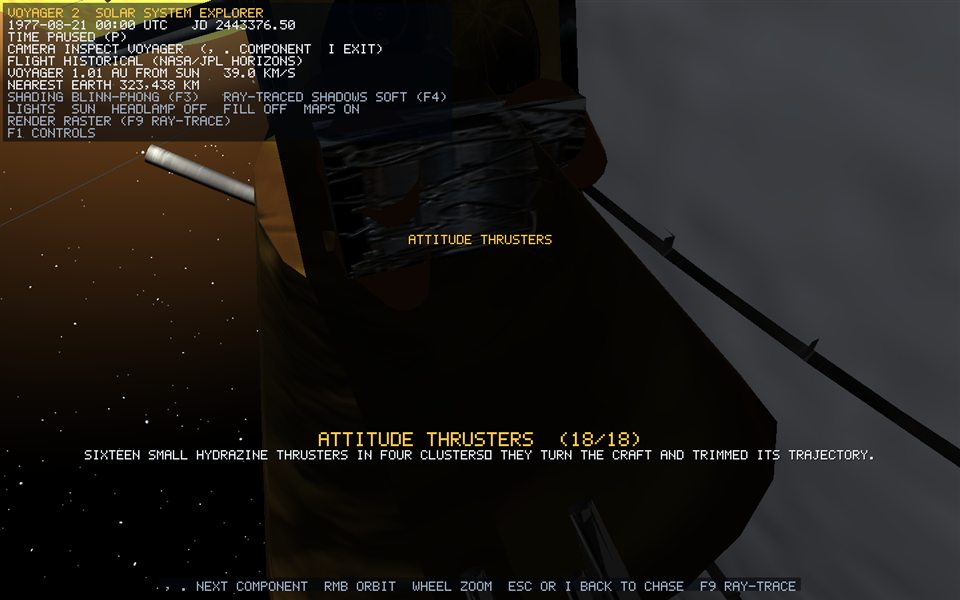 |

### Two construction details worth studying

**Placing the bay blankets on a decagon.** Face k of a regular 10-gon of radius R has its centre at angle (k + ½)·36°, at distance **apothem = R·cos 18°** from the middle. Its width is 2R·sin 18°. Each blanket is a thin box placed at `outward × (apothem + 1.2 cm)` and rotated by that angle about Z, so its thin axis points outward.

**Mounting the dish without intersecting the bus.** The dish's lowest point (its vertex) is `dishDepth` below its rim. The rim is placed at `z = −busDepth/2 − dishDepth − 4 cm`, so the vertex sits 4 cm in front of the bus face. An earlier version put the rim at the bus face, and the bus showed through the bowl. The ray-traced view made the mistake obvious.

## 8.4 Textures from NASA's atlas

The 12 materials are made by `finish(pixelRect, tint, specular, power)`. Each one shows one rectangle of `assets/textures/spacecraft/voyager_nasa_atlas.png`, a public-domain image taken from NASA 3D Resources' Voyager model. **Only the image is used; every vertex is ours.** Chapter 4.4 explains the pixel-rectangle-to-UV conversion. [voyager-textures.md](../objects/voyager-textures.md) lists each region.

The generators' UVs decide how a region is laid on each part: box faces get the full 0..1 square, cylinders wrap u around and run v along the axis, and discs and dishes use the disc mapping. A normal map is derived from the same atlas (relief 1.4, strength 0.8), so the crinkles in the foil catch the light.

## 8.5 Lighting and shading on Voyager

- Every Voyager material comes from `MaterialLibrary::spacecraft`, so all of them are `Lit` and have **`selfShadowing = true`**.
- The five shading techniques apply exactly as on planets (chapter 6 has Voyager in every technique). Foil and lenses have high specular power, so the difference between Gouraud and Phong is most visible on Voyager.
- **Self-shadowing.** In the raster pass, each Voyager pixel shoots its Sun shadow ray through Voyager's own BVH (chapter 7.6), starting 2e-5 above its surface. The dish shades the bus, and the booms cast thin lines. This is a true ray-traced shadow inside a rasterised image.
- **Planet shadows on Voyager.** The same shadow ray also tests every planet sphere and ring. Voyager goes dark when it passes through a planet's shadow, which happens for real behind Saturn.
- **Inspection studio fill.** In Inspect mode the fill light comes from behind the camera (0.45 intensity), so the part you are studying is readable even on its night side.
- **Ray-traced view.** With F9, Voyager is rendered only by the ray tracer: primary rays hit its triangles, the atlas is sampled through the material palette, shadow rays run, and foil and metal reflect `specular × 0.3` of the scene.

| Raster | Ray-traced |
| --- | --- |
|  | 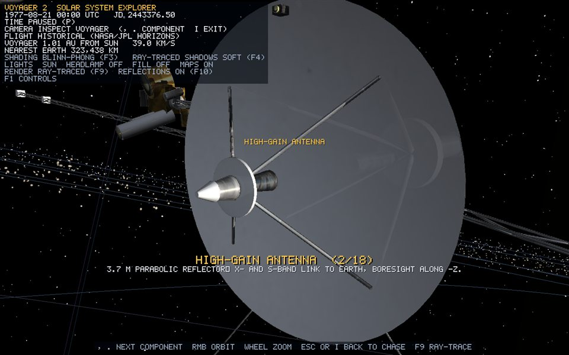 |
|  | 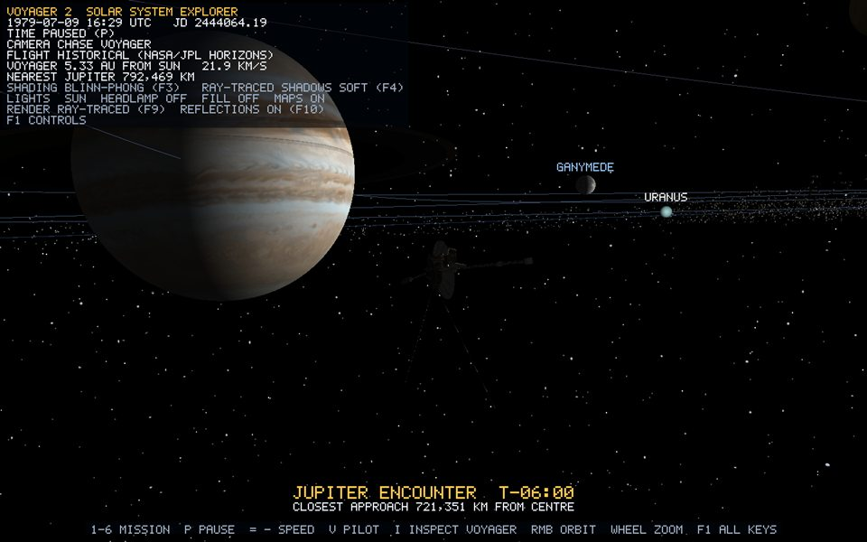 |

## 8.6 Flying: Historical and Manual

`V` switches between the two flight modes.

- **Historical** (default). Every frame, `MissionController::placeVoyager` samples the NASA/JPL trajectory (chapter 9) at the simulation date. The heading comes from a central difference, `position(t + step) − position(t − step)`. `setHistoricalState` eases the orientation toward that heading with `slerp(current, target, 0.2)`, so the swing around a planet is a visible turn rather than a snap.
- **Manual** (6-DOF). A quaternion orientation and a velocity. The rotation keys multiply turns **on the right**, `orientation = orientation × turn`, which rotates about the ship's *own* axes:

| Key | Action |
| --- | --- |
| A / D | yaw |
| R / F | pitch (nose up / down) |
| Q / E | roll |
| W / S | thrust forward / back |
| Space / Ctrl | thrust up / down |
| Shift | boost |
| X | braking burn (opposes velocity without overshooting) |

## 8.7 Looking at it: Chase and Inspect

- **C: Chase.** The camera orbits Voyager in Voyager's frame. During a flyby, the frame turns to look at the planet, so the craft stays in the foreground with the world behind it.
- **I** (or click Voyager): **Inspect.** It starts on the whole craft; `.` and `,` step through the 18 components. The camera orbits the component's centre (`componentWorldCentre`, which moves with the craft). The wheel zooms down to 0.3 × the component's size. The first view blends "outward from the craft" with "toward the Sun" so the part is lit, and a caption shows the component's fact. `Esc` goes back to Chase.
