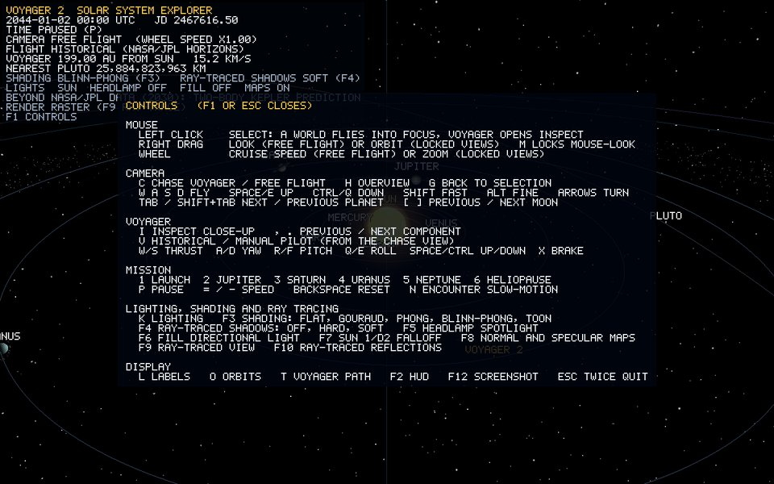

# 9. Data, time and the mission

[Guide index](README.md) · previous: [The Voyager 2 spacecraft](08-voyager.md) · next: [How to change things](10-how-to-change-things.md)

Planets and historical Voyager playback use **real state-vector data** evaluated at **one date**. Moon revolution, axial spin and the comet use documented visual animation rules; manual flight and camera movement use real frame time.

## 9.1 The data files

| File | What | Read by |
| --- | --- | --- |
| `assets/data/celestial_bodies.csv` | 26 bodies: id, name, parent, radius, semi-major axis, eccentricity, orbital period, rotation period, axial tilt, texture, material preset, type | `BodyCatalog` → `SolarSystemBuilder` |
| `assets/data/ring_bands.csv` | 15 ring bands: planet, band, inner and outer radius (in planet radii), colour, opacity | `BodyCatalog` → `SolarSystemBuilder` |
| `assets/data/mission_bookmarks.csv` | keys 1–6: launch, four encounters, heliopause | `MissionController` |
| `assets/trajectory/planets/*_heliocentric.csv` | NASA/JPL Horizons position + velocity for 9 planets | `MissionEphemeris` |
| `assets/trajectory/voyager2_heliocentric.csv` | 11,002 Horizons state vectors for Voyager 2, denser near encounters | `MissionEphemeris` |

The program never goes online. Past the tables' end (2030-01-02) planets are propagated by Kepler's laws (see 9.2). `scripts/fetch_horizons.ps1` regenerates the trajectory tables from the Horizons API. It also builds each encounter's rows as *planet position + planet-centred Voyager position*. That fixed a 13,600 km mismatch between Horizons' heliocentric Voyager and Neptune solutions.

## 9.2 The simulation clock

`SimulationClock` owns the **only** date in the program, a Julian Date (days since 4713 BC; JD 2444064.4 is Jupiter closest approach, 1979-07-09).

- Rate: `120 days per second × user speed × encounterFactor` (the speed doubles or halves with `=` and `−` between 1/64 and 64; `P` pauses; Backspace resets).
- **Encounter slow-motion** (N toggles it): within 60 days of a closest approach the rate is scaled by `days to encounter / 60`, down to a minimum factor of 0.0004 (about 1.2 mission-hours per real second at speed 1). Weeks pass in seconds during the cruise, and the few hours around a flyby play out slowly.
- **Sub-stepping**: a long frame is split so that no step jumps more than a quarter of the remaining distance to an encounter. The slow zone cannot be skipped over.

Planets and Voyager are placed from this date every frame. Moons and spin use a *visual* clock driven by the same speed and pause state (moons are not in the ephemeris).

### After the data ends (2030 onward)

The Horizons tables end on 2030-01-02, about 2.5 minutes after launch at 1×. The clock used to stop there, and every planet froze. It now runs on to the year 2500:

- **Planets** follow the **two-body Kepler orbit** through their last real state vector (`Trajectory::propagateKepler`). From r and v it finds the orbit's plane (angular momentum r × v), its perihelion (eccentricity vector), its size (vis-viva: 1/a = 2/r − v²/μ) and the current eccentric anomaly E. It then advances the mean anomaly M = E − e sin E by n·Δt, with n = √(μ/a³), and solves Kepler's equation for the new E by Newton's method. μ is the Sun's GM, 2.959 × 10⁻⁴ AU³/day².
- **Voyager** coasts in a straight line at its last velocity. By 2030 it is on a nearly straight escape path at about 15 km/s.
- The HUD shows `BEYOND NASA/JPL DATA (2030): TWO-BODY KEPLER PREDICTION`.


- Start-up logs a self-check: Kepler propagation over the last year of each table, compared with Horizons. Earth differs by about 1.3 million km (0.14% of its yearly path; the Moon's pull, which a two-body model ignores) and Neptune by about 78,000 km. Both are far below one rendered planet radius.

Near each flyby the encounter slow-motion still makes the planets look almost still (about 1.2 mission-hours per second). `N` turns it off.

## 9.3 Hermite interpolation between samples

The tables hold a position **and a velocity** at each sample time. Between two samples a cubic **Hermite** curve matches both positions and both velocities, so the path is smooth and follows the real curvature of a flyby (`Trajectory.cpp`):

```cpp
// t in [0, 1] between samples; span = sample spacing in days
h00 =  2t³ − 3t² + 1      h10 = t³ − 2t² + t
h01 = −2t³ + 3t²          h11 = t³ − t²
p(t) = h00·p0 + h10·span·v0 + h01·p1 + h11·span·v1
```

Velocity is multiplied by `span` because the curve's parameter runs 0..1 over the interval, not in days.

## 9.4 Scale: fitting the solar system on screen

At true scale, Earth would be a sub-pixel dot 1 AU from the Sun, and Voyager 0.00000001 units long. `ScaleManager` owns every mapping (chapter 3; [scale-manager.md](../objects/scale-manager.md)):

| Quantity | Mapping | Example |
| --- | --- | --- |
| Body radius | `0.5 × (r / 6371 km)^0.6` | Earth 0.5, Jupiter 2.1 |
| Sun radius | capped at 6.0 | |
| Heliocentric distance | `12 × (d / 0.387 AU)^0.55` | Mercury 12, Earth ≈ 20, Neptune ≈ 132 |
| Moon orbit | `R′ × (1.6 + √(a / R))`, in the parent's render radius R′ | innermost moons clear the rings |
| Spacecraft | `0.006 × metres`, linear | 3.7 m dish = 0.022 |

Power laws keep **order**: everything bigger or farther stays bigger or farther. They compress the huge ratios so that everything fits.

### Flyby clearance

A power-law distance map does not preserve the tiny gap between Voyager and a planet at closest approach. At render scale Voyager could pass *through* Neptune. `MissionEphemeris::applyClearance` pushes Voyager's rendered position out from the planet centre, fading the correction smoothly to zero by 8 clearances:

```text
L' = L + (sqrt(L² + c²) − L) · fade        c = clearance, fade = 1 − smoothStep(4c, 8c, L)
```

The encounter log prints the real distance and the display clearance, for example `Neptune closest approach JD 2447763.6642, 29187 km (1.19 radii)`. The real dates and distances match NASA's published closest approaches (Neptune: 1989-08-25, about 29,200 km from the planet's centre, 4,950 km above the cloud tops).

## 9.5 Bookmarks

Keys 1–6 jump to rows of mission_bookmarks.csv. An encounter bookmark starts `lead_days` (1.5) before the computed closest approach and enters Chase. A dated bookmark (6: heliopause, JD 2458427.5) goes straight to that date.
