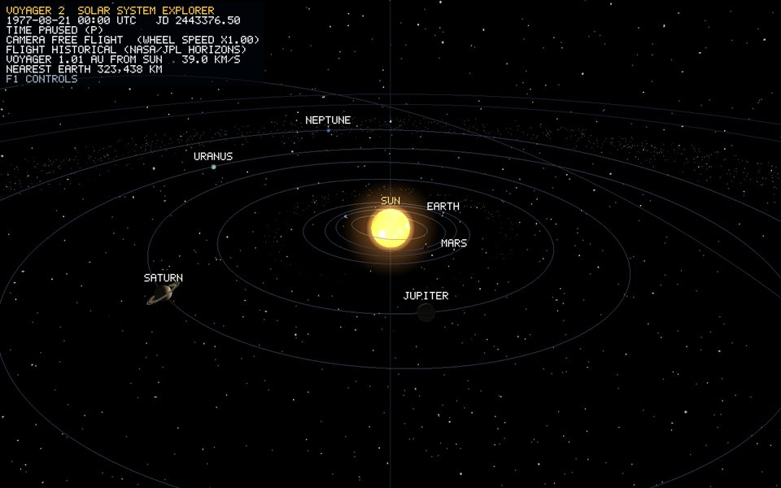

# Object Guide

These notes explain the renderable objects at the level needed to reconstruct and defend the implementation. Start with the shared-system guides, then read each object's page.

**New to the code?** Read the [learning guide](../guide/README.md) first. It builds everything up from the ground: the OpenGL pipeline, how every vertex and triangle is generated, transforms, textures, lighting, the five shading techniques, ray tracing, Voyager 2, the mission data, and step-by-step recipes for changes. These object pages are the reference that goes with it.

1. [Procedural mesh handbook](procedural-meshes.md): exact vertex equations, index order, normals, UVs, winding, and counts for boxes, cylinders/frusta/cones, parabolic dishes, annuli, line circles, and star points.
2. [UV sphere geometry](uv-sphere.md): every position, normal, UV, index, triangle count, seam, pole, and winding decision for all bodies and small rocks.
3. [Rendering pipeline](phase-2-rendering-pipeline.md): how CPU vertices become pixels, including the floating origin and logarithmic depth.
4. [Lighting, shading, glow and depth](lighting.md) (Phase 14): the light model, five shading techniques (Flat, Gouraud, Phong, Blinn-Phong, Toon), point/spot/directional lights, derived normal and specular maps, two-sided rings, halo shells.
   [Ray tracing](ray-tracing.md): ray-traced soft shadows in the raster view, the Whitted ray-traced view (F9), and Voyager's triangle BVH.
5. [ScaleManager](scale-manager.md), [Mission ephemeris and simulation clock](mission-ephemeris.md) (Phase 11) and [Orbital motion and spin](orbital-motion.md): how real km, AU and dates become render positions. Read these before the per-body pages.
6. [Controls](controls.md): free flight, click-to-select, Focus fly-to with planet and moon stepping, chase rig, Inspect close-ups, six-degree-of-freedom piloting, lighting and ray-tracing keys, clock, bookmarks and capture tours.
7. [HUD, labels and help overlay](hud-overlay.md): the project-authored 5x7 font, screen-space text renderer, Inspect captions and the key-hint bar.
8. Every body (all share the one sphere from #2; only transform, motion and texture differ). Each page opens with a runtime capture:

   | Star | Planets + dwarf | Moons |
   |---|---|---|
   | [Sun](sun.md) | [Mercury](mercury.md), [Venus](venus.md), [Earth](earth.md), [Mars](mars.md), [Jupiter](jupiter.md), [Saturn](saturn.md), [Uranus](uranus.md), [Neptune](neptune.md), [Pluto](pluto.md) | [Moon](moon.md) (Earth); [Io](io.md), [Europa](europa.md), [Ganymede](ganymede.md), [Callisto](callisto.md) (Jupiter); [Tethys](tethys.md), [Dione](dione.md), [Rhea](rhea.md), [Titan](titan.md), [Iapetus](iapetus.md) (Saturn); [Miranda](miranda.md), [Ariel](ariel.md), [Umbriel](umbriel.md), [Titania](titania.md), [Oberon](oberon.md) (Uranus); [Triton](triton.md) (Neptune) |

   26 bodies total. Pluto and Saturn's Tethys, Dione, Rhea and Iapetus are the bible's optional set (section 3).

9. [Planetary rings](rings.md): Saturn and Uranus (5 real bands each), plus faint translucent Jupiter (2) and Neptune (3) systems, all in planet-radius units.
10. [Voyager 2](voyager-2.md): the from-scratch spacecraft (82 parts, 11,652 triangles, 18 inspectable components), its quaternion flight model, chase and Inspect cameras, self-shadowing and ray tracing. [Voyager textures](voyager-textures.md): how each part shows one region of NASA's public-domain hardware atlas. Its [historical trajectory](voyager-trajectory.md) follows 11,002 NASA/JPL Horizons state vectors. The [primary-source NASA research note](../research/voyager-2-spacecraft-reference.md) separates sourced dimensions from implementation inference.
11. [GPU instancing](instancing.md): the shared mechanism behind every "thousands of bodies, one draw call" object below.
12. [Asteroid belt, Kuiper belt, Oort cloud](small-body-fields.md): lit instanced small-body fields.
13. [Background starfield](starfield.md): three camera-centred brightness layers, 7,380 points.
14. [Orbit guides](orbit-rings.md): osculating ellipses from each planet's own Horizons state, so every planet rides its line.
15. [Drifting comet](drifting-comet.md): an elliptical orbit, a glowing coma, and a tail that always points away from the Sun.
16. [Termination shock and heliopause](heliosphere.md): wireframe boundaries at Voyager 2's own crossing distances.

## Texture provenance, at a glance

Two credited real-imagery sources, no procedurally-generated or synthetic textures in the current build (normal and specular maps are *derived* at load time from these same photographs):

- **Sun, all 8 planets, the Moon** — Solar System Scope free 2k texture pack, CC BY 4.0 (https://www.solarsystemscope.com/textures/).
- **Every other moon, plus Pluto** (Io, Europa, Ganymede, Callisto, Tethys, Dione, Rhea, Titan, Iapetus, Miranda, Ariel, Umbriel, Titania, Oberon, Triton, Pluto) — NASA 3D Resources (github.com/nasa/NASA-3D-Resources), public domain.
- **Voyager 2** — the texture atlas of NASA 3D Resources' "Voyager Probe (B)", public domain; image only, no geometry ([voyager-textures.md](voyager-textures.md)).

Every body's own doc repeats its specific credit line under "Material mapping". None of this touches geometry: see [phase-2-rendering-pipeline.md](phase-2-rendering-pipeline.md) for why a texture swap can never change a vertex.

## Rule for Every Future Object

Before an object phase is complete, add `docs/objects/<object-id>.md` containing:

- where its geometry comes from and whether a mesh is shared;
- its vertex attributes, index/triangle construction, winding, and topology exceptions;
- its model transform, units, animation rules, and at least one worked local-to-world example;
- every visual asset's local path, source, credit, mapping, and scientific limitation;
- a diagram or annotated screenshot plus the exact build/run/manual checks performed.

Keep reusable algorithms in a shared guide and link to it from each object guide. Do not claim presentation scale is physically accurate: dates, directions and order are real (Horizons), but distances and radii are compressed ([scale-manager.md](scale-manager.md)). Runtime captures are regenerated with `Voyager-2.exe --capture <dir>` (tour, `images/runtime`), `--capture-bodies <dir>` (`images/bodies`), `--capture-shading <dir>` (`images/shading`), `--capture-raytrace <dir>` (`images/raytrace`) and `--capture-voyager <dir>` (`images/voyager`). The tool writes BMP; the docs store JPG conversions.
