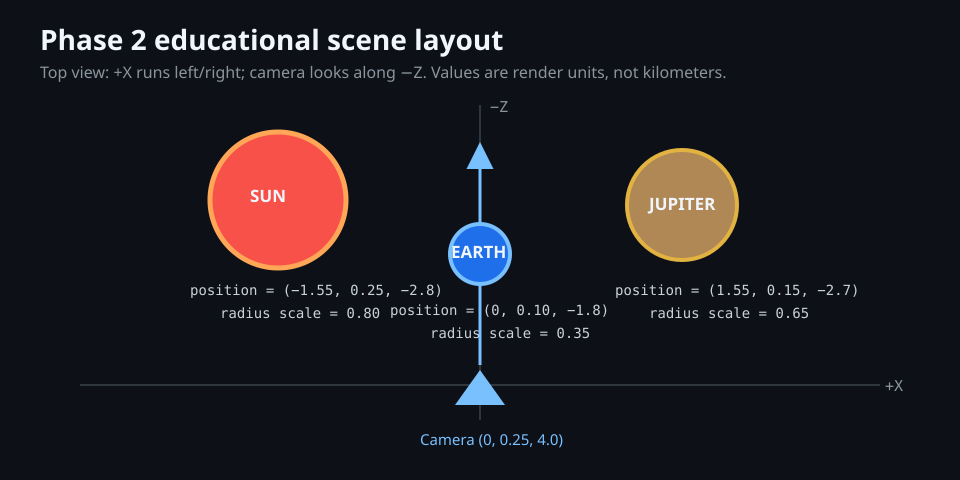

# Object Guide

These notes explain the renderable objects at the level needed to reconstruct and defend the implementation. Start with the shared-system guides, then read each object's page.

1. [Procedural mesh handbook](procedural-meshes.md): exact vertex equations, index order, normals, UVs, winding, and counts for boxes, cylinders/frusta/cones, parabolic dishes, annuli, line circles, and star points.
2. [UV sphere geometry](uv-sphere.md): every position, normal, UV, index, triangle count, seam, pole, and winding decision for all bodies and small rocks.
3. [Rendering pipeline](phase-2-rendering-pipeline.md): how CPU vertices become pixels through VBO/VAO/EBO state, transforms, materials, shaders, depth testing, and culling.
4. [ScaleManager](scale-manager.md) (Phase 4) and [Orbital motion](orbital-motion.md) (Phase 5): how real km measurements become render units and real elliptical motion — read these before the per-body pages below, since every body's Transform/Orbit sections depend on them.
5. [Controls: camera modes, focus, simulation clock](controls.md): direct fixed/free toggle, Tab-to-select, pause/speed.
6. Every body (all share the one sphere from #2 — only transform and texture differ):

   | Star | Planets + dwarf | Moons |
   |---|---|---|
   | [Sun](sun.md) | [Mercury](mercury.md), [Venus](venus.md), [Earth](earth.md), [Mars](mars.md), [Jupiter](jupiter.md), [Saturn](saturn.md), [Uranus](uranus.md), [Neptune](neptune.md), [Pluto](pluto.md) | [Moon](moon.md) (Earth); [Io](io.md), [Europa](europa.md), [Ganymede](ganymede.md), [Callisto](callisto.md) (Jupiter); [Tethys](tethys.md), [Dione](dione.md), [Rhea](rhea.md), [Titan](titan.md), [Iapetus](iapetus.md) (Saturn); [Miranda](miranda.md), [Ariel](ariel.md), [Umbriel](umbriel.md), [Titania](titania.md), [Oberon](oberon.md) (Uranus); [Triton](triton.md) (Neptune) |

   26 bodies total. Pluto and Saturn's Tethys/Dione/Rhea/Iapetus are the bible's optional/"when scope permits" set (section 3) — added once the required 21 were solid.

7. [Planetary rings](rings.md) — Saturn/Uranus (5 real named bands each), generated in units of the parent planet's own radius so each cascades that planet's scale automatically. Jupiter and Neptune intentionally have no enlarged visible ring geometry.
8. [Voyager 2](voyager-2.md): the from-scratch spacecraft — true parabolic dish, boxes, cylinders/frusta, lattice booms, finned RTGs, full component hierarchy, flight modes, and fixed chase camera. Its [historical trajectory](voyager-trajectory.md) uses offline NASA/JPL Horizons samples, while the [primary-source NASA research note](../research/voyager-2-spacecraft-reference.md) separates sourced dimensions from implementation inference.
9. [GPU instancing](instancing.md): the shared mechanism behind every "thousands of bodies, one draw call" object below.
10. [Asteroid belt, Kuiper belt, Oort cloud](small-body-fields.md): instanced small-body fields.
11. [Background starfield](starfield.md): 4,000 points, one `GL_POINTS` draw call.
12. [Orbital trajectory guides](orbit-rings.md): sampled historical paths for Earth, Mars, Jupiter, Saturn, Uranus, and Neptune; analytic Kepler ellipses for Mercury, Venus, and Pluto. A moving planet is always drawn on the guide computed by its own position source.
13. [Drifting comet](drifting-comet.md): a moving nucleus plus tapered tail that dynamically points away from the Sun; it replaced both the poor Andromeda disc and three incomplete static comet nuclei.
14. [Termination shock and heliopause](heliosphere.md): two nested three-circle wireframe boundaries that communicate the outer heliosphere without transparency.

## Texture provenance, at a glance

Two credited real-imagery sources, no procedurally-generated or synthetic textures in the current build:

- **Sun, all 8 planets, the Moon** — Solar System Scope free 2k texture pack, CC BY 4.0 (https://www.solarsystemscope.com/textures/).
- **Every other moon, plus Pluto** (Io, Europa, Ganymede, Callisto, Tethys, Dione, Rhea, Titan, Iapetus, Miranda, Ariel, Umbriel, Titania, Oberon, Triton, Pluto) — NASA 3D Resources (github.com/nasa/NASA-3D-Resources), public domain.

Every body's own doc repeats its specific credit line under "Material mapping". None of this touches geometry: see [phase-2-rendering-pipeline.md](phase-2-rendering-pipeline.md) for why a texture swap can never change a vertex.

## Rule for Every Future Object

Before an object phase is complete, add `docs/objects/<object-id>.md` containing:

- where its geometry comes from and whether a mesh is shared;
- its vertex attributes, index/triangle construction, winding, and topology exceptions;
- its model transform, units, animation rules, and at least one worked local-to-world example;
- every visual asset's local path, source, credit, mapping, and scientific limitation;
- a diagram or annotated screenshot plus the exact build/run/manual checks performed.

Keep reusable algorithms in a shared guide and link to it from each object guide. Do not claim presentation scale or animation speed is physically accurate unless it is driven by the later simulation systems.
