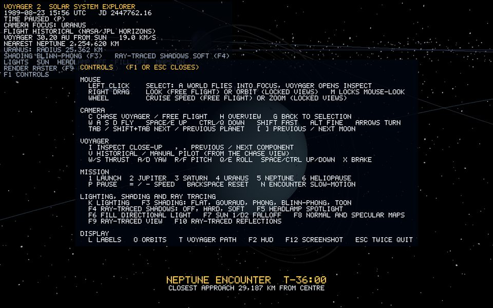

# Controls: cameras, focus, flight and the simulation clock

*Runtime capture: `F1` shows this list in the program itself ([hud-overlay.md](hud-overlay.md)).*

The camera is fully free. A viewer can fly anywhere, at any speed, and inspect every body, ring, moon and part of Voyager at close range. Input is read only by `Input`, which polls GLFW and accumulates the mouse wheel through one callback. `Application` routes it; bodies and the camera never poll GLFW (bible section 36).

## Camera modes

| Mode | Enter | What it does |
| --- | --- | --- |
| **Free flight** | `C` from a locked view, `H`, or any fly key in Focus/Chase | Fly anywhere (below) |
| **Chase** | startup, `C` from free flight, bookmarks `1`-`6`, `V` into Manual | Orbit rig on Voyager 2 |
| **Focus** | Left-click a world, `Tab` / `Shift+Tab`, `[` / `]`, `G` | Orbit rig on the selected body, with a fly-to transition |
| **Inspect** | Left-click Voyager, or `I` | Orbit rig on one Voyager component, in Voyager's frame |

### Free flight

- `W A S D` move; `Space`/`E` go up and `Ctrl`/`Q` go down, in world up.
- Hold **RMB** and move the mouse to look (the cursor is captured while held). `M` latches mouse-look on for trackpads or long flights. The arrow keys also turn.
- **Adaptive speed.** Base speed is 0.9 x the distance to the nearest surface, whether that is a body or Voyager, clamped between 0.004 and 300 units per second. The same keys therefore skim 1 cm from an antenna or cross the Kuiper belt in seconds.
- **Wheel**: cruise-speed multiplier, 30 % per notch (0.001x to 1000x), shown in the HUD. **Shift** multiplies speed by 6 and **Alt** by 0.15 for fine positioning.
- Leaving a locked view keeps the exact current position and view direction, so there is no jump.

### Focus (any of the 26 bodies)

- **Left-click** any world to fly to it. The click is a pick ray through the pixel (`CameraController::pickAt`), tested against every body's angular radius plus a 1.2 degree tolerance, so small distant moons are still easy to hit.
- `Tab` / `Shift+Tab` cycle through the Sun, the planets and Pluto. `]` / `[` (or `Page Down` / `Page Up`) step through the moons of the current planet.
- The camera flies there over 1.6 s along an eased path with logarithmic distance blending, so long hops start fast and settle gently. The fly-to tracks the target every frame, so it lands exactly even on a moving planet.
- It opens on the day side, 40 degrees round from the body-to-Sun direction, at 3.2 radii (5.5 for planets with moons, 4 for the Sun).
- Drag with RMB or use the arrows to orbit. The wheel zooms multiplicatively from 1.08 radii (surface close-up) out to 5,000 units.
- `G` flies back to the last selected body after free flight.
- The HUD shows the name and real radius.

### Chase

- The same orbit rig, expressed in Voyager's own frame, so "behind" follows its pitch and roll in Manual flight. It opens as a three-quarter rear view (20 degree yaw, 10 degree pitch, 4 bounding radii).
- During a Historical flyby, when within 6 clearances of a giant planet or near Earth at launch, the rig faces the planet instead. The probe stays in the foreground with the world it is passing behind it. The frame change is smoothed.
- Drag or use the arrows to orbit. The wheel zooms from 1.3 bounding radii out to 5,000 units.

### Inspect (Voyager close-up)

- `I` or a click on Voyager opens Inspect on the whole craft. `.` and `,` step through its 18 components (bus, high-gain antenna, feed stack, sun sensor, Golden Record, calibration target, magnetometer boom and tip, RTGs, plasma science, cosmic ray, LECP, scan platform, both cameras, IRIS, radio antennas, thrusters). `I` or `Esc` returns to Chase.
- The rig orbits the component's centre in Voyager's own frame, so the part stays framed while the craft moves and turns. The wheel zooms down to 0.3 of the component's size.
- The first view blends "outward from the craft" with "toward the Sun", so the part is lit and the camera is never inside the bus. A studio fill light from behind the camera is switched on while inspecting ([lighting.md](lighting.md)).
- A caption names the component and gives a one-line fact; labels mark every component. See [voyager-2.md](voyager-2.md).

`H` or `Home` places free flight at the overview camera, 150 units in front of and 62 above the Sun, looking at the inner system.

## Voyager flight

`V` toggles Historical and Manual flight. Manual control is active only in the Chase camera; in free flight the same keys fly the camera.

| Key | Manual action |
| --- | --- |
| `W` / `S` | Thrust forward / backward along the nose |
| `A` / `D` | Yaw left / right about the ship's up axis |
| `R` / `F` | Pitch nose up / down |
| `Q` / `E` | Roll |
| `Space` / `Ctrl` | Translate along the ship's up axis |
| `Shift` | Boost thrust x8 |
| `X` | Braking burn: opposes the velocity without overshooting |

Orientation is a quaternion and every turn is about the ship's own axes, so there is no gimbal lock (bible F6). Flight is inertial: turning changes facing, not velocity, and speed is capped at 12 units per second. Details are in [voyager-2.md](voyager-2.md).

## Mission and clock

| Key | Action |
| --- | --- |
| `1` | Launch, 1977-08-21 |
| `2` / `3` / `4` / `5` | Jupiter / Saturn / Uranus / Neptune, 1.5 days before each computed closest approach |
| `6` | Heliopause crossing, 2018-11-05 |
| `P` | Pause or resume |
| `=` / `-` (keypad `+` `-`) | Double or halve speed, 1/64x to 64x |
| `Backspace` | Speed back to 1x and unpause |
| `N` | Encounter slow-motion on or off |
| `T` | Voyager trajectory line |
| `O` | Orbit guides |

The shared Julian Date runs at 120 mission days per second at 1x, easing to about 1.2 hours per second at each closest approach. Planets, Voyager and the HUD all read it ([mission-ephemeris.md](mission-ephemeris.md)). Moon revolution and axial spin use the same speed factor and pause ([orbital-motion.md](orbital-motion.md)).

## Display

| Key | Action |
| --- | --- |
| `F1` | Controls overlay |
| `F2` | HUD panel |
| `L` | Body labels |
| `F12` | Screenshot to `captures/screenshot_NNN.bmp` |
| `Esc` | Closes help, then leaves Inspect; otherwise press twice within 2 s to quit |

A hint bar along the bottom of the screen always lists the keys that matter in the current mode (`Application::keyHints`).

## Lighting, shading and ray tracing

| Key | Action |
| --- | --- |
| `K` | Lighting on or off |
| `F3` / `Shift+F3` | Shading technique: Flat, Gouraud, Phong, Blinn-Phong (default), Toon |
| `F4` | Ray-traced Sun shadows: off, hard, soft (default) |
| `F5` | Camera headlamp spotlight |
| `F6` | Fill directional light |
| `F7` | Sun 1/d^2 distance falloff |
| `F8` | Normal and specular maps |
| `F9` | Full ray-traced view |
| `F10` | Ray-traced reflections |

Details: [lighting.md](lighting.md), [ray-tracing.md](ray-tracing.md) and the learning guide chapters [5](../guide/05-lighting.md)-[7](../guide/07-ray-tracing.md).

## Scripted captures

`Voyager-2.exe --capture <dir>` runs a fixed tour: overview, launch, four pre-encounter views, heliopause, four Focus views and the help overlay. It writes each view as a BMP and exits. `--capture-bodies <dir>` shoots a Focus view of each of the 26 bodies. `--capture-shading <dir>` shoots Earth and Voyager in every shading technique plus each light and shadow mode, `--capture-raytrace <dir>` pairs raster and ray-traced views of the same shots, and `--capture-voyager <dir>` shoots every Inspect component. These produced the images in `docs/objects/images/`.

## Verification

1. At startup the HUD reads `CAMERA CHASE VOYAGER`. Drag with RMB and the view orbits the probe. The wheel zooms in until the struts fill the screen.
2. Press `W`. The HUD switches to `FREE FLIGHT` without a jump. Scroll up and the `WHEEL SPEED` factor rises.
3. Press `Tab` repeatedly. The camera flies to the Sun, then Mercury, then Venus, and so on. At Jupiter press `]`: it flies to Io, then Europa. Zoom to 1.08 radii to see surface texture detail. Left-click another planet and the camera flies there.
4. Press `I`, then `.` a few times. The caption steps through Voyager's components and the camera frames each one. `Esc` returns to Chase.
5. Press `C`, then `V`. Pilot with `W`/`A`/`R`/`Q`, press `X` to stop, then `V` again. Voyager returns to its historical position.
6. Press `P` and all motion stops while the camera keeps flying. Press `=` and the HUD rate doubles.
