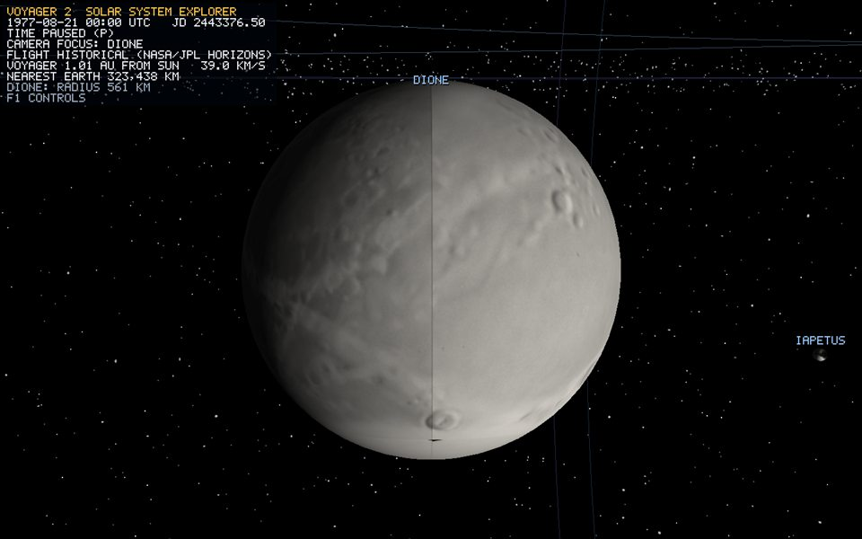

# Dione

*Annotated runtime capture: `Tab` Focus view of Dione at launch date 1977-08-21, Sun lighting on, labels and HUD visible (`Voyager-2.exe --capture-bodies <dir>`).*

## Overview

`Dione` is a `CelestialBody` (Moon) registered by `SolarSystem` as parent `"saturn"`. It draws with the one shared 32x64 UV-sphere `Mesh` ([uv-sphere.md](uv-sphere.md)); this page covers only what is specific to Dione: scale, motion, physical data, material and verification.

## Geometry generation

None of its own. Dione contributes zero unique vertices: all 26 bodies share one sphere upload (2,145 vertices, 3,968 triangles, bible F9). The derivation of every vertex, UV, index and the duplicated seam column is in [uv-sphere.md](uv-sphere.md).

## Vertex attributes / triangle construction

Unchanged shared layout: `position` (location 0), `normal` (1), `texCoord` (2), counter-clockwise triangles — see [uv-sphere.md](uv-sphere.md) and [phase-2-rendering-pipeline.md](phase-2-rendering-pipeline.md).

## Transform

- World radius: `0.1164` = 0.50 x (561.4 / 6,371)^0.60; Saturn's is `1.8860`.
- Local scale: `0.0617` = world radius / Saturn radius, because the parent's world matrix multiplies it by Saturn's scale again ([scale-manager.md](scale-manager.md), parent-scale compensation).
- Rotation: `angleAxis(0.0 deg, +Z)` tilt; spin applied to the mesh only.

## Motion

Local ellipse around Saturn (`CelestialBody::setOrbit`, [orbital-motion.md](orbital-motion.md)) in Saturn's tilted equatorial frame:

- semi-major axis `4.1458` parent radii = 1.6 + sqrt(377,396 / 58,232.0) (`ScaleManager::moonOrbitDistanceToRenderUnits`), eccentricity `0.0022`;
- angular rate `0.9183` rad/s = 2 pi x 0.4 / 2.737 days (moon visual clock: 0.4 days per second at 1x);
- starting true anomaly `137.5` deg (sibling 1 x golden angle 137.5 deg), giving local position `(-3.0619, 0, 2.8050)`.

## Worked vertex example

Local equator vertex `(1, 0, 0)` -> scale `0.0617` -> tilt 0.0 deg about +Z -> `(0.0617, 0.0000, 0)` (spin 0) -> plus the body position. That sum is still in Saturn's local frame; the parent world matrix (its tilt, scale and position) is applied next. Every matrix is double precision until `Renderer::submit` subtracts the camera position and narrows to float.

## Physical data

Source: NASA Planetary Fact Sheets (https://nssdc.gsfc.nasa.gov/planetary/factsheet/); positions of planets from NASA/JPL Horizons.

- Radius: 561.4 km
- Semi-major axis: 377,396 km
- Eccentricity: 0.0022
- Orbital period: 2.737 days
- Rotation period: 65.7 hours
- Axial tilt: 0.0 degrees

## Material mapping

- Texture file: `assets/textures/bodies/dione.jpg` (1440x720, loaded via `Texture2D::loadFromFile` → `stb_image` decode → `glTexImage2D`)
- Source and credit: NASA 3D Resources (github.com/nasa/NASA-3D-Resources), public domain ("free and without copyright" per the repo README)
- Shading: `Lit` (Sun point light, Lambert diffuse + Blinn-Phong specular strength 0, ambient 0.07) — [lighting.md](lighting.md). `K` toggles lighting off to show the raw texture.
- UVs come from the shared sphere generator; swapping the texture changes no vertex data.

## Limitations

- Radius is power-law compressed (size order preserved, absolute ratios not); see [scale-manager.md](scale-manager.md).
- Moon orbital positions run on a visual clock, not the dated ephemeris; real relative periods are preserved.
- Perfect sphere: no oblateness, no shadows cast onto rings or moons.

## Verification

- Startup log: `[SCENE] 26 bodies share 1 sphere mesh (2145 vertices, 3968 triangles), 26 real texture maps loaded`.
- Visual: `Tab` until the HUD shows `CAMERA FOCUS: DIONE`; the camera flies in on the day side and the label reads `DIONE`. Wheel zooms to the surface, drag orbits, `W` leaves into free flight.
