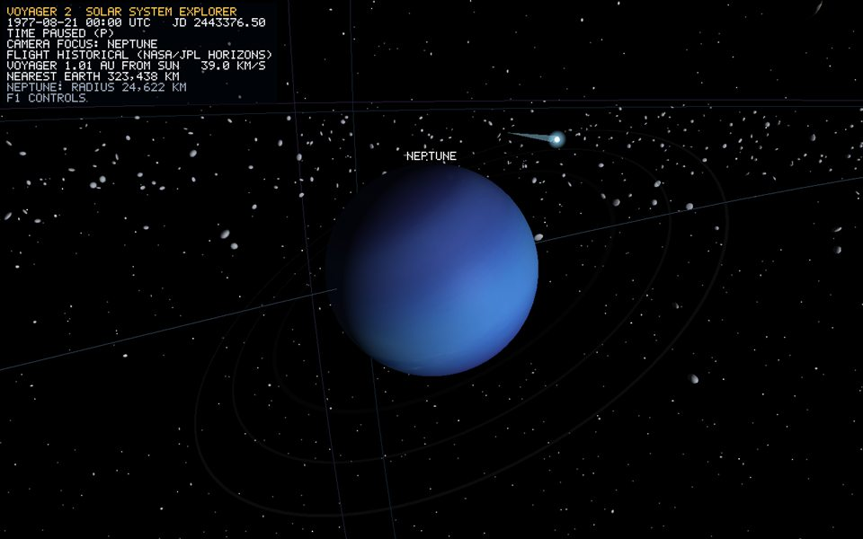

# Drifting comet

*Runtime capture, Focus on Neptune at launch date: the comet appears top right, with a glowing coma and a tail pointing away from the Sun.*

Its sphere and cone use the shared formulas in [uv-sphere.md](uv-sphere.md) and the [Procedural Mesh Construction Handbook](procedural-meshes.md).

## Overview

`drifting_comet` is a mesh-less `CelestialBody` used as a moving container, with three children: nucleus, coma and tail. It orbits beyond the Kuiper belt and gives the outer system a moving object.

## Geometry generation

- **Nucleus**: the shared 32x64 sphere, scale 0.25.
- **Coma**: the shared sphere again, scale 0.9, with `Glow` shading (falloff 2, opacity 0.8, pale cyan), so it is a soft halo round the nucleus ([lighting.md](lighting.md)).
- **Tail**: `CylinderGenerator::generate(0.35, 0.0, 9.0, 16)`, a 16-sided cone 9 units long that is wide at the nucleus and a point at the far end. It is `Unlit` pale cyan at opacity 0.45, so it is translucent.

## Transform

- **Orbit**: `setOrbit(ScaleManager::distanceAuToRenderUnits(60 AU) = 192.2, 0.008 rad/s, start at 270 degrees, centre = Sun, e = 0.35)`. It is a real ellipse with the Sun at the focus, and one revolution takes about 13 minutes at 1x. Pause and speed apply.
- **Tail direction**: every frame `Comet::update` (src/scene/Comet.cpp) rotates the cone's +Y axis onto `normalize(comet - sun)` with `angleAxis(acos(dot(Y, d)), normalize(Y x d))`, falling back to identity or a 180-degree flip when the vectors are parallel. It then offsets the cone by `rotation * (0, 4.5, 0)`, half its length, so the wide end sits on the nucleus. Real tails point away from the Sun whatever the direction of motion.

## Limitations

- Orbit radius, speed and eccentricity are chosen for framing. It is not a catalogued comet.
- The tail does not grow near the Sun.

## Verification

1. The startup log mentions `1 drifting comet`.
2. Fly out past Neptune toward the comet, an unlabelled glowing point. The tail points away from the Sun from every viewing angle and swings as the comet moves.
