# Lighting, shading, glow and depth

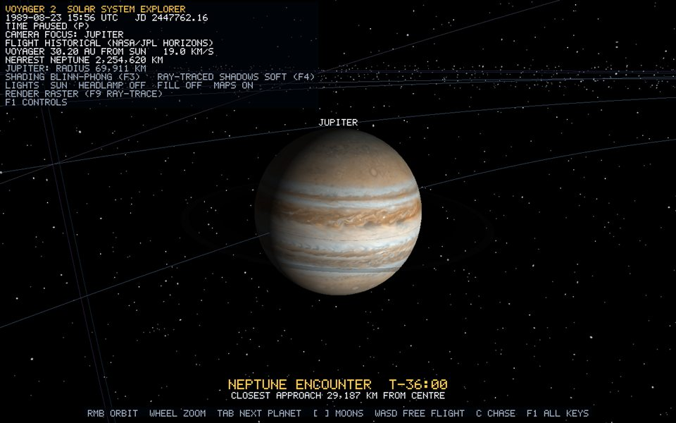

*Runtime capture: Focus on Jupiter. The terminator runs down the left limb, the faint main ring is translucent, and the moons are lit by the same Sun.*

This is the reference page for the lighting system (bible Phase 14). The learning guide derives each formula step by step: [chapter 5, Lighting](../guide/05-lighting.md) and [chapter 6, Shading techniques](../guide/06-shading-techniques.md). The ray-traced shadows it uses are in [ray-tracing.md](ray-tracing.md).

No shader or lighting code was supplied to the project. Everything below was written from the standard models (Lambert, Phong, Blinn-Phong, Gouraud, light attenuation, spotlight cones, tangent-space normal mapping).

## Files

| File | Role |
| --- | --- |
| `shaders/lighting.glsl` | The light model: `Light` struct, `evaluateLights`, `toonBand`, `SHADING_*` and `LIGHT_*` defines. Included by every lit shader. |
| `shaders/scene.vert` | Transforms, UV atlas window, **Gouraud** (per-vertex lighting) |
| `shaders/scene.frag` | Flat, Phong, Blinn-Phong and Toon (per-fragment lighting), normal and specular maps, shadow ray, glow, log depth |
| `src/rendering/Lighting.h` | `ShadingTechnique`, `LightType`, `ShadowMode`, `Light`, `LightingState` (4 lights) |
| `src/rendering/LightingUniforms.*` | Uploads lights (camera-relative) and the ray-trace scene to any program |
| `src/core/LightingController.*` | Builds the rig every frame (Sun, headlamp, fill) and handles `K`, `F3`-`F8` |
| `src/rendering/Material.h`, `MaterialLibrary.*` | Surface response: presets for bodies, the textured spacecraft finishes |
| `src/rendering/SurfaceMaps.*` | Normal maps and the ocean specular mask, derived from albedo photographs |

## Uniform interface

| Uniform | Set by | Meaning |
| --- | --- | --- |
| `model`, `view`, `proj` | Renderer | Camera-relative model matrix, view at the origin, perspective |
| `baseColor`, `useTexture`, `albedoTexture` (unit 0) | Material | Albedo and tint |
| `uvTransform` | Material | Atlas window: `uv * zw + xy` |
| `shadingModel` | `Material::shading` | 0 Unlit, 1 Lit, 2 LitTwoSided, 3 Glow |
| `specularStrength`, `specularPower` | Material | Highlight brightness and tightness; Glow uses power as the falloff |
| `opacity` | Material | Below 1, the draw is deferred and alpha blended |
| `normalMap` (unit 1), `useNormalMap`, `normalStrength` | Material | Tangent-space bump detail |
| `specularMap` (unit 2), `useSpecularMap` | Material | Per-texel highlight mask |
| `selfShadowing` | Material | Spacecraft parts trace shadow rays through Voyager's BVH |
| `lightingEnabled`, `shadingTechnique`, `ambientStrength`, `surfaceMapsEnabled` | LightingState | `K`, `F3`, 0.07, `F8` |
| `lights[4]` (`type`, `enabled`, `position`, `direction`, `color`, `attenuation`, `innerCutoff`, `outerCutoff`) | LightingState | The rig below |
| `spheres[]`, `rings[]`, `sunCenter`, `sunLightRadius`, `shadowMode`, BVH uniforms | Renderer | Shadow-ray scene ([ray-tracing.md](ray-tracing.md)) |
| `logDepthCoefficient` | Renderer | `2 / log2(far + 1)` |

## The model

```text
colour = albedo * (ambient + Σ diffuse_i * radiance_i) + Σ specular_i * radiance_i
diffuse  = max(dot(n, l), 0)                            (toon: quantised into 4 bands)
Phong    = pow(max(dot(v, reflect(-l, n)), 0), power)
Blinn    = pow(max(dot(n, normalize(l + v)), 0), 2 * power)
radiance = color * intensity * attenuation * spotCone
```

The Sun (light 0) is kept separate in `LightTerms`, so only its diffuse and specular are multiplied by the ray-traced shadow factor.

## Shading techniques (F3)

| Flat | Gouraud | Phong | Blinn-Phong (default) | Toon |
| --- | --- | --- | --- | --- |
|  | 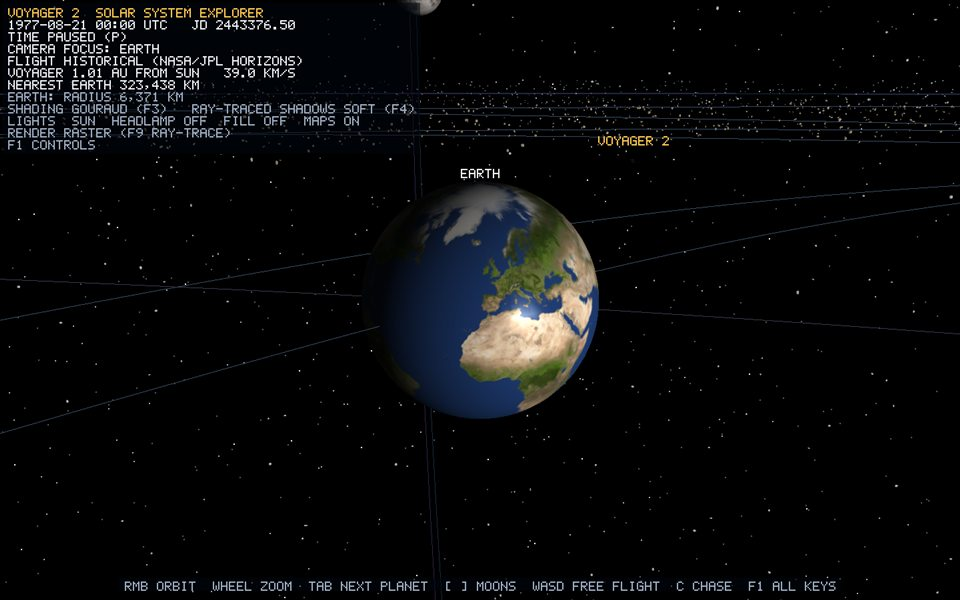 |  | 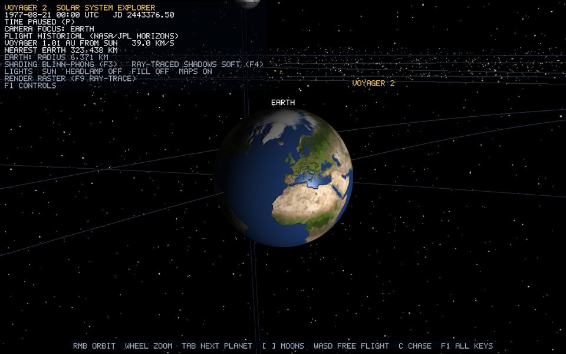 | 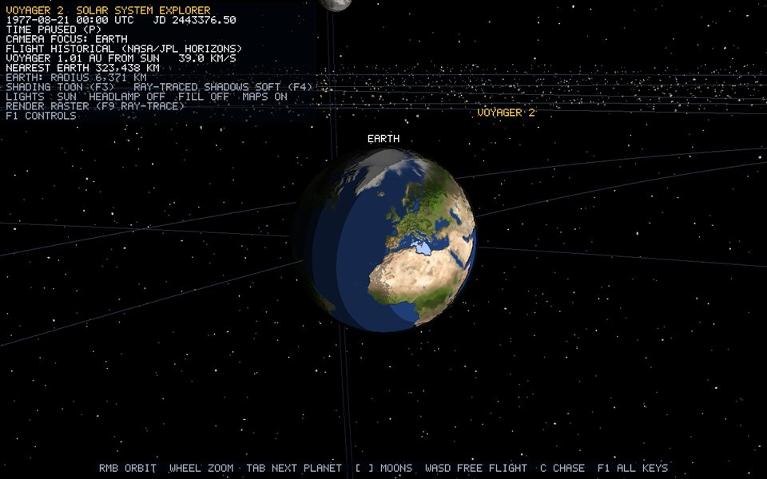 |
|  | 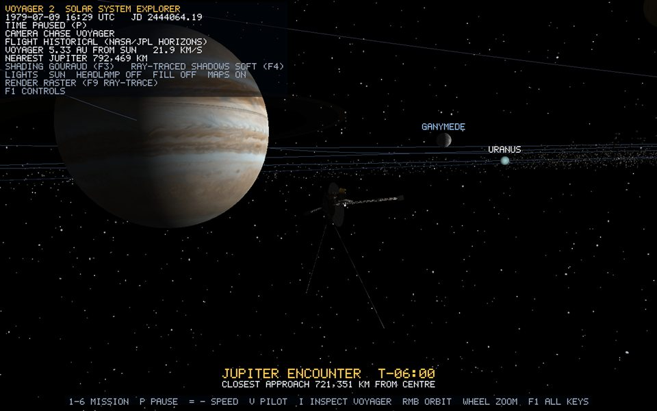 | 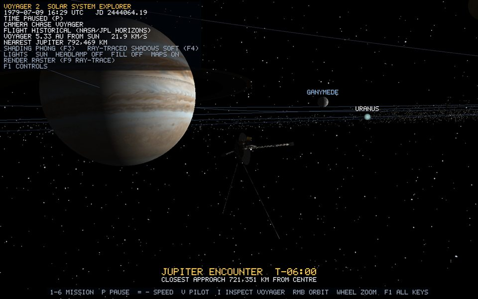 | 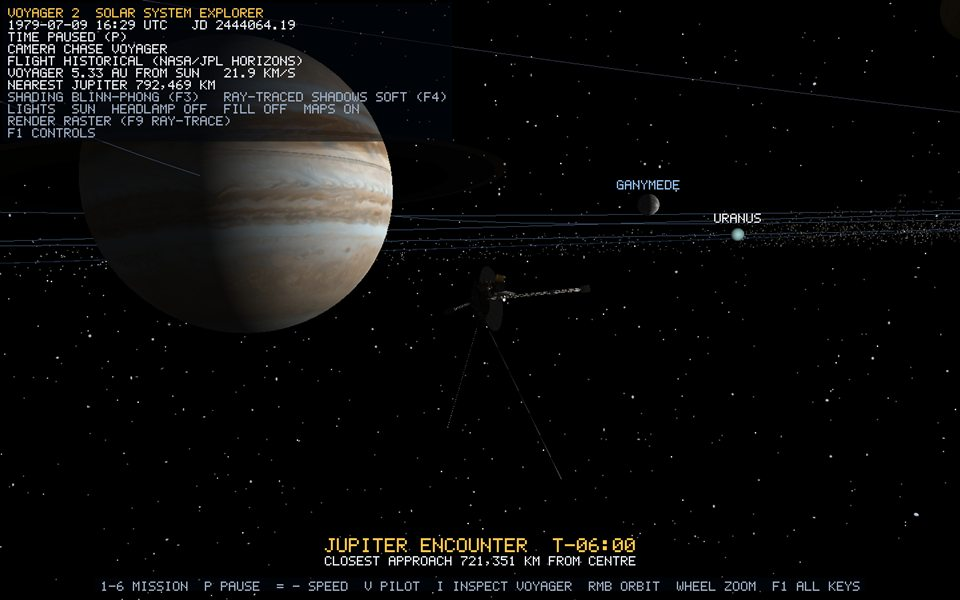 | 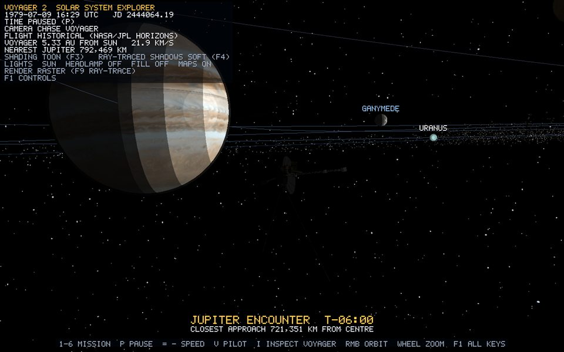 |

- **Flat**: face normal `cross(dFdx(p), dFdy(p))` per fragment.
- **Gouraud**: `evaluateLights` in the vertex shader; the four light terms are interpolated. Normal maps are off.
- **Phong**: interpolated normal, reflect-vector specular per fragment.
- **Blinn-Phong**: interpolated normal, half-vector specular (exponent doubled to match Phong's highlight size). The ray tracer uses this too.
- **Toon**: 4 diffuse bands, `step(0.5)` specular, rim ink where `dot(n, v) < 0.22`.

## Light casters

| Light | Type | Default | Key | Values |
| --- | --- | --- | --- | --- |
| 0 Sun | Point | on | `F7` toggles falloff | colour (1, 0.98, 0.94); attenuation (1, 0, 0), or (0.3, 0, 0.7/400) with falloff: 1.0 at Earth's 20-unit orbit, about 0.03 at Neptune |
| 1 Headlamp | Spot | off | `F5` | at the eye along the view; inner 12°, outer 18°; intensity 1.4; quadratic reach 3 × distance to the nearest surface |
| 2 Fill | Directional | off | `F6` | direction (0.25, −1, 0.15), cool (0.55, 0.65, 0.85), 0.35. In Inspect mode it becomes a studio fill from behind the camera (0.45) |

| Headlamp | Fill | Sun falloff |
| --- | --- | --- |
| 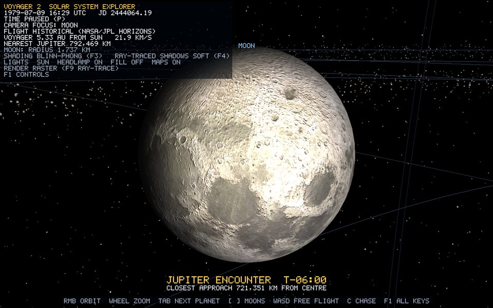 | 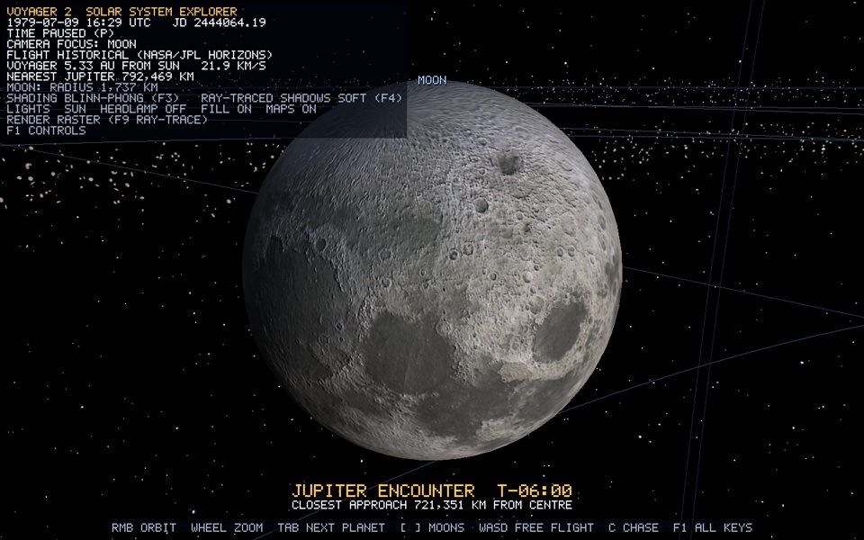 | 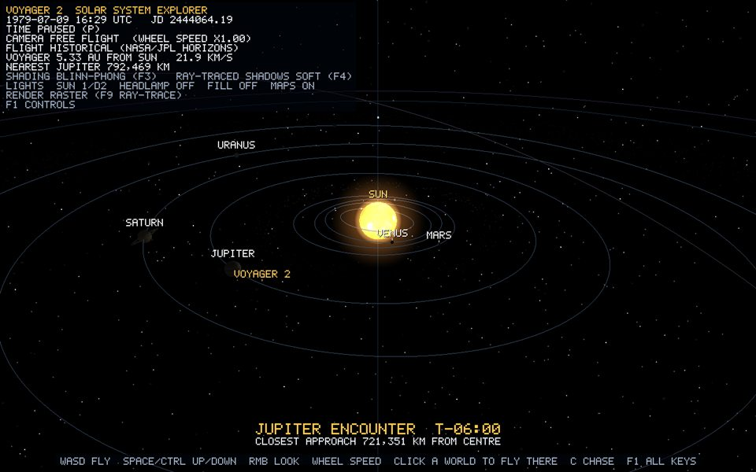 |

## Materials

| Preset | Specular / power | Maps | Bodies |
| --- | --- | --- | --- |
| emissive | Unlit | none | Sun |
| rocky | 0.03 / 8 | normal (relief 2.0) | Mercury, Mars, Moon, Io, Callisto |
| ocean | 0.55 / 48 | normal (1.2) + ocean mask | Earth |
| ice | 0.22 / 36 | normal (1.6) | Pluto, Europa, Ganymede, Saturn and Uranus moons, Triton |
| gas | 0.06 / 10 | none | Jupiter, Saturn, Uranus, Neptune |
| cloud | 0.10 / 6 | none | Venus, Titan |
| spacecraft finishes | 0.12–0.90 / 10–120 | atlas normal map (1.4) | Voyager 2 ([voyager-textures.md](voyager-textures.md)) |

## Lighting maps (F8)

`SurfaceMaps::normalMapFromAlbedo` treats luminance as height and takes a Sobel gradient: `n = normalize(−dx·s, −dy·s, 1)`, wrapped in longitude. `oceanSpecularMap` marks blue-dominant, dark texels as water (255, land 30). The fragment shader rebuilds the tangent frame per pixel from `dFdx`/`dFdy` of position and UV, so the `Vertex` format needs no tangent attribute.

| Moon, maps off | Moon, maps on | Earth, maps off | Earth, maps on |
| --- | --- | --- | --- |
| 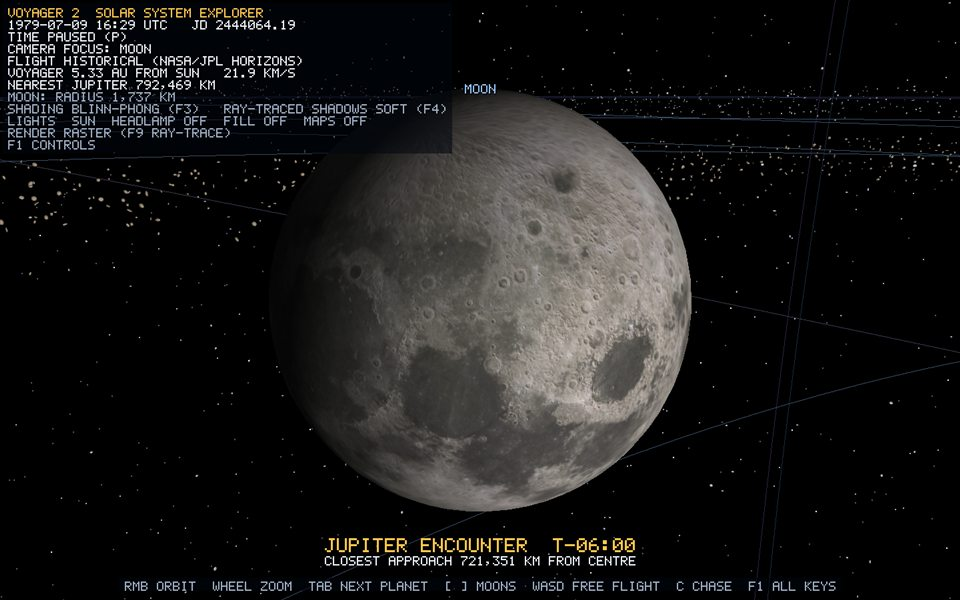 | 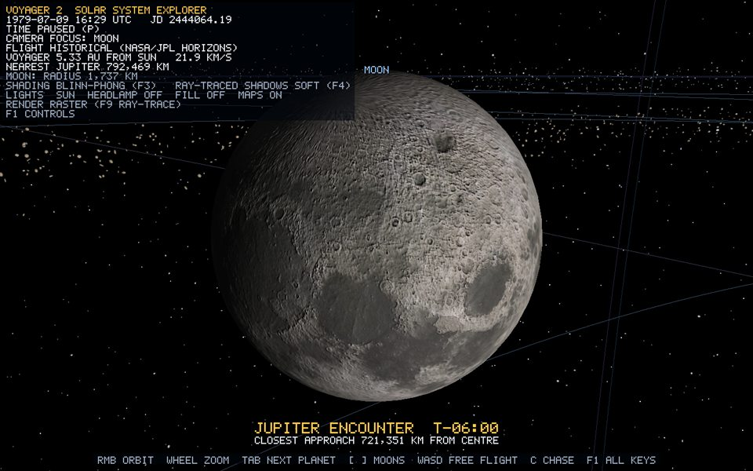 | 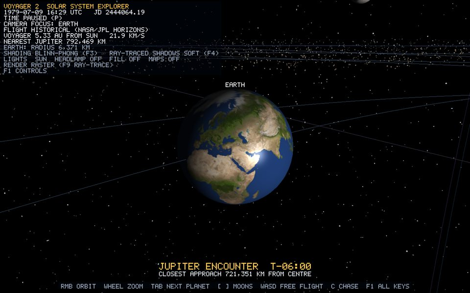 | 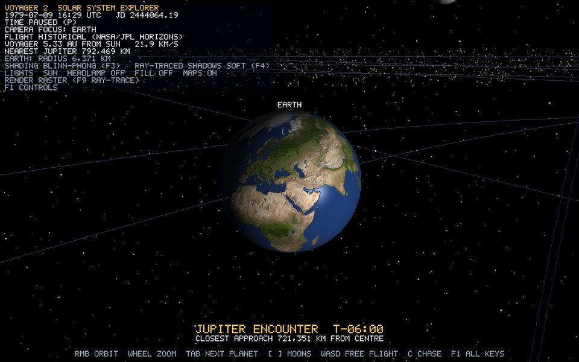 |

## Two-sided rings, glow shells and unlit guides

- `LitTwoSided` rings flip the normal toward the viewer and use `abs(dot(n, l))`, so a ring seen from its unlit side is not black.
- The Sun has two `Glow` shells: `sun_corona` (1.25 radii, falloff 1.5, opacity 0.9) and `sun_halo` (2.6 radii, falloff 3, opacity 0.55). Alpha is `|dot(n, v)|^power * opacity`, blended additively. The comet coma uses the same model. Glow and translucent draws are deferred to `Renderer::endFrame`: depth-tested, never depth-written.
- `Unlit`: the Sun's surface, orbit guides, trajectory, heliosphere, stars and comet tail.

## Floating origin and logarithmic depth

`Renderer::submit` subtracts the camera position from each world matrix in double before narrowing to float. Lights, trace spheres and the BVH position are uploaded camera-relative the same way. Depth is logarithmic, `gl_FragDepth = log2(1 + w) * logDepthCoefficient * 0.5`, with near 1e-6 and far 1e6. A 5 cm antenna and the 3,000-unit Oort cloud share one depth buffer without z-fighting. See [guide chapter 3](../guide/03-transforms-and-cameras.md).

## Limitations

- Only the Sun casts shadows; the headlamp and fill do not.
- No HDR, bloom, atmospheric scattering or indirect light. Ambient is a constant 0.07.
- Normal maps are derived from colour, which approximates relief: dark maria read as low and bright rays as high.
- Sun falloff is compressed (it is off by default) because real 1/d² would make the outer planets black at this scale.

## Verification

1. `Tab` to Earth. Day side toward the camera, soft terminator, sun glint on oceans only.
2. `F3` five times. The HUD cycles FLAT, GOURAUD, PHONG, BLINN-PHONG, TOON. Flat shows facets; Gouraud loses the ocean highlight.
3. `F8`. The Moon's craters flatten, and Earth's glint spreads onto land.
4. `F5` near a moon's night side: a soft-edged spot lights it. `F6`: the night sides fill with cool light. `F7`: Neptune dims.
5. `K`: raw albedo everywhere, then back.
6. `x64\Release\Voyager-2.exe --capture-shading <dir>` regenerates every image on this page.
