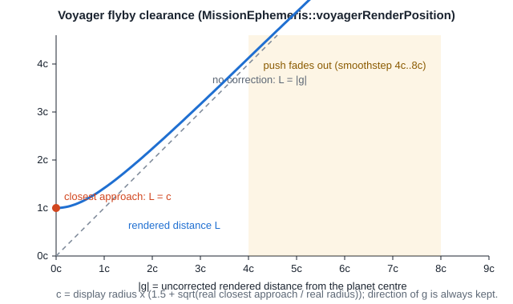

# Mission ephemeris and simulation clock


*Runtime capture (`--capture` tour): Jupiter and Voyager 2 placed from the same Horizons date, six hours before the computed closest approach. The encounter banner counts down to it; the chase camera faces the planet.*

This page covers bible Phase 11: one date drives every planet and the spacecraft, and each giant-planet flyby happens at the correct historical moment and on the correct side of the planet. Code: `src/scene/MissionEphemeris.*`, `src/scene/SimulationClock.*`, `src/scene/Trajectory.*`, and `src/scene/MissionController.*`, which owns the ephemeris, the clock and the bookmarks (`assets/data/mission_bookmarks.csv`). Every frame `MissionController::update` advances the clock, `placeBodies` moves each planet to its Horizons position and `placeVoyager` moves the spacecraft. The derivation is also walked through in [guide chapter 9](../guide/09-mission-data.md).

## Data

All tables are offline NASA/JPL Horizons state vectors, checked in so the program never uses the network. `scripts/fetch_horizons.ps1` regenerates them.

| File | Target | Step | Rows |
| --- | --- | --- | ---: |
| `assets/trajectory/planets/mercury_heliocentric.csv` | 199 | 4 days | 4,782 |
| `venus`, `earth`, `mars` | 299, 399, 499 | 5 days | 3,826 each |
| `jupiter`, `saturn` | 599, 699 | 20 days | 957 each |
| `uranus`, `neptune`, `pluto` | 799, 899, 999 | 30 days | 638 each |
| `assets/trajectory/voyager2_heliocentric.csv` | -32 | 5 days; within ±40 days of each encounter 6 h, within ±3 days 10 min, within ±6 h of closest approach 1 min | 11,002 |

Every row is `julian_date,x_au,y_au,z_au,vx_au_d,vy_au_d,vz_au_d`: heliocentric (`500@10`), ecliptic of J2000, ICRF axes, AU and AU/day, 1977-08-21 to 2030-01-02. The targets are body centres, not system barycentres.

**Encounter rows are composed.** Horizons serves heliocentric Voyager from the spacecraft reconstruction (`Voyager_2_ST+refit2022_m`) but heliocentric planets from the current planetary ephemeris. At Neptune the two disagree by about 13,600 km, which is almost half the real pass distance. Within ±40 days of each encounter the script therefore writes Voyager as *planet (heliocentric) + Voyager (planet-centred, `500@599` etc.)*, using identical epochs. The planet-centred vector is the geometry the mission actually flew: 29,300 km from Neptune's centre at 03:56 UT, matching the published pass.

## Interpolation

`Trajectory::heliocentricPositionAtJulianDate` uses cubic Hermite interpolation between the two rows around the date. For `t` in [0, 1] across a row interval of `h` days:

```text
p(t) = (2t^3 - 3t^2 + 1) p0 + (t^3 - 2t^2 + t) h v0 + (-2t^3 + 3t^2) p1 + (t^3 - t^2) h v1
```

The curve matches both the position and the velocity Horizons gives at every row, so a 20-day Jupiter table and a 10-minute Neptune-encounter table both produce smooth orbital arcs rather than polylines. `velocityAtJulianDate` is the derivative of the same polynomial divided by `h`.

## Mapping to the scene

`Trajectory::mapHeliocentricToRender` swaps ecliptic `(x, y, z)` to scene `(x, z, y)`, which makes the ecliptic the horizontal plane and ecliptic north scene +Y. It keeps the direction from the Sun and replaces the distance with `ScaleManager::distanceAuToRenderUnits(r) = 12 (r / 0.387098)^0.55` ([scale-manager.md](scale-manager.md)). Planets and Voyager use this one function, so their relative directions are the real ones on every date.

## Flyby clearance



Bodies are drawn about a hundred times larger than their orbits allow, so the real 721,000 km Jupiter pass would put the rendered probe inside the rendered planet. `MissionEphemeris::voyagerRenderPosition` corrects this locally. Let `g` be Voyager's rendered offset from a planet and `c` that encounter's clearance:

```text
L = |g| + (sqrt(|g|^2 + c^2) - |g|) * (1 - smoothstep(4c, 8c, |g|))
Voyager = planet + normalize(g) * L
```

- At closest approach `|g|` is almost zero, so `L = c`. The direction still comes from the real Horizons geometry, so the probe swings round the planet on the correct side as the real flyby turns in a few hours.
- At `|g| = 2c` the push is 12 %. By `8c` it is exactly zero, so cruise is untouched.
- `c` is the planet's display radius times `1.5 + sqrt(real closest approach / real radius)`. The real passes were Neptune 1.19, Saturn 2.76, Uranus 4.22 and Jupiter 10.32 radii, which become 2.59, 3.16, 3.56 and 4.71 display radii. Their order is unchanged, and the Saturn pass stays outside the F ring (2.33).
- Earth uses a fixed three-radius clearance, because at launch Voyager is only 323,000 km away.

`computeEncounters` finds each closest approach by scanning every Voyager row (1-minute spacing at closest approach), then refining with a 60-step golden-section search on the Hermite curves. At startup it logs:

```text
[TRAJECTORY] Jupiter closest approach JD 2444064.4369, 721351 km (10.32 radii), display clearance 4.71 display radii
[TRAJECTORY] Saturn closest approach JD 2444842.6419, 160517 km (2.76 radii), display clearance 3.16 display radii
[TRAJECTORY] Uranus closest approach JD 2446455.2498, 107117 km (4.22 radii), display clearance 3.56 display radii
[TRAJECTORY] Neptune closest approach JD 2447763.6642, 29187 km (1.19 radii), display clearance 2.59 display radii
```

Those Julian Dates are 1979-07-09 22:29, 1981-08-26 03:24, 1986-01-24 18:00 and 1989-08-25 03:56 (TDB). NASA's published closest approaches are 22:29 UT at 721,670 km, 03:24 at 161,000 km, 17:59 at 107,000 km and 03:56 at about 29,240 km. The dates agree to within a minute and the distances to within 0.5 %.

## Simulation clock

`SimulationClock` holds the only Julian Date. Planets, Voyager, the HUD date and the encounter banner all read it, which satisfies bible requirement R2.

- The base rate is 120 mission days per real second at speed 1x. `=`/`-` double or halve it (1/64x to 64x), `P` pauses and `Backspace` resets it.
- Encounter slow-motion (`N` toggles it) multiplies the rate by `clamp(|t - t_CA| / 60 days, 0.0004, 1)`. Approaching a planet is therefore an exponential ease-in of about four seconds per side, with a floor of about 1.2 mission hours per second at closest approach. The 12-year cruise still plays in seconds. Updates are sub-stepped so a long frame cannot jump across the slow zone.
- The date is clamped to the data range and stops at 2030-01-02 instead of wrapping.
- Moons keep their own visual orbital clock ([orbital-motion.md](orbital-motion.md)). At 120 days per second, Io would otherwise complete 68 orbits every second.

## Bookmarks

`1` starts at launch. `2` to `5` jump to 1.5 days before each computed closest approach, so the slow-motion plays the whole flyby. `6` jumps to the heliopause crossing on 2018-11-05. Each bookmark switches to Historical flight and the chase camera. During an encounter the chase camera faces the planet, so the spacecraft stays in the foreground with the planet behind it.

## Limitations

- Horizons body centres are exact, but the display clearance is educational: rendered distances near a planet are not to scale.
- Every table ends on 2030-01-02. Outside the range positions are linear extrapolation, which the clock never requests.

## Verification

1. Run `.\scripts\run.ps1` and check the four `closest approach` log lines above.
2. Press `2`. The banner counts down to `T-00:00` as the probe sweeps round Jupiter, and the HUD's `NEAREST JUPITER` distance bottoms out near 721,000 km before rising again.
3. Press `T` and fly out with `C`: the gold path loops tightly round each giant planet and nowhere passes through a sphere.
4. `.\scripts\verify_scene_layout.ps1` checks the data files and encounter geometry offline.
