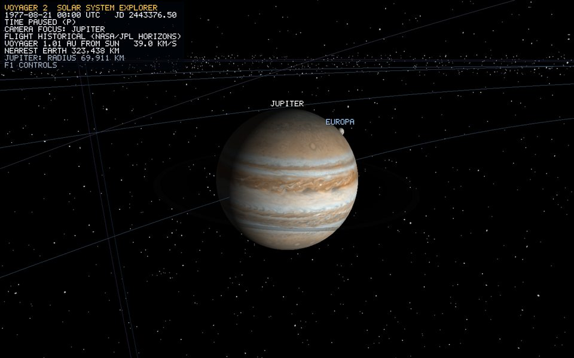

# Orbital motion and spin



*Runtime capture, Focus on Jupiter: the Galilean moons on their compressed parent-relative orbits, and the faint main ring in the same tilted equatorial frame.*

Three motions animate the solar system, and each has one owner.

| Motion | Owner | Clock |
| --- | --- | --- |
| Planet and Pluto positions | `MissionController::placeBodies` using `MissionEphemeris` | Shared `SimulationClock` Julian Date |
| Moon revolution | `CelestialBody::setOrbit` / `update` | Visual clock: 0.4 days per real second x speed |
| Axial spin | `CelestialBody::update` | 1 simulated hour per real second x speed |

`P` pauses all three, and `=`/`-` scale all three together (bible section 21). Camera motion and manual piloting always use unscaled real time.

## Planets: dated ephemeris, not animation

Planets are scene roots. There is no orbit angle to integrate: every frame, each planet's position is the cubic-Hermite interpolation of its Horizons state vectors at the clock's Julian Date, mapped by `Trajectory::mapHeliocentricToRender`. Kepler's second law, perturbations, inclination and perihelion direction are therefore all present automatically, because they are in the data. Jupiter and Saturn really do move faster near perihelion, and Pluto really is 17 degrees out of the ecliptic. See [mission-ephemeris.md](mission-ephemeris.md).

This replaces the earlier mechanism, where planets advanced a true-anomaly angle at a constant rate from J2000 phases. That was wrong in two ways: it violated Kepler's second law, and it put planets in positions that did not match Voyager's historical date.

## Moons: parent-relative ellipses

```cpp
void setOrbit(semiMajorAxis, angularVelocity, initialAngleRadians, center = (0,0,0), eccentricity = 0);
// every frame:
angle += angularVelocity * dt * simulationSpeed;
r = semiMajorAxis * (1 - e^2) / (1 + e * cos(angle));   // focus at the planet
localPosition = r * (cos(angle), 0, sin(angle));
```

- `semiMajorAxis` is `1.6 + sqrt(a / R_parent)` parent radii ([scale-manager.md](scale-manager.md)), expressed in the parent's local units.
- `eccentricity` is the real value, for example the Moon 0.0549 and Titan 0.0288.
- `angularVelocity = 2 pi * 0.4 / orbitalPeriodDays`. Real relative speeds hold, so Io laps Callisto 9.4 times. Triton's period is stored as negative, so it orbits retrograde.
- `initialAngle = siblingIndex * 137.5 degrees` (the golden angle), which spreads siblings round the planet at startup.
- The orbit lies in the parent's **tilted equatorial frame**, because the moon is a child of the planet and the planet's transform holds its axial tilt. Uranus's moons therefore circle nearly perpendicular to the ecliptic, as the real ones do.

Moons deliberately do not use the dated ephemeris. At the mission playback rate of 120 days per second, Io would complete 68 orbits per second and strobe.

## Spin without dragging children

`CelestialBody::update` sets `transform().rotation` to the axial tilt only. `CelestialBody::render` draws the body's own sphere with `worldMatrix() * spin` and then renders its children through the unspun matrix. Moons and rings therefore inherit the tilt and position of the planet but not its daily rotation. Earlier builds applied spin to the shared transform, so Jupiter's 10-hour day dragged every Galilean moon round with it.

```text
spin rate = 2 pi / (rotationPeriodHours * 3600) * 3600   rad per simulated second
```

Negative rotation periods (Venus, Pluto) spin retrograde. Uranus's retrograde spin comes from its 97.77 degree tilt.

## Known simplifications

- Moon orbits advance true anomaly at a constant rate. The ellipse shape is exact, but moment-to-moment speed does not follow Kepler's second law. The planets do follow it, because they come from data.
- Moon phases are not date-synchronized.

## Verification

1. Press `P`. Planets, moons and spin all stop, while the camera and manual flight keep working.
2. Press `=` a few times. Planets move faster along their guides ([orbit-rings.md](orbit-rings.md)), and moons and spin speed up by the same factor.
3. Focus Uranus with `Tab` until the HUD shows `FOCUS: URANUS`. Its moons orbit in the tilted plane of its rings.
4. Focus Jupiter. The moons keep their own periods and do not sweep round once per Jupiter day.
