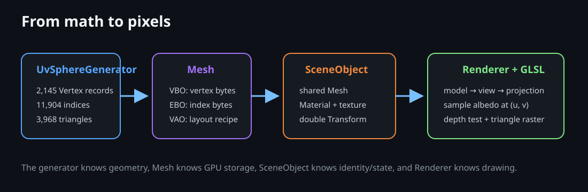

# Phase 2 Rendering Pipeline



## CPU Data and GPU Upload

Each [`Vertex`](../../src/rendering/Vertex.h) contains eight contiguous floats (32 bytes):

| Attribute | Shader location | Components | Byte offset | Purpose |
| --- | ---: | ---: | ---: | --- |
| `position` | 0 | 3 | 0 | Unit-sphere shape |
| `normal` | 1 | 3 | 12 | Outward direction for Sun lighting |
| `texCoord` | 2 | 2 | 24 | Point in the equirectangular image |

`MeshData` holds CPU vectors. A `Mesh` uploads vertices once to a VBO and 11,904 indices once to an EBO. Its VAO remembers the three attribute layouts and the EBO association. All bodies keep a `shared_ptr` to that one `Mesh`; each draw changes only material and model matrix.

## Per-Object Transform

The model matrix is `M = T × R × S`. With GLM column vectors, a local vertex is scaled, then rotated, then translated: `p_world = M × (p_local,1)`. World transforms stay double precision all the way to `Renderer::submit`, which subtracts the camera position from the translation column and only then narrows to float (floating origin, bible section 20). The view matrix is built with the eye at the origin, so the GPU only ever sees camera-relative coordinates ([lighting.md](lighting.md)).

The vertex shader then performs:

```text
p_clip = projection × view × model × p_local
```

Perspective division converts clip coordinates to screen position. The normal uses the inverse-transpose model matrix so non-uniform scaling would not bend its direction incorrectly.

## Material and Fragment Colour

`Material` owns a fallback `baseColor` and an optional shared `Texture2D`. `Texture2D::loadFromFile` decodes a real image file (JPEG, via the vendored public-domain `stb_image` single-header decoder — the same category of vendored utility as GLAD or GLFW, not part of the geometry or shading pipeline) into an RGBA byte buffer, then `uploadRgba` uploads it once and builds mipmaps. This is a decode step only: it never touches vertex positions, so which texture file is bound cannot affect a body's shape (see each object's own doc, "Material mapping"). Longitude wraps with `GL_REPEAT`; latitude clamps to the edge to avoid sampling across opposite poles.

For a valid texture, `baseColor` is neutral white and the texel is the surface albedo. If loading fails, `baseColor` becomes the object's fallback colour and texturing is disabled. Keeping fallback and tint behaviour separate prevents a blue fallback from darkening a valid Earth map. Phase 14 lighting uses the `normal` attribute that has been in this format since Phase 2: `Material::shading` selects unlit, Sun-lit (Lambert plus Blinn-Phong), two-sided lit or additive glow. The mesh format did not change. See [lighting.md](lighting.md).

## Visibility Rules

Every frame clears both colour and depth buffers and enables `GL_DEPTH_TEST`, so the closest fragment wins regardless of draw order. Depth is logarithmic (`gl_FragDepth = log2(1 + w) / log2(far + 1)`), which keeps precision from 1e-6 to 1e6 units in one pass. `GL_CULL_FACE` removes clockwise back faces. Together these settings make intersecting or overlapping spheres behave as solid objects. The order within a frame is: background stars with no depth writes, the opaque scene, glow and translucent draws (depth-tested, no depth writes), then the screen-space HUD ([hud-overlay.md](hud-overlay.md)).
