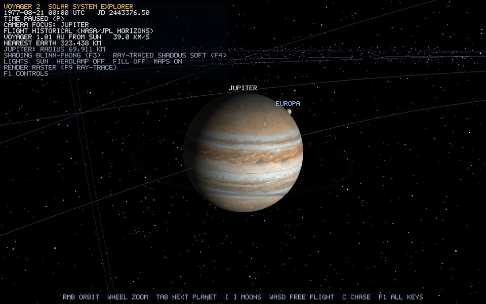
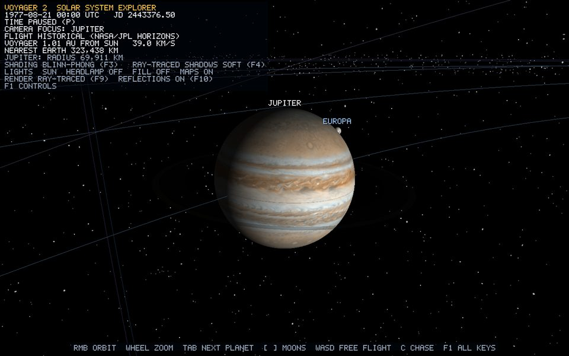
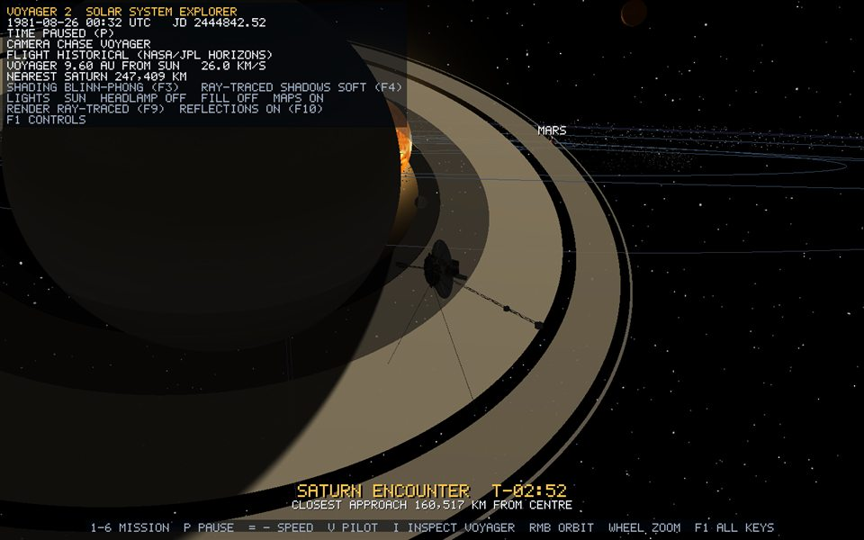

# Ray tracing

| Raster | Ray-traced (F9) |
| --- | --- |
|  |  |
|  |  |
|  |  |

*Runtime captures from `--capture-raytrace`: each row is the same frame, rasterised and ray-traced.*

This is the reference page for the project's ray tracing. The step-by-step derivation (ray-sphere, ray-plane, soft shadows, Whitted recursion, BVH, Möller–Trumbore) is in [guide chapter 7](../guide/07-ray-tracing.md).

## What is ray-traced

1. **Sun shadows in the raster view** (always, unless `F4` is off). Every lit fragment fires one shadow ray to the Sun through the analytic scene: every body sphere, every ring band, and, for Voyager's own parts, Voyager's triangle BVH. Planet shadows on rings, ring shadows on planets, moon eclipse shadows and Voyager's self-shadowing all come from this one function, `sunVisibility`.
2. **The ray-traced view** (`F9`). A Whitted-style tracer draws the Sun, the 25 other bodies, all 15 ring bands and Voyager 2's 11,652 triangles. It has shadow rays, rays through translucent rings (up to 4 layers), one mirror bounce (`F10`), and a solar glow. It composites with the rasterised orbit lines, trajectory, belts, stars and heliosphere through the depth buffer.

## Files

| File | Role |
| --- | --- |
| `shaders/raytrace.glsl` | Scene uniforms; `intersectSphere`, `intersectRing`, `discCoverage`, `sunVisibility` |
| `shaders/raytrace_mesh.glsl` | Triangle BVH traversal: `intersectBox` (slab), `intersectTriangle` (Möller–Trumbore), `intersectMesh`, `meshSurface` |
| `shaders/raytrace.vert` | Full-screen triangle from `gl_VertexID` |
| `shaders/raytrace.frag` | Primary rays, `castRay`, `lightSurface`, reflection bounce, glow, depth write |
| `src/rendering/RayTraceScene.h` | `TraceSphere`, `TraceRing`, `RayTraceScene` (limits 32 spheres, 16 rings; `sunLightRadius` 0.6) |
| `src/scene/SolarSystem.cpp` | `buildTraceScene`: spheres from each body's `surfaceMatrix`, rings from the band registry, reflectivity (ocean 0.12, ice 0.06) |
| `src/rendering/RayTracer.*` | The F9 pass; builds the 1024×512 `GL_TEXTURE_2D_ARRAY` of body albedos on first use |
| `src/rendering/TriangleBvh.*` | Builds Voyager's BVH (median split, leaves of 4 or fewer) and uploads it as two `GL_TEXTURE_BUFFER`s |
| `src/rendering/LightingUniforms.cpp` | `uploadTraceScene`, camera-relative |

## Primitives

| Primitive | Test | Normal | Texture |
| --- | --- | --- | --- |
| Body sphere | `t = −b ± √(b² − c)` with `b = (o−c)·d`, `c = |o−c|² − r²` | `normalize(p − centre)` (exact, no facets) | lat/long from the normal in the body's spin frame; same convention as `UvSphereGenerator` |
| Ring band | plane `t = ((C − o)·N) / (d·N)`, keep if inner ≤ |p − C| ≤ outer | ±N toward the ray | flat band colour, opacity |
| Voyager triangle | Möller–Trumbore through the BVH | barycentric blend of the 3 vertex normals | barycentric UV into the atlas palette |

## Shadow rays

- **Hard** (`F4` → HARD): one ray to the Sun's centre; a hit is full shadow.
- **Soft** (default): the Sun is a disc of angular radius `asin(0.6 / d)`. Each occluding sphere hides the circle-overlap fraction `discCoverage(sunAngle, occluderAngle, separation)`, which gives an analytic umbra and penumbra with no noise. Ring bands multiply by `1 − opacity`. Voyager's triangles block completely (its penumbra is far below one pixel).
- **Bias**: the sphere the point lies on is skipped, ring rays start `1e-4 × outer radius` off the plane, and spacecraft rays start at `p + n × 2e-5`.

| Off | Hard | Soft |
| --- | --- | --- |
|  |  |  |

## The traced view, per pixel

```text
d = normalize(forward + ndc.x·tan(fov/2)·aspect·right + ndc.y·tan(fov/2)·up)
castRay(eye, d):  up to 4 layers
    nearest sphere, nearer ring, nearer Voyager triangle
    triangle  -> atlas-textured, lit, stop
    ring      -> add opacity·shaded, transmittance *= 1 − opacity, continue
    sphere    -> Sun: emissive; else textured + lit (Blinn-Phong + shadow ray), stop
reflection:  castRay(p + n·bias, reflect(d, n)) weighted by reflectivity (F10)
glow:        0.85·exp(−(miss − R)/(0.45R)) around the Sun
depth:       gl_FragDepth = log2(1 + t·dot(d, forward)) · coefficient · 0.5
```

The pass is drawn after the opaque raster pass with depth test on, and blends by coverage. In `Application::render`, the `bodies` and `spacecraft` groups are hidden from the raster pass for that frame.

## Voyager's BVH

| | |
| --- | --- |
| Triangles | 11,652 (every visible part, in the spacecraft frame, added by `VoyagerModelBuilder::add`) |
| Nodes / depth | 8,191 / 12 (median split on the longest centroid axis, leaves of 4 or fewer) |
| Materials | 12 palette slots (limit 16): colour, specular, atlas UV window |
| GPU layout | nodes: 2 RGBA32F texels `(min, first) (max, second)`; triangles: 7 texels (positions, material, normals, UVs) |
| Per frame | `meshPosition` (camera-relative), `meshWorldToLocal` (transpose of the rotation), `meshBoundingRadius`; the ray is moved into the mesh frame, not the mesh into the world |
| Traversal | bounding-sphere reject, explicit 32-entry stack, slab test against the closest hit so far; shadow rays stop at the first hit |

| Raster | Ray-traced |
| --- | --- |
|  |  |

## Limitations

- Whitted-style: one bounce, no refraction, no diffuse inter-reflection or global illumination.
- Only the Sun casts shadows; belts, comet and guides are neither traced nor occluders.
- Earth's atmosphere and the Sun's halo shells are not traced (the glow is an analytic falloff).
- Body textures are resampled to 1024×512 in the traced view (2k in the raster view).

## Verification

1. Press `3` (Saturn encounter), then `Tab` until Saturn. The rings show the planet's shadow and the planet shows ring shadows. Press `F4` to cycle off, hard and soft.
2. Press `F9`. The HUD reads `RENDER RAY-TRACED`. The planet is perfectly round at any zoom; the rings are translucent and the planet shows through the C ring.
3. Press `I`, `F9`. Voyager is ray-traced with its textures; the dish shades the bus. `F10` toggles reflections in the foil.
4. The log shows `BVH built: 11652 triangles, 8191 nodes, depth 12, 12 materials` and, on the first traced frame, `ray-tracer albedo atlas: 26 layers of 1024x512`.
5. `x64\Release\Voyager-2.exe --capture-raytrace <dir>` regenerates the comparison images.
