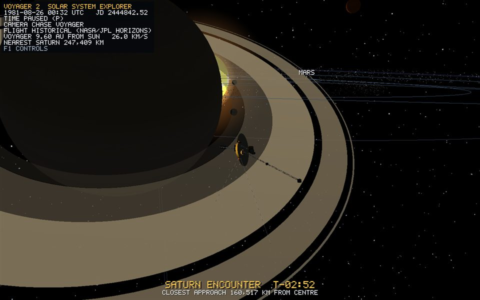

# Planetary rings (Saturn, Uranus, Jupiter, Neptune)

*Runtime capture: Saturn encounter, three hours before closest approach. The B ring is brightest, the Cassini Division is a real gap, and the rings are lit from both sides.*

All four ring systems named in bible section 26 are present: 15 bands in total. The exact annulus vertex equations, index order, normals and winding are in the [Procedural Mesh Construction Handbook](procedural-meshes.md). This page records band radii, transforms, materials and limits.

## Geometry generation

`RingGenerator::generate(inner, outer, 128)` builds a flat, double-sided annulus in the local XZ plane. It has 128 radial segments, and each face is generated twice with opposite normals and winding, so back-face culling never removes a ring seen from below. Each named band is its own `SceneObject` child of the planet. Real gaps, such as the Cassini Division, are therefore missing geometry, not a darker colour.

Radii are in units of the planet's own radius, so a ring needs no scale of its own: `planet.worldMatrix()` supplies the planet's scale and tilt.

## Transform

A ring is a child of its `CelestialBody`. It inherits the planet's position, the display radius from its scale, and the axial tilt, which puts the rings in the equatorial plane: 26.7 degrees for Saturn and 97.8 degrees for Uranus. It does **not** inherit the planet's spin, which is applied only to the planet's own mesh ([orbital-motion.md](orbital-motion.md)).

## Bands

Radii are in km divided by the planet's radius. Opacity below 1 makes a band translucent.

**Saturn** (58,232 km):

| Band | Inner | Outer | Colour | Opacity |
| --- | ---: | ---: | --- | ---: |
| D | 1.110 | 1.236 | dim grey-brown | 0.35 |
| C | 1.239 | 1.527 | medium | 0.70 |
| B | 1.527 | 1.951 | brightest cream | 0.97 |
| *Cassini Division* | 1.951 | 2.027 | *gap* | - |
| A | 2.027 | 2.269 | tan | 0.90 |
| F | 2.320 | 2.334 | thin, bright | 0.80 |

**Uranus** (25,362 km). These are narrow, dark, carbon-rich rings. The table shows five of the 13 named rings:

| Band | Inner | Outer | Opacity |
| --- | ---: | ---: | ---: |
| 6/5/4 group | 1.648 | 1.662 | 0.80 |
| alpha | 1.750 | 1.760 | 0.80 |
| beta | 1.786 | 1.796 | 0.80 |
| gamma/eta/delta group | 1.860 | 1.876 | 0.80 |
| epsilon | 2.000 | 2.020 | 0.90 |

**Jupiter** (69,911 km). Tenuous dust:

| Band | Inner | Outer | Opacity |
| --- | ---: | ---: | ---: |
| halo | 1.40 | 1.71 | 0.12 |
| main | 1.72 | 1.81 | 0.28 |

**Neptune** (24,622 km). Faint dust:

| Band | Inner | Outer | Opacity |
| --- | ---: | ---: | ---: |
| Galle | 1.69 | 1.73 | 0.18 |
| Le Verrier | 2.14 | 2.16 | 0.30 |
| Adams | 2.53 | 2.55 | 0.35 |

Moon orbits start at 3.85 parent radii ([scale-manager.md](scale-manager.md)), outside every band. Voyager's Saturn pass is drawn at 3.16 radii, just outside the F ring.

## Material mapping

The bands use flat colour with no texture, and the `LitTwoSided` shading model ([lighting.md](lighting.md)). Diffuse lighting uses `|n·l|`, so both faces are lit as a translucent ring would be. Translucent bands are drawn after opaque geometry with alpha blending and no depth writes. The earlier decision to leave out Jupiter's and Neptune's rings came from opaque unlit annuli looking falsely prominent. With low opacity and lighting they now read as faint dust, as they should.

## Limitations

- Brightness is flat within a band: there are no radial texture, spokes or Adams-ring arcs.
- The planet casts no shadow on its rings.
- Translucent bands are not depth-sorted against each other. Bands do not overlap, so this is invisible in practice.

## Verification

1. The startup log reads `[SCENE] ring systems attached: Saturn (5 bands, Cassini Division gap), Uranus (5), Jupiter (2 faint), Neptune (3 faint)`.
2. Focus Saturn with `Tab`. Stars show through the Cassini Division and the rings are lit from above and below.
3. Focus Uranus. Thin dark rings stand almost vertical, matching its tilt.
4. Focus Jupiter and Neptune. Faint translucent rings are visible and do not hide the planet.
