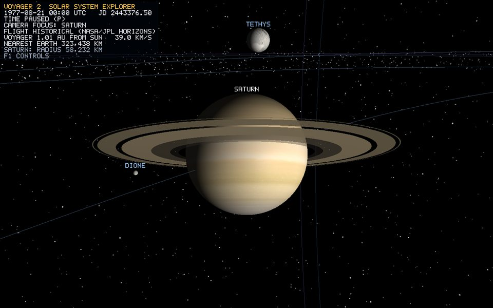

# Saturn

*Annotated runtime capture: `Tab` Focus view of Saturn at launch date 1977-08-21, Sun lighting on, labels and HUD visible (`Voyager-2.exe --capture-bodies <dir>`).*

## Overview

`Saturn` is a `CelestialBody` (Planet) registered by `SolarSystem` as a scene root. It draws with the one shared 32x64 UV-sphere `Mesh` ([uv-sphere.md](uv-sphere.md)); this page covers only what is specific to Saturn: scale, motion, physical data, material and verification.

## Geometry generation

None of its own. Saturn contributes zero unique vertices: all 26 bodies share one sphere upload (2,145 vertices, 3,968 triangles, bible F9). The derivation of every vertex, UV, index and the duplicated seam column is in [uv-sphere.md](uv-sphere.md).

## Vertex attributes / triangle construction

Unchanged shared layout: `position` (location 0), `normal` (1), `texCoord` (2), counter-clockwise triangles — see [uv-sphere.md](uv-sphere.md) and [phase-2-rendering-pipeline.md](phase-2-rendering-pipeline.md).

## Transform

- Scale: `1.8860` = 0.50 x (58,232.0 / 6,371)^0.60 (`ScaleManager::radiusToRenderUnits`, [scale-manager.md](scale-manager.md)).
- Rotation: `angleAxis(26.73 deg, +Z)` — the axial tilt only. That tilted frame is inherited by moons and rings; the spin is applied to the sphere alone in `CelestialBody::render`, so children are never dragged round once per Saturn day.
- Spin: `2 pi / (10.656 h x 3600) x 3600` rad per simulated second (1 simulated hour per real second at 1x); negative period = retrograde.

## Motion

Date-driven, not animated: every frame `updateEphemerisPositions` samples `assets/trajectory/planets/saturn_heliocentric.csv` (NASA/JPL Horizons state vectors, cubic Hermite interpolation) at the shared `SimulationClock` Julian Date and maps it with `Trajectory::mapHeliocentricToRender` — direction preserved, distance compressed to `12 x (r_AU / 0.387098)^0.55` ([mission-ephemeris.md](mission-ephemeris.md)). The same date places Voyager 2, so encounters line up by construction.

Worked example (launch, JD 2443376.5): ecliptic `(-7.1329, 5.7773, 0.1824)` AU, distance `9.1809` AU, scene axes `(x, z, y)`, render distance `68.465`, world position `(-53.192, 1.361, 13.083)`.

Its orbit guide is the osculating two-body ellipse through its 1987-07-15 Horizons state, mapped with the same law ([orbit-rings.md](orbit-rings.md)).

## Worked vertex example

Local equator vertex `(1, 0, 0)` -> scale `1.8860` -> tilt 26.73 deg about +Z -> `(1.6845, 0.8483, 0)` (spin 0) -> plus the body position. That sum is the world vertex. Every matrix is double precision until `Renderer::submit` subtracts the camera position and narrows to float.

## Physical data

Source: NASA Planetary Fact Sheets (https://nssdc.gsfc.nasa.gov/planetary/factsheet/); positions of planets from NASA/JPL Horizons.

- Radius: 58,232.0 km
- Semi-major axis: 1,433,530,000 km
- Eccentricity: 0.0565
- Orbital period: 10,759.22 days
- Rotation period: 10.656 hours
- Axial tilt: 26.73 degrees

## Material mapping

- Texture file: `assets/textures/bodies/saturn.jpg` (2048x1024, loaded via `Texture2D::loadFromFile` → `stb_image` decode → `glTexImage2D`)
- Source and credit: Solar System Scope free 2k texture pack, CC BY 4.0 (https://www.solarsystemscope.com/textures/)
- Shading: `Lit`, `gas` preset: specular strength 0.06, power 10, ambient 0.07, no lighting maps (cloud tops have no relief). Lit by the Sun point light (plus the optional headlamp and fill) in whichever technique `F3` selects (default Blinn-Phong) — [lighting.md](lighting.md). `K` toggles lighting off to show the raw texture; `F8` toggles the maps.
- Shadows: every fragment traces a soft shadow ray to the Sun through all body spheres and ring bands, so this body both casts and receives eclipse shadows (`F4`: off, hard, soft). In the ray-traced view (`F9`) it is an exact analytic sphere — [ray-tracing.md](ray-tracing.md).
- UVs come from the shared sphere generator; swapping the texture changes no vertex data.

## Limitations

- Radius is power-law compressed (size order preserved, absolute ratios not); see [scale-manager.md](scale-manager.md).
- Perfect sphere: no oblateness. Shadows come only from the Sun; the headlamp and fill cast none.

## Verification

- Startup log: `[SCENE] 26 bodies share 1 sphere mesh (2145 vertices, 3968 triangles), 26 real texture maps loaded`.
- Startup log: `[TRAJECTORY] loaded ... state vectors from assets/trajectory/planets/saturn_heliocentric.csv`.
- Visual: `Tab` until the HUD shows `CAMERA FOCUS: SATURN`; the camera flies in on the day side and the label reads `SATURN`. Wheel zooms to the surface, drag orbits, `W` leaves into free flight.
