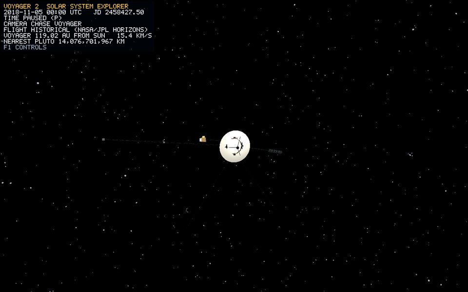

# Background starfield

*Runtime capture: bookmark `6`, Voyager at 119 AU. Three brightness layers of stars surround the camera wherever it goes.*

The exact point-position equation is also collected in the [Procedural Mesh Construction Handbook](procedural-meshes.md).

## Overview

The background is three camera-centred point layers owned by `Application` (`m_backgroundLayers`), not by the scene. They are drawn first each frame by `Renderer::submitBackground` with depth writes off. Their radius is therefore irrelevant: every planet, ring and line draws in front of them, and they never move relative to the camera (bible section 30).

## Geometry generation

`StarfieldGenerator::generate(count, 5000, seed)` places points uniformly on a sphere by sampling `theta` uniformly and `cos(phi)` uniformly in [-1, 1]. Sampling `phi` directly would bunch points at the poles. Each layer has a fixed seed, so the sky is deterministic.

| Layer | Count | Colour | Seed |
| --- | ---: | --- | ---: |
| faint | 5,200 | (0.34, 0.35, 0.40) | 11 |
| medium | 1,800 | (0.66, 0.66, 0.72) | 23 |
| bright | 380 | (1.00, 0.97, 0.92) | 37 |

Three independent layers give a magnitude distribution with many faint stars and few bright ones, without adding a per-vertex colour attribute.

## Vertex attributes / primitives

Standard `Vertex` (normal and UV unused). The indices are `0..count-1` drawn as `GL_POINTS`, and `default.vert` writes `gl_PointSize = 2` (with `GL_PROGRAM_POINT_SIZE` enabled).

## Transform

`submitBackground` uses an identity model matrix. In the floating-origin frame ([lighting.md](lighting.md)), the origin is the camera, so the shell is always centred on the eye.

## Material

`Unlit` flat colour.

## Limitations

- The stars are random, not a real catalogue: there are no constellations and no Milky Way band.
- All points are the same pixel size.

## Verification

1. The startup log reports `7,380-star background`.
2. Fly in any direction at full speed. The stars stay fixed and never streak or thin out, even beyond the Oort cloud.
3. Planets and lines always draw in front of the stars.
