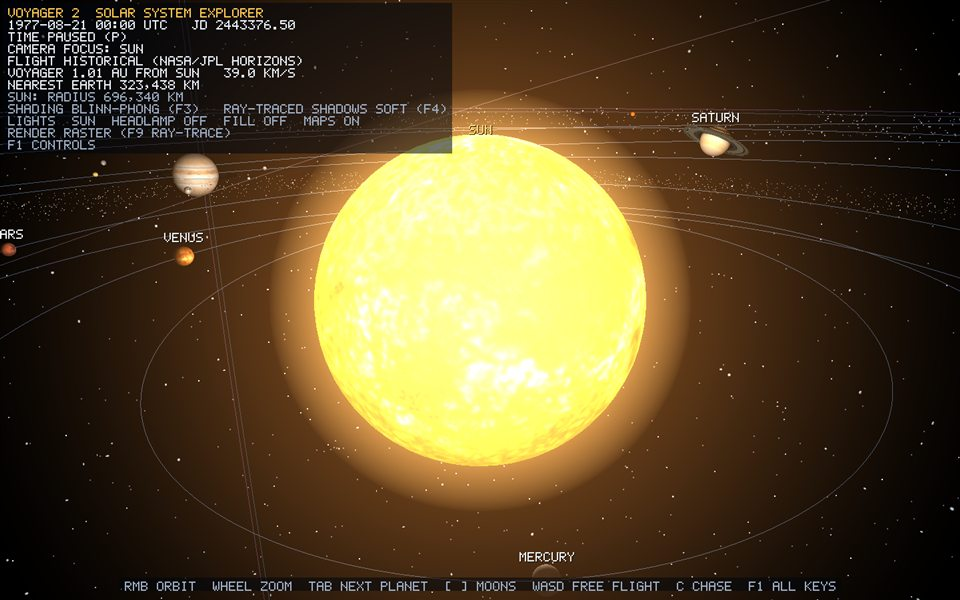

# Sun

*Annotated runtime capture: `Tab` Focus view of Sun at launch date 1977-08-21, Sun lighting on, labels and HUD visible (`Voyager-2.exe --capture-bodies <dir>`).*

## Overview

`Sun` is a `CelestialBody` (Star) registered by `SolarSystem` as a scene root. It draws with the one shared 32x64 UV-sphere `Mesh` ([uv-sphere.md](uv-sphere.md)); this page covers only what is specific to Sun: scale, motion, physical data, material and verification.

## Geometry generation

None of its own. Sun contributes zero unique vertices: all 26 bodies share one sphere upload (2,145 vertices, 3,968 triangles, bible F9). The derivation of every vertex, UV, index and the duplicated seam column is in [uv-sphere.md](uv-sphere.md).

## Vertex attributes / triangle construction

Unchanged shared layout: `position` (location 0), `normal` (1), `texCoord` (2), counter-clockwise triangles — see [uv-sphere.md](uv-sphere.md) and [phase-2-rendering-pipeline.md](phase-2-rendering-pipeline.md).

## Transform

- Position: `(0.0, 0.0, -30.0)`, fixed; every heliocentric mapping is centred here.
- Scale: `6.00` — the one display-capped radius. The shared radius law ([scale-manager.md](scale-manager.md)) would give 8.4 units and crowd Mercury's 12-unit orbit.
- Children: `sun_corona` (scale 1.25) and `sun_halo` (scale 2.6), additive `Glow` shells that inherit the Sun's scale ([lighting.md](lighting.md)).

## Motion

The Sun does not move. It is the point light for every lit material ([lighting.md](lighting.md)).

## Worked vertex example

Local `(1, 0, 0)` -> scale `6.00` -> `(6.00, 0, 0)` -> tilt 7.25 deg about +Z -> `(5.952, 0.7572, 0)` -> translate -> world `(5.9520, 0.7572, -30.0000)`. Renderer then subtracts the camera position in double precision before narrowing to float (floating origin, [phase-2-rendering-pipeline.md](phase-2-rendering-pipeline.md)).

## Physical data

Source: NASA Planetary Fact Sheets (https://nssdc.gsfc.nasa.gov/planetary/factsheet/); positions of planets from NASA/JPL Horizons.

- Radius: 696,340.0 km
- Rotation period: 587.28 hours
- Axial tilt: 7.25 degrees

## Material mapping

- Texture file: `assets/textures/bodies/sun.jpg` (2048x1024, loaded via `Texture2D::loadFromFile` → `stb_image` decode → `glTexImage2D`)
- Source and credit: Solar System Scope free 2k texture pack, CC BY 4.0 (https://www.solarsystemscope.com/textures/)
- Shading: `Unlit` (emissive preset): the Sun is the light source itself, so its texture is shown at full brightness, surrounded by two additive glow shells — [lighting.md](lighting.md). In the ray-traced view (`F9`) it is an emissive sphere with an analytic glow — [ray-tracing.md](ray-tracing.md).
- UVs come from the shared sphere generator; swapping the texture changes no vertex data.

## Limitations

- Radius is power-law compressed (size order preserved, absolute ratios not); see [scale-manager.md](scale-manager.md).
- Perfect sphere: no oblateness. Shadows come only from the Sun; the headlamp and fill cast none.

## Verification

- Startup log: `[SCENE] 26 bodies share 1 sphere mesh (2145 vertices, 3968 triangles), 26 real texture maps loaded`.
- Visual: `Tab` until the HUD shows `CAMERA FOCUS: SUN`; the camera flies in on the day side and the label reads `SUN`. Wheel zooms to the surface, drag orbits, `W` leaves into free flight.
