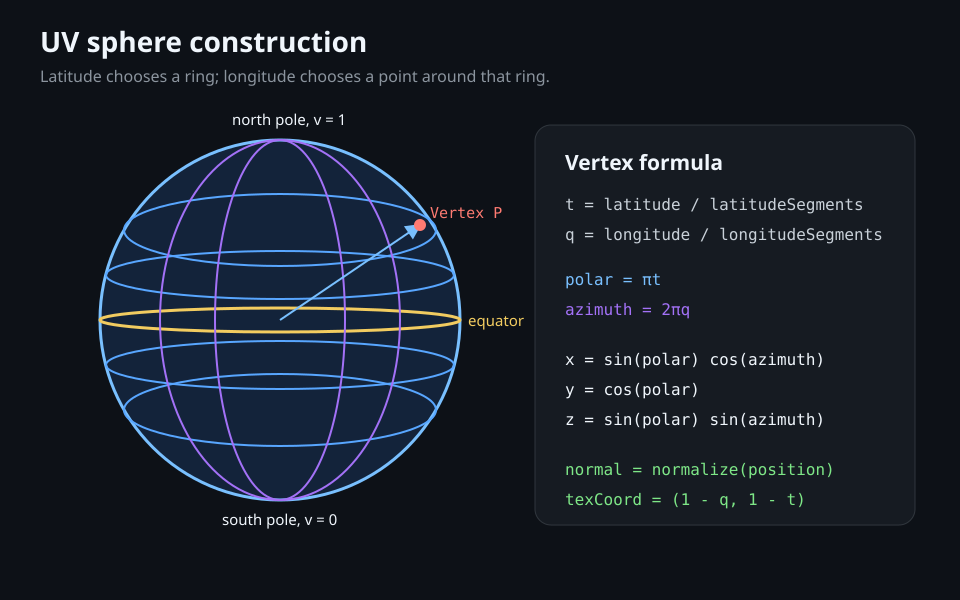
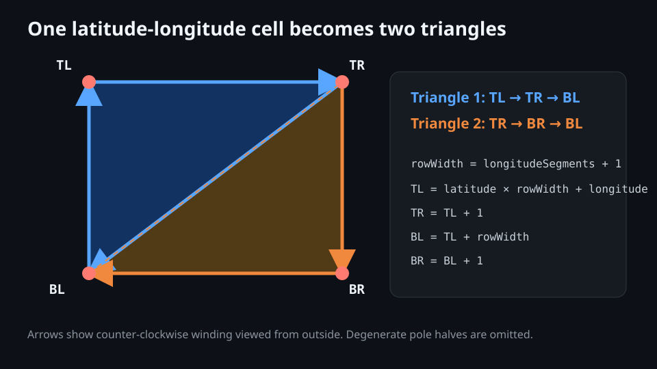

# UV Sphere: Vertices and Triangles

All Phase 2 bodies share one unit-radius UV sphere generated by [`UvSphereGenerator.cpp`](../../src/rendering/UvSphereGenerator.cpp). The generator is CPU-only: it returns `MeshData`, while `Mesh` owns the OpenGL upload. This keeps geometry mathematics testable and independent of a graphics context.



## Vertex Position

The current call uses 32 latitude segments and 64 longitude segments. For grid coordinates `lat ∈ [0,32]` and `lon ∈ [0,64]`:

```text
t = lat / 32                 polar = πt
q = lon / 64                azimuth = 2πq
x = sin(polar) cos(azimuth)
y = cos(polar)
z = sin(polar) sin(azimuth)
position = (x,y,z)
texture UV = (1-q, 1-t)
```

Examples: `(lat=0, any lon)` is the north pole `(0,1,0)`; `(16,0)` is `(1,0,0)`; `(16,16)` is `(0,0,1)`; and `(32, any lon)` is the south pole `(0,-1,0)`, apart from tiny floating-point error.

The grid has `(32+1)(64+1) = 2,145` vertices. The extra longitude column duplicates the seam's positions: `lon=0` has `u=1`, while `lon=64` has `u=0`. A single vertex cannot carry both UV values, so this duplication prevents the texture from interpolating across the whole image at the wrap seam. Pole positions are also duplicated per longitude so every wedge can receive the correct UV.

## Normal and Texture Coordinate

The sphere is unit radius, so its outward smooth normal is simply `normalize(position)`. UV is `(1-q, 1-t)`: reversing longitude makes increasing map `u` follow geographic east on the outside surface instead of mirroring the continents. `v` moves from south (`0`) to north (`1`). The image is vertically flipped during loading, reconciling top-first JPEG rows with OpenGL's bottom-left texture origin.

## Indexed Triangles

Each ordinary grid cell names four vertex indices, where `rowWidth = 65`:

```text
TL = lat*65 + lon       TR = TL + 1
BL = TL + 65            BR = BL + 1
triangle A = TL, TR, BL
triangle B = TR, BR, BL
```



The order is counter-clockwise when viewed from outside, matching `glFrontFace(GL_CCW)`. Back faces are culled. At the north pole, triangle A would contain two coincident pole positions, so it is omitted. At the south pole, triangle B is omitted for the same reason. Therefore:

```text
triangles = 2 × longitudeSegments × (latitudeSegments - 1)
          = 2 × 64 × 31 = 3,968
indices   = 3 × 3,968 = 11,904
```

Generation performs fail-fast validation: exact counts, unit-length positions/normals, UVs in `[0,1]`, in-range indices, non-zero triangle area, and eastward UV orientation. Those checks run once during scene construction, not per frame.
