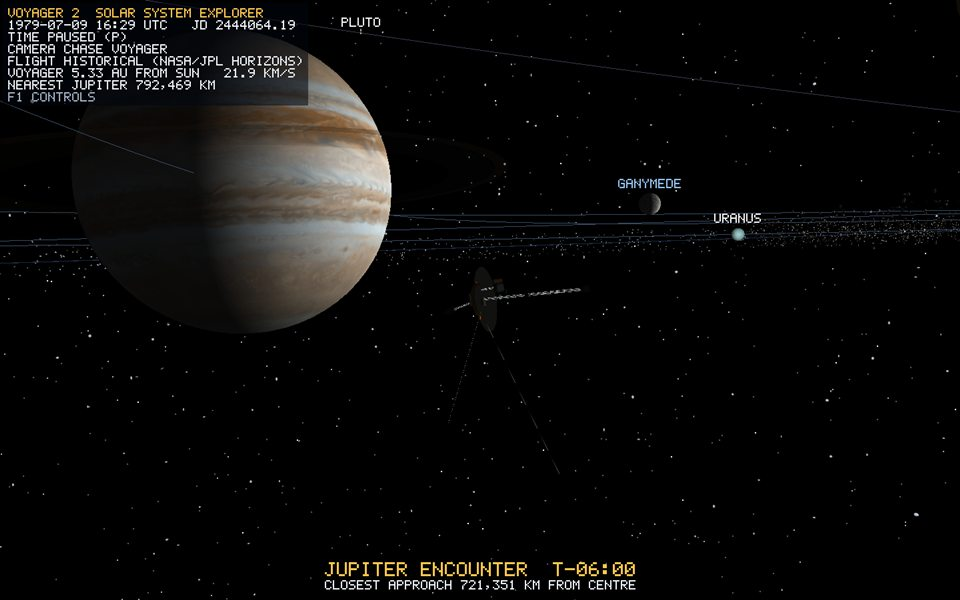

# Voyager 2 spacecraft

## Overview

`voyager2` is a procedural, from-scratch model built by `VoyagerModelBuilder`. The application does **not** load NASA's downloadable glTF/USDZ model. NASA's model, spacecraft pages, diagrams, and the two local reference images are used only to establish proportions and component layout; the sourced facts and exact links are collected in [the research note](../research/voyager-2-spacecraft-reference.md).

The root is one `Voyager2` scene object. Its visible children include a decagonal bus, true parabolic high-gain antenna, feed supports and low-gain antenna, three separate lattice booms, a finned three-RTG assembly, science scan platform and instruments, two cameras, magnetometer packages, the Golden Record, radiator/calibration panels, two 10 m plasma-wave antennas, and 16 attitude-control thruster nozzles. All parts inherit the root transform, so manual or historical motion moves one coherent spacecraft.



*Runtime capture: the procedural spacecraft lit by the Sun, chase camera facing Jupiter. The dish, the RTG and magnetometer booms and the science platform are all visible.*

## Real dimensions and display scale

`ScaleManager::spacecraftSizeToRenderUnits` uses one linear factor of `0.002 render units / metre`. This scale is independent of planet radius and interplanetary distance, but ratios inside the spacecraft are real:

| Component | Source size | Render size |
| --- | ---: | ---: |
| High-gain antenna | 3.7 m diameter | 0.0074 diameter |
| Decagonal bus | 1.78 m diameter, 0.47 m deep | 0.00356 diameter, 0.00094 deep |
| Magnetometer boom | 13 m | 0.026 |
| RTG boom | 3.7 m | 0.0074 |
| Science boom | 3.0 m | 0.006 |
| PRA/PWS antennas | 10 m each | 0.02 each |
| RTGs | 0.58 m long, 0.40 m across fin tips | 0.00116 long, 0.0008 across |

The 3.7 m dish is therefore about 2.08 times the 1.78 m bus diameter. No part is enlarged on its own to improve visibility. The chase camera frames the whole probe at 4 bounding radii (bounding radius 9 m = 0.018 units), and logarithmic depth keeps the 2 cm struts stable at any zoom ([lighting.md](lighting.md)).

## Geometry and triangles

All vertices use `Vertex { position, normal, texCoord }`, all surface triangles are counter-clockwise from outside, and no two faces are deliberately coplanar. Rods intersect only at structural joints, where real hardware would also connect; these are volume intersections, not overlapping coplanar triangles. [Procedural Mesh Construction Handbook](procedural-meshes.md) gives the exact vertex equations and index triples for every generator used below.

### Decagonal bus and cylindrical hardware

`CylinderGenerator` makes the 10-sided bus, feed/LGA bodies, camera barrels, RTG cores, thin rods, and thruster frusta. A capped straight cylinder or frustum with `n` radial segments has `4n+6` vertices, `2n` side triangles, and `2n` cap triangles. A frustum uses the same topology with different end radii. Repeated parts share uploaded meshes where their dimensions match.

### Parabolic high-gain antenna

`ParabolicDishGenerator` uses 48 angular segments and 8 radial rings. For radial fraction `t = ring / 8`:

```text
r = radius * t
y = -depth + depth * t^2
x = r * cos(theta)
z = r * sin(theta)
```

That equation produces a paraboloid, not the old capped cone. The front and rear surfaces are separated by a real thickness and joined only at the rim, so the shell is watertight without coincident faces. Each surface has one center vertex plus `8 * (48 + 1)` ring vertices. One 48-triangle fan covers the center and seven rings of 96 triangles connect outward. Front, rear, and rim together total 1,536 triangles. The `+1` seam vertex carries the distinct `u=1` coordinate required beside `u=0`.

### Boxes and panels

`BoxGenerator` creates 24 vertices and 12 triangles: four independent vertices per face, two triangles per face, six faces. Position-sharing across an edge is deliberately not vertex-sharing because the adjoining faces need different normals and UVs. The unit box mesh is shared and scaled into instrument packages, panels, magnetometers, the scan platform, and each RTG fin.

### Lattice booms

For endpoints `S,E`, `axis=normalize(E-S)`. A reference vector is `(0,1,0)` unless the axis is almost vertical, then `(1,0,0)`. The perpendicular basis is `sideA=normalize(cross(axis,reference))`, `sideB=normalize(cross(axis,sideA))`. Three rail offsets form an equilateral triangle:

```text
o0 = halfWidth*sideA
o1 = halfWidth*(-0.5*sideA + 0.866025403784*sideB)
o2 = halfWidth*(-0.5*sideA - 0.866025403784*sideB)
```

`buildTriangularTruss` first places the three rails from `S+oi` to `E+oi`. For every bay `[t0,t1]` and each triangular face `rail -> (rail+1)%3`, it adds one brace. `(bay+rail)%2` selects which diagonal direction, creating the alternating lattice without doubled rods. Every rod is a capped six-sided cylinder with 30 vertices and 24 triangles, rotated from local `+Y` onto its endpoint direction and translated to its midpoint. A truss with `b` bays therefore contains `3+3b` rods and `72+72b` triangles.

### Finned RTGs

Three cylindrical cores are placed end-to-end beyond the 3.7 m RTG boom. Each gets six longitudinal radial box fins, matching the six-fin NASA construction. All cores and 18 fins are merged into one CPU `MeshData` and one GPU mesh/draw submission.

At startup the `[VOYAGER]` diagnostic prints the final visible-assembly and rendered-triangle counts. This is the number to quote during inspection; it is generated from the exact current build rather than duplicated as a stale constant here.

### Exact triangle inventory in the submitted model

| Assembly | Copies/detailed construction | Triangles |
| --- | --- | ---: |
| Decagonal bus | capped 10-segment cylinder: `4*10` | 40 |
| High-gain antenna | 48×8 front/back paraboloid plus rim | 1,536 |
| Feed horn | capped 12-segment frustum | 48 |
| Low-gain antenna | capped 12-segment frustum | 48 |
| Three feed supports | 3 capped 5-segment rods, 20 each | 60 |
| Radiator, electronics bay, calibration target | 3 boxes, 12 each | 36 |
| Golden Record | capped 24-segment cylinder | 96 |
| Magnetometer boom | 18 bays: 57 six-sided rods × 24 | 1,368 |
| Two magnetometer packages | 2 boxes × 12 | 24 |
| RTG boom | 7 bays: 24 six-sided rods × 24 | 576 |
| Three RTGs | 3 twelve-sided cores × 48 + 18 box fins × 12 | 360 |
| Science boom | 5 bays: 18 six-sided rods × 24 | 432 |
| Scan platform and two spectrometers | 3 boxes × 12 | 36 |
| Two camera barrels | 2 capped 12-segment cylinders × 48 | 96 |
| Two PRA/PWS elements | 2 capped 5-segment rods × 20 | 40 |
| Sixteen thruster nozzles | 16 capped 8-segment frusta × 32 | 512 |
| **Total** | **37 visible scene assemblies** | **5,308** |

The total counts actual submitted triangles, including repeated `SceneObject`s that share one GPU mesh. For example, the thruster mesh is uploaded once but drawn at 16 transforms, so it contributes `16*32=512` visible triangles.

## Component hierarchy and transforms

The physical HGA boresight is local `-Z`; project flight heading is local `+Z`. The bus cylinder is rotated from the generator's `+Y` axis onto `+Z`, while the dish is rotated so its concave face opens toward `-Z`. Its feed and low-gain antenna continue outward on that same axis. In the following formulas `u(m)=0.002m`, bus radius `B=u(1.78)/2=0.00178`, bus depth `H=u(0.47)=0.00094`, dish radius `R=u(3.7)/2=0.0037`, and dish-rim coordinate `Zr=-H/2-u(0.10)=-0.00067`.

| Part | Exact local placement / size before root motion |
| --- | --- |
| Bus | center `(0,0,0)`, radius `B`, depth `H`, rotate `+Y` axis 90° about `+X` onto `+Z` |
| Dish | center `(0,0,Zr)`, radius `R`, depth `u(0.38)=0.00076`, thickness `u(0.045)=0.00009`, rotate -90° about `+X` |
| Feed | center `(0,0,Zr-u(0.72))`; radii `u(0.07),u(0.16)`, length `u(0.30)` |
| Low-gain antenna | center `(0,0,Zr-u(0.96))`; radii `u(0.10),u(0.025)`, length `u(0.20)` |
| Feed support `i` | from `(0.68R*cos(2*pi*i/3),0.68R*sin(2*pi*i/3),Zr-u(0.02))` to feed center |
| Magnetometer boom | start `(B,u(0.12),u(0.08))`; direction `normalize(1,0.10,0.05)`; length `u(13)` |
| Magnetometers | same boom line at `u(7)` and `u(13)` from its start; cubes `u(0.18)` and `u(0.22)` |
| RTG boom | start `(-B,-u(0.12),u(0.04))`; direction `normalize(-1,-0.20,0.05)`; length `u(3.7)` |
| RTG core `g=0..2` | along RTG direction from `u(3.7+0.64g)` to that value plus `u(0.58)`; radius `u(0.14)` |
| RTG fin `f=0..5` | radial angle `2*pi*f/6`; dimensions `u(0.50) × u(0.12) × u(0.025)`; center offset `u(0.14)` from core axis |
| Science boom | start `(0.65B,0.70B,u(0.04))`; end `start+(u(3.0),u(0.30),u(0.15))` |
| PRA/PWS elements | common root `(0,-0.75B,u(0.04))`; directions `normalize(-0.75,-1,0.15)` and `normalize(0.75,-1,-0.15)`; length `u(10)` |
| Thruster cluster `c=0..3` | radial `(cos(c*pi/2),sin(c*pi/2),0)`; four nozzles combine tangent offsets `+/-u(0.055)` and axial offsets `+/-u(0.16)` |

The three major booms start on different bus sides:

- the 13 m magnetometer lattice ends in mid-field and low-field sensor packages;
- the 3.7 m RTG lattice leads to three tandem finned generators;
- the 3.0 m science lattice ends in an asymmetric platform of camera barrels and spectrometer boxes.

The two 10 m PRA/PWS elements share a root below the bus and open into a wide V. Four bus locations each carry four small nozzles, representing all 16 attitude-control thrusters without inventing a main engine.

In Historical mode `Application` places the root every frame from the dated ephemeris (`Voyager2::setHistoricalState`). In Manual mode `Voyager2::update` integrates the inertial velocity. In both modes the root rotation is the quaternion `m_orientation`, and child local transforms compose through `rootWorld * childLocal`.

## Flight and camera

**Historical.** The position comes from `MissionEphemeris::voyagerRenderPosition(date)`. The heading is the direction of motion along the rendered path, eased by quaternion slerp and kept level (the local +Y axis stays as close to world up as possible). See [voyager-trajectory.md](voyager-trajectory.md).

**Manual (six degrees of freedom).** Orientation is a quaternion, and each turn multiplies it on the right, which rotates it about the ship's *own* axes:

```text
turn = angleAxis(yaw * 1.1 dt, +Y) * angleAxis(pitch * 1.1 dt, +X) * angleAxis(roll * 1.6 dt, +Z)
orientation = normalize(orientation * turn)
```

| Key | Effect |
| --- | --- |
| `W` / `S` | velocity += / -= forward x 1.5 x dt (`Shift` x8) |
| `A` / `D` | yaw |
| `R` / `F` | pitch nose up / down |
| `Q` / `E` | roll |
| `Space` / `Ctrl` | velocity along the ship's up axis |
| `X` | braking burn: velocity decreases by up to 3 x dt, never reversing |

Flight is inertial: turning changes attitude, not velocity, and speed is capped at 12 units per second. There is no drag, which is deliberate because space has none, but `X` stops the ship. Entering Manual keeps the current facing, with a gentle drift of up to 0.25 units per second.

**Chase camera.** The orbit rig (`Camera::updateOrbit`) is expressed in Voyager's own frame, so it follows pitch and roll. It opens as a three-quarter rear view. RMB drag or the arrows orbit it, and the wheel zooms from 1.3 bounding radii out to 5,000 units. During a Historical flyby the rig faces the planet instead ([controls.md](controls.md)).

## Materials and assets

The materials are flat colours with Sun lighting (`Lit`, specular 0.35, exponent 24): off-white antenna, gold thermal blanket and bays, metallic trusses, dark instruments and RTGs, and copper thrusters. No image texture or imported geometry is used. The local reference images remain under `images/`, and NASA sources are linked from the research note.

## Verification

1. Rebuild Debug x64 and run from the repository root. The log shows `[VOYAGER] procedural spacecraft built (37 visible assemblies, 5308 rendered triangles)`.
2. At startup the chase view shows the dish, booms and RTGs from behind, lit by the Sun. Zoom in with the wheel until the lattice struts fill the screen. They do not shimmer.
3. Press `V` to switch to Manual. Pitch up with `R`, roll with `Q` and thrust with `W`. The camera follows the roll, every part stays attached to one root, and `X` brings the ship to rest.
4. Press `W` in Historical mode (the camera leaves into free flight), inspect the probe from any side, then press `C` to fly back to the chase view.
