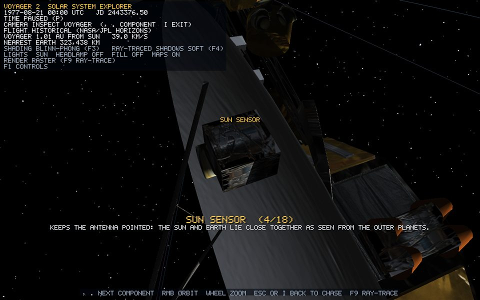
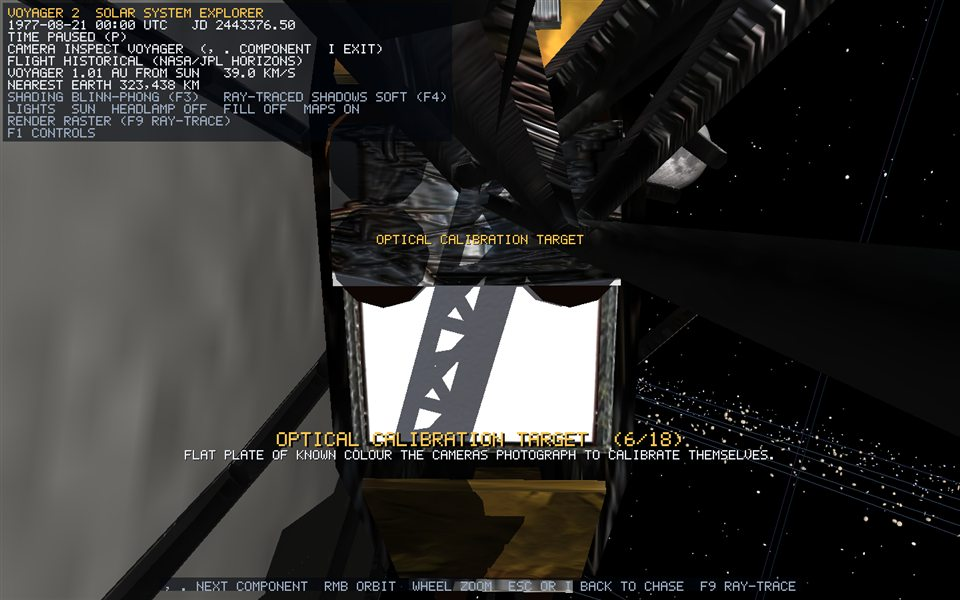
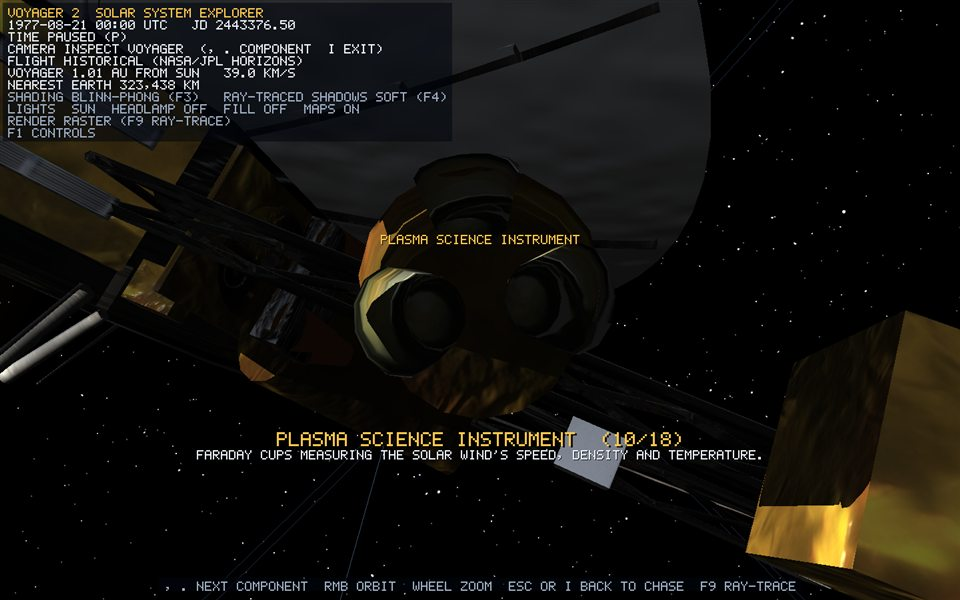
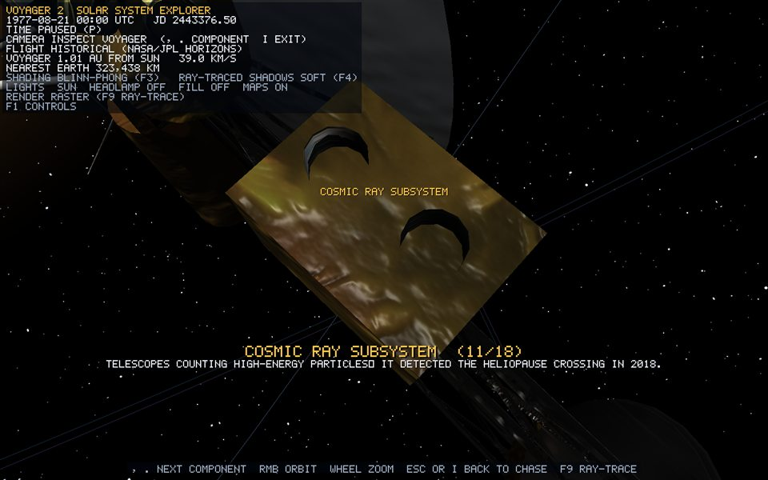
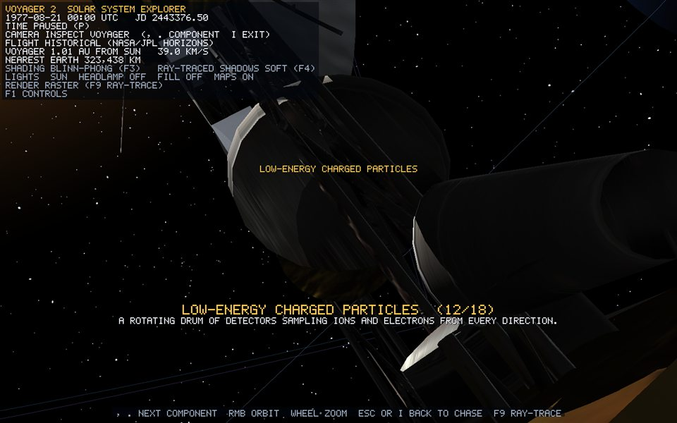
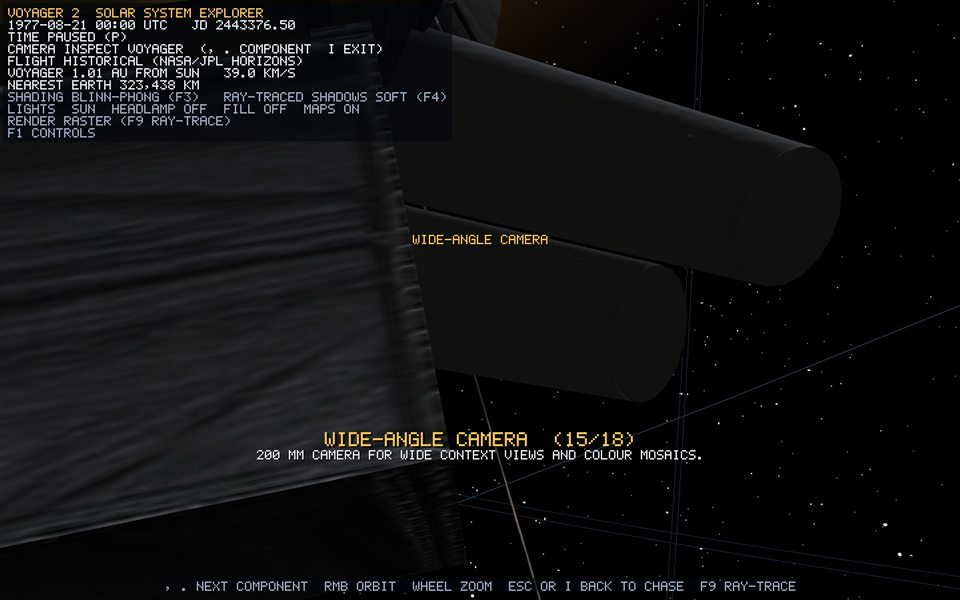
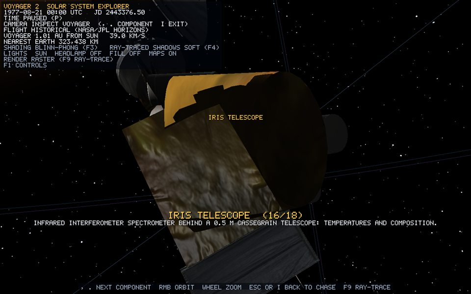
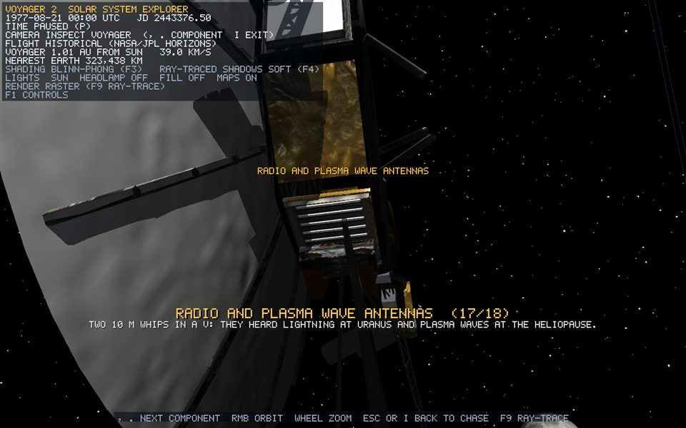
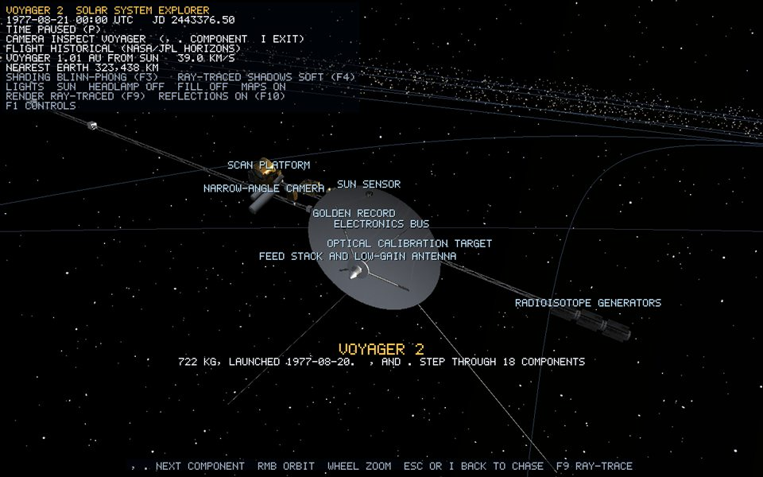

# Voyager 2 spacecraft


*Runtime capture (`--capture-voyager`): the whole craft in Inspect mode, textured with NASA hardware photographs, sunlit with the studio fill.*

## Overview

`voyager2` is a procedural, from-scratch model built by `VoyagerModelBuilder` (src/scene/VoyagerModelBuilder.cpp). The application does **not** load NASA's glTF/USDZ geometry. NASA's model, spacecraft pages and diagrams are used only for proportions and layout (sources in [the research note](../research/voyager-2-spacecraft-reference.md)). The single image taken from NASA is the public-domain texture atlas ([voyager-textures.md](voyager-textures.md)).

The root is one `Voyager2` scene object with **82 child parts** and **11,652 triangles**. All parts inherit the root transform, so historical or manual motion moves one coherent spacecraft. The start-up log prints the exact figures from the current build:

```text
[SHADER] BVH built: 11652 triangles, 8191 nodes, depth 12, 12 materials
[VOYAGER] procedural spacecraft built (82 visible assemblies, 11652 rendered triangles), Historical mode
```

The learning walkthrough is [guide chapter 8](../guide/08-voyager.md). This page is the reference.

## Scale

`ScaleManager::kSpacecraftUnitsPerMetre = 0.006`. Every dimension in the builder is written in real metres through `units(m)`, so the spacecraft's internal proportions are exact. No part is enlarged on its own.

| Component | Source size | Render size |
| --- | ---: | ---: |
| High-gain antenna | 3.7 m diameter, 0.38 m deep | 0.0222 diameter |
| Decagonal bus | 1.78 m across, 0.47 m deep | 0.0107, 0.0028 |
| Magnetometer boom | 13 m | 0.078 |
| RTG boom | 3.7 m | 0.0222 |
| Science boom | 3.0 m | 0.018 |
| PRA/PWS antennas | 10 m each | 0.06 |
| RTG | 0.58 m long, 0.40 m across fins | 0.0035, 0.0024 |
| Bounding radius (camera framing) | 9 m | 0.054 |

## Frame

Boresight (the high-gain antenna's pointing direction) is local **−Z**; flight heading is local **+Z**. The bus is a decagon in the local XY plane. The magnetometer boom points to +X, the RTG boom to −X, the science boom to +X/+Y, and the radio antennas down (−Y). The cylinder generator's +Y axis is turned onto each part's axis with `rotateYTo(axis)`.

## Components and construction

`component(name, fact, centre, size)` registers 18 inspectable components (`Voyager2::Component`). `add(part, meshData)` attaches each part to the root **and** adds its triangles to Voyager's ray-tracing BVH, so the two can never disagree.

| # | Component | Construction | Finish |
| --- | --- | --- | --- |
| 1 | Electronics bus | `CylinderGenerator(R, R, 0.47 m, 10)` rotated onto +Z; 10 bay blankets (boxes at apothem `R·cos 18°`, width `2R·sin 18° × 0.86`); 2 louvre strips on each gold bay; 3 launch-adapter feet | darkMetal; gold, dark-gold and black blankets; louvres; aluminium |
| 2 | High-gain antenna | `ParabolicDishGenerator(1.85 m, 0.38 m, 0.045 m, 64, 12)`, rim at `z = −busDepth/2 − dishDepth − 0.04 m`; 12 ribs × 6 rods following `z = rim + depth(1 − x²) + 0.06 m`; 4 feed struts | whitePaint, aluminium |
| 3 | Feed stack and low-gain antenna | X-band feed frustum, subreflector disc, S-band feed, LGA cone on −Z | darkMetal, whitePaint, aluminium |
| 4 | Sun sensor | box + aperture on the dish rim | darkMetal, lens |
| 5 | Golden Record | 0.31 m disc (32 segments) + hub on bus face 0 | recordGold, aluminium |
| 6 | Optical calibration target | 0.42 × 0.34 m plate on bus face 5 | calibrationPanel |
| — | Shunt radiator | 0.46 × 0.38 m plate on bus face 7 | radiatorBlue |
| 7 | Magnetometer boom | canister + `buildTriangularTruss` 13 m, 26 bays | darkGoldFoil, aluminium |
| 8 | Low-field magnetometer (tip) | sensor boxes at 0.9 m and 1.4 m (high-field), 10 m and 13 m (low-field) | whitePaint |
| 9 | Radioisotope generators | 3.7 m truss (9 bays); 3 cores (16 sides, r 0.10 m, 0.58 m) with 6 fins each (unit box with a basis matrix) and end flanges | darkMetal, aluminium |
| 10 | Plasma science | cylinder + 3 Faraday-cup frustums | goldFoil, lens |
| 11 | Cosmic ray subsystem | box + 2 telescopes | goldFoil, darkMetal |
| 12 | Low-energy charged particles | drum + platform | darkGoldFoil, aluminium |
| 13 | Scan platform | box + actuator at the science-boom tip; UVS box; photopolarimeter | darkGoldFoil, blackBlanket, aluminium |
| 14 | Narrow-angle camera | 0.95 m barrel + lens | whitePaint, lens |
| 15 | Wide-angle camera | 0.50 m barrel + lens | whitePaint, lens |
| 16 | IRIS telescope | 0.52 m-wide barrel + mirror | goldFoil, lens |
| 17 | Radio and plasma wave antennas | two 10 m rods in a V + root box | aluminium, goldFoil |
| 18 | Attitude thrusters | 4 blocks, 16 copper nozzle frustums (one shared mesh) | darkMetal, copper |

| | | |
| --- | --- | --- |
|  |  |  |
|  |  |  |
|  | .jpg>) |  |
|  |  |  |
|  |  |  |
|  |  |  |

## Geometry details

All vertices use `Vertex { position, normal, texCoord }`, and every surface triangle is counter-clockwise from outside. Exact vertex and index equations for each generator are in [procedural-meshes.md](procedural-meshes.md) and [guide chapter 2](../guide/02-geometry.md).

- **Boxes**: one shared unit-cube mesh (24 vertices, 12 triangles), scaled per part.
- **Cylinders and frustums**: `4n + 6` vertices and `4n` triangles for n segments with both caps.
- **Dish**: 64 segments × 12 rings, front and back surfaces `thickness` apart, joined at the rim: a closed shell.
- **Rods** (`appendRod`): a capped 6-sided cylinder turned onto `end − start` and translated to the midpoint.
- **Trusses** (`buildTriangularTruss`): 3 rails at 120° (`sideA`, `−½sideA ± (√3/2)sideB`) and one alternating diagonal per face per bay, giving `3 + 3·bays` rods.
- **Merged assemblies** (`appendTransformed`): ribs, feet, struts, trusses, RTGs and antennas are baked into one `MeshData` each, with positions transformed, normals transformed by the inverse-transpose, and indices re-based.

## Materials, lighting and ray tracing

- 11 finishes sample rectangles of the NASA atlas through `Material::uvTransform`; copper is untextured ([voyager-textures.md](voyager-textures.md)). A normal map is derived from the atlas.
- Every finish is `Lit`, with its own specular strength and power (0.12/10 for black blanket up to 0.90/120 for lenses), and `selfShadowing = true`.
- **All five shading techniques** apply ([lighting.md](lighting.md)); Voyager is shot in each for the shading comparison images.
- **Self-shadowing**: in the raster pass, each Voyager fragment traces a shadow ray through Voyager's own BVH (bias 2e-5), so the dish shades the bus and booms cast shadows. The same ray tests planets and rings, so Voyager darkens in a planet's shadow.
- **Ray-traced view** (F9): Voyager is traced as triangles, textured through the BVH material palette, shadowed, and its foil and metal reflect `specular × 0.3` of the scene ([ray-tracing.md](ray-tracing.md)).

| Raster | Ray-traced |
| --- | --- |
|  |  |

## Flight

**Historical** (default). The position comes from `MissionEphemeris::voyagerRenderPosition(date)` ([voyager-trajectory.md](voyager-trajectory.md)). The heading comes from a central difference along the rendered path. `setHistoricalState` eases the orientation with `slerp(current, target, 0.2)` and keeps local +Y as close to world up as possible.

**Manual** (six degrees of freedom, `V`). Orientation is a quaternion, and turns multiply on the right, which rotates about the ship's own axes:

```text
turn = angleAxis(yaw·1.1·dt, +Y) · angleAxis(pitch·1.1·dt, +X) · angleAxis(roll·1.6·dt, +Z)
orientation = normalize(orientation · turn)
```

| Key | Effect |
| --- | --- |
| `W` / `S` | velocity ± forward × 1.5 × dt (`Shift` × 8) |
| `A` / `D`, `R` / `F`, `Q` / `E` | yaw, pitch, roll |
| `Space` / `Ctrl` | velocity along the ship's up axis |
| `X` | braking burn; never reverses |

Flight is inertial and capped at 12 units per second.

## Cameras

- **Chase** (`C`): the orbit rig in Voyager's frame, from 1.3 bounding radii out to 5,000 units. During a flyby it faces the planet.
- **Inspect** (`I` or a click on Voyager): orbits one component in Voyager's frame, down to 0.3 of its size. `.` and `,` step through the 18 components. It opens on the sunlit side and turns on the studio fill. A caption shows the name and fact, and labels mark every component ([controls.md](controls.md), [hud-overlay.md](hud-overlay.md)).

## Limitations

- Geometry is an engineering approximation from public diagrams, not CAD. Cabling, hinges and blanket seams are omitted.
- The scan platform does not articulate, and the booms are always deployed (even at launch).
- Atlas regions are stretched to each part's UVs, so texture density varies between parts.

## Verification

1. Run from the repository root. The log shows the BVH and `[VOYAGER]` lines above.
2. Press `I`. The whole craft fills the screen, sunlit. Press `.` repeatedly: the caption steps through all 18 components and the camera frames each. Zoom in on the narrow-angle lens with the wheel; nothing shimmers.
3. `F3` through the five techniques: facets in Flat, lost highlights in Gouraud, rim ink in Toon.
4. On the High-gain antenna component, turn the view until the Sun is behind the dish: the bus is in the dish's shadow. `F4` off: the shadow disappears.
5. `F9`: the ray-traced craft matches the raster one; `F10` toggles reflections in the foil.
6. `V`, then pilot with `W`/`A`/`R`/`Q`; `X` stops; `V` returns to the historical position.
7. `x64\Release\Voyager-2.exe --capture-voyager <dir>` regenerates the component images.
