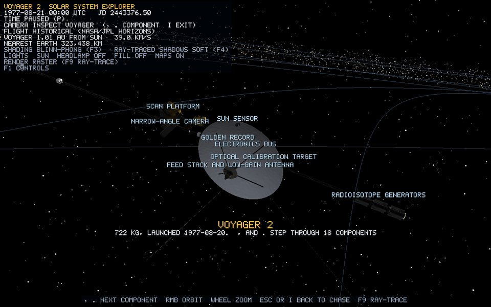

# Voyager 2 textures (NASA hardware atlas)



## Source and credit

`assets/textures/spacecraft/voyager_nasa_atlas.png` (1024×1024) is the texture image embedded in **"Voyager Probe (B)"** from NASA 3D Resources (github.com/nasa/NASA-3D-Resources). It is public domain, as NASA media is. It contains photographs of real Voyager hardware finishes: gold and black multi-layer insulation, white paint, polished aluminium, thermal louvres, the Golden Record, the calibration target and the radiator.

**Only the image is used.** NASA's mesh, UVs and transforms are not imported. Every vertex and UV on the spacecraft comes from the project's own generators ([procedural-meshes.md](procedural-meshes.md), [voyager-2.md](voyager-2.md)), as the project's texture policy requires.

## How a part shows one region of the atlas

Each material is created in `VoyagerModelBuilder::build` by

```cpp
finish(pixelRect /* left, top, right, bottom in atlas pixels */, tint, specularStrength, specularPower)
```

which calls `MaterialLibrary::spacecraftTextured`. It converts the rectangle to a UV window, flipping v because images load bottom-up:

```text
u0 = left / 1024     u1 = right / 1024
v0 = 1 − bottom / 1024   v1 = 1 − top / 1024
uvTransform = (u0, v0, u1 − u0, v1 − v0)        scene.vert: uv' = uv * zw + xy
```

The generator's own 0..1 UVs are then squeezed into that window, so a whole box face shows the whole gold-foil rectangle, and a cylinder wraps it around its circumference. The ray tracer uses the same window through the BVH material palette (`meshMaterialUv`).

## The regions

| Finish | Pixels (l, t, r, b) | Tint | Specular / power | Used on |
| --- | --- | --- | --- | --- |
| whitePaint | 225, 835, 352, 958 | 1.0 | 0.20 / 16 | high-gain dish, subreflector, LGA, cameras, magnetometer sensors |
| goldFoil | 390, 710, 490, 818 | 1.15 | 0.75 / 70 | bay blankets, plasma science, cosmic ray, IRIS, PRA root |
| darkGoldFoil | 390, 710, 490, 818 | 0.62 | 0.55 / 50 | bay blankets, magnetometer canister, LECP, scan platform |
| blackBlanket | 8, 8, 212, 160 | 1.0 | 0.12 / 10 | bay blankets, ultraviolet spectrometer |
| aluminium | 978, 20, 1010, 560 | 1.1 | 0.55 / 40 | trusses, dish ribs, struts, adapter feet, flanges, platforms |
| darkMetal | 150, 492, 232, 626 | 0.45 | 0.35 / 30 | bus, feeds, sun sensor, RTGs, thruster blocks, telescopes |
| lens | 298, 672, 360, 736 | 1.0 | 0.90 / 120 | camera lenses, IRIS mirror, Faraday cups, sun-sensor aperture |
| radiatorBlue | 480, 356, 640, 536 | 1.0 | 0.30 / 24 | shunt radiator |
| recordGold | 8, 172, 234, 396 | 1.1 | 0.85 / 90 | Golden Record |
| louvres | 278, 122, 448, 280 | 1.0 | 0.60 / 50 | thermal louvre strips |
| calibrationPanel | 470, 20, 630, 220 | 1.0 | 0.15 / 12 | optical calibration target |
| copper | untextured, (0.72, 0.36, 0.12) | n/a | 0.60 / 48 | thruster nozzles |

The tint multiplies the photograph, so one gold-foil region gives both the bright and the aged, darker blankets.

## Lighting maps

`MaterialLibrary::loadAtlas(path, 1.4)` also derives a normal map from the atlas (Sobel on luminance, [lighting.md](lighting.md)). Every textured finish uses it at strength 0.8, so the wrinkles in the foil and the louvre slats catch the light in Phong, Blinn-Phong and Toon. All finishes set `selfShadowing`, so the raster pass traces shadow rays through Voyager's own BVH ([ray-tracing.md](ray-tracing.md)).

## Changing a finish

Open the atlas in any image editor, read the pixel corners of the region you want, and edit that `finish(...)` line. See [guide chapter 10](../guide/10-how-to-change-things.md).

## Limitations

- The atlas regions are small photographs, so stretched on a long boom they repeat no detail and simply scale.
- Colour-derived normals approximate relief; they are not measured surface height.

## Verification

1. Press `I` and step with `.`: gold blankets, white dish, black blankets, the Golden Record and the calibration target show their photographs.
2. Press `F8`: the foil flattens without its normal map.
3. Press `F9`: the ray-traced Voyager shows the same textures.
4. The log shows `texture uploaded: assets/textures/spacecraft/voyager_nasa_atlas.png (1024x1024)` and its `[normal]` map.
