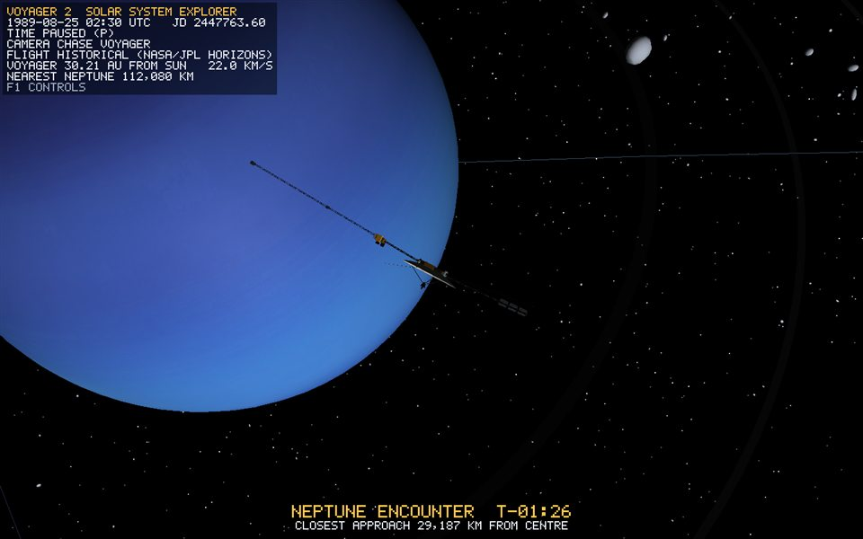

# Voyager 2 historical trajectory

*Runtime capture: Historical mode at 1989-08-25 02:30 UTC, 86 minutes before the real 29,187 km Neptune pass. The chase camera faces Neptune.*

## Source

`assets/trajectory/voyager2_heliocentric.csv` holds 11,002 NASA/JPL Horizons state vectors for target `-32`. They are heliocentric, in the ecliptic ICRF frame, in AU and AU/day, and span 1977-08-21 to 2030-01-02:

- every 5 days during cruise;
- within ±40 days of each giant-planet encounter, every 6 hours, composed as planet plus planet-centred Voyager;
- within ±3 days, every 10 minutes;
- within ±6 hours of each published closest approach, every minute.

`scripts/fetch_horizons.ps1` regenerates the file. Why the encounter rows are composed from planet-centred vectors, and how the clock and bookmarks work, is explained in [mission-ephemeris.md](mission-ephemeris.md).

## From data to position

Every frame in Historical mode:

1. `SimulationClock` supplies the Julian Date.
2. `Trajectory` cubic-Hermite interpolates the Voyager state and every planet state at that date.
3. `Trajectory::mapHeliocentricToRender` maps each one: ecliptic `(x, y, z)` becomes scene `(x, z, y)`, the direction is kept, and the distance becomes `12 (r / 0.387098)^0.55`.
4. `MissionEphemeris::voyagerRenderPosition` applies the local flyby clearance round Earth and the four giant planets.
5. The heading is the direction of `position(t + h) - position(t - h)`, where `h` shrinks with the encounter slow-motion so the hyperbolic turn is resolved. `Voyager2::setHistoricalState` eases the orientation toward that heading, keeping the ship level.

Voyager is never animated along its own copy of the path, so the probe and the planets cannot disagree about the date.

## Line geometry

`voyager2_historical_trajectory` evaluates the same `voyagerRenderPosition` at every one of the 11,002 sample dates. It stores them Sun-relative in one `GL_LINE_STRIP`: 11,002 vertices, 11,002 indices, 11,001 segments and one draw call, with an `Unlit` gold material. Because the samples are denser where the path bends, the line is smooth where it matters, looping round each planet at the clearance radius. `T` shows or hides it, and it is hidden at startup.

## Flight modes

`V` switches between Historical and Manual. Manual flight keeps the current facing and a gentle drift, and the date keeps running, so the planets still move. Returning to Historical snaps Voyager back to its real position for the current date. Piloting is documented in [voyager-2.md](voyager-2.md).

## Accuracy boundary

- Positions and dates are real Horizons data. Encounter times agree with published closest approaches to within a minute, and distances to within 0.5 %.
- Rendered distance near a planet is educational: the probe passes at 2.6 to 4.7 display radii instead of the real 1.2 to 10.3 radii, preserving the order ([mission-ephemeris.md](mission-ephemeris.md)).
- Orientation follows the direction of motion. The real spacecraft kept its high-gain antenna pointed at Earth.

## Verification

1. Startup prints `[TRAJECTORY] loaded 11002 NASA/JPL Horizons state vectors ...` and four `closest approach` lines.
2. Press `T`, then `H`. A single gold curve leaves Earth's orbit, bends at Jupiter, Saturn, Uranus and Neptune, and heads south of the ecliptic after Neptune, as the real trajectory does.
3. Press `5`. Voyager sweeps round Neptune, and the HUD distance bottoms out near 29,200 km.
4. Press `V` and fly manually, then press `V` again. Voyager returns to the dated position.
