# Visual fundamentals: reconstructing the project's objects

This catalogue pairs the submitted geometry with construction diagrams and actual runtime captures. It expands slides 3–7 and the report's methodology without adding pages to the thirteen-slide presentation. For each family, distinguish **mesh data**, **object transform**, **material** and **motion**: a photograph can change without any new vertices being generated.

The current geometry is the source of truth. The spacecraft dish uses **48 angular segments and six radial rings**, not the older eight-ring example. The three rock fields use **3×6 spheres**, not the earlier 6×8 mesh. Images are recorded renderings or explicitly labelled mathematical diagrams; colour-derived maps are approximations.

## 1. Shared vertices and indexed triangles

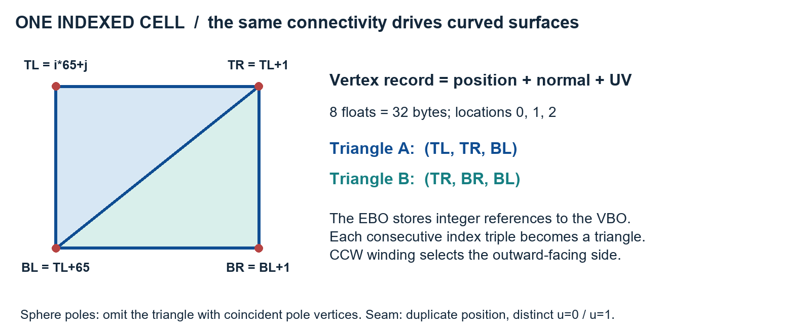

`Vertex` has position, normal and UV: eight floats, 32 bytes. A vertex buffer contains the records; an index buffer references them; a vertex array describes their interpretation. Locations 0/1/2 correspond to position/normal/UV. Index order determines winding. A surface normal describes orientation, not velocity or position; UV describes where to sample an image.

**Worked cell:** let latitude i=10 and longitude j=20 on the 32×64 sphere. Row width is 65, so TL=670, TR=671, BL=735, BR=736. The two index triples are `(670,671,735)` and `(671,736,735)`. Six indices select four stored records. At the poles, one triple is omitted because it would use coincident positions and have zero area.

**Worked sphere vertex:** at i=16, j=16, φ=π/2 and θ=π/2. Position is approximately `(0,0,1)`, normal `(0,0,1)` and UV `(0.75,0.5)`. The longitude seam has the same position at j=0 and j=64, but u=1 and u=0. That is intentional duplication of attributes.

Counts are `(L+1)(N+1)` vertices and `2N(L−1)` triangles. The full sphere has 2,145 vertices, 3,968 triangles and 11,904 indices. LOD copies use 561/960 and 153/224 vertices/triangles. Read the [sphere construction reference](../objects/uv-sphere.md) for exact pole exceptions, winding and validation.

## 2. Every textured body

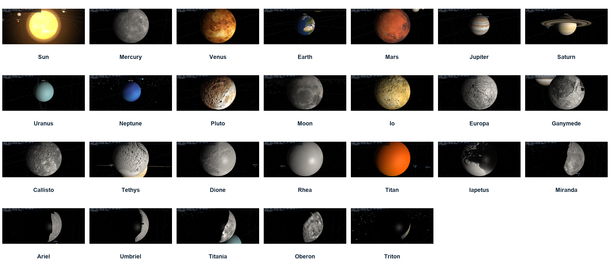

Each body uses the same sphere rules above. Its catalogued radius sets scale; its material determines specular/normal-map response; its albedo map determines geographic colour; its hierarchy determines which tilt and translation it inherits. The Sun's surface is unlit with separate glow shells. Gas planets avoid inferred normal relief; Earth has an ocean specular mask; rocky/icy surfaces use their corresponding presets.

The main bodies are Sun, Mercury, Venus, Earth, Mars, Jupiter, Saturn, Uranus, Neptune and Pluto. The sixteen moons are Earth's Moon; Jupiter's Io, Europa, Ganymede and Callisto; Saturn's Tethys, Dione, Rhea, Titan and Iapetus; Uranus's Miranda, Ariel, Umbriel, Titania and Oberon; and Neptune's Triton. Their [individual object pages](../objects/README.md) specify source maps, physical facts, transforms, materials and limitations. They are separate scene objects without separate hand-authored sphere triangle lists.

A larger body is not created by moving the sphere's UVs. A different texture does not alter topology. A spinning planet changes a surface transform; it does not regenerate a mesh each frame. These distinctions explain both implementation efficiency and visible behavior.

## 3. Boxes, cylinders, frustums and the dish

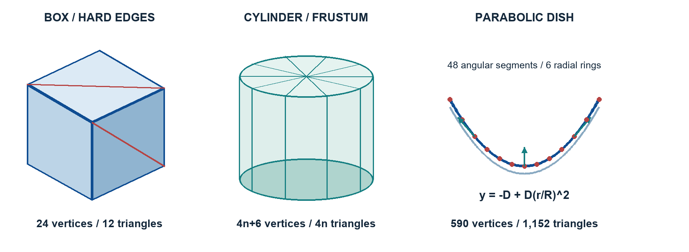

**Box:** corners use half-width/height/depth. Each face has four records with a face normal and UVs `(0,0),(0,1),(1,1),(1,0)`. For face base b, triangles are `(b,b+1,b+2)` and `(b,b+2,b+3)`. The six faces total 24 vertices and twelve triangles. Eight shared corner records cannot provide six distinct face normals.

**Cylinder/frustum:** for ring k and segment i, θ=2πi/n; position is `(r(k)cosθ, y(k), r(k)sinθ)`. With bottom/top radii rb/rt and height h, the side normal is proportional to `(h cosθ, rb−rt, h sinθ)`. Both rings contain n+1 records for the seam. A side quad splits into two triangles. Each cap has its own center/rim records and ±Y normal, because cap and side normals differ. A capped cylinder with nonzero radii totals 4n+6 vertices and 4n triangles. The ten-sided bus therefore starts with 46 vertices and forty triangles before its attached blanket panels and hardware.

**Cone:** one ring radius is zero, so zero-area side halves and the zero-radius cap are omitted. The comet's sixteen-sided capped-base cone has 52 vertices and 32 triangles.

**Dish:** its vertex is at y=−D and rim at y=0. Radius fraction t gives r=Rt and y=−D+Dt². At r=R/2, y=−3D/4 and slope dy/dr=D/R. For a front point `(x,y,z)`, the normal is proportional to `(-2Dx/R²,1,-2Dz/R²)`. Thus curvature changes both positions and lighting normals.

The current dish has one center plus six rings of 49 vertices per face: 295 per face, 590 total. Each face contains a 48-triangle center fan and five bands of 96 triangles: 528. The rim joins front/back with 96 triangles. Total is 1,152 triangles and 3,456 indices. Front center triples are `(center,next,current)` and the rear reverses them. The back surface is thickness-offset and reverses its normal.

Read the [procedural mesh handbook](../objects/procedural-meshes.md) for the complete emitted index sequence and UV convention. The wireframe captures in `captures/assessment/technical/` are generated using OpenGL polygon-line mode on these same meshes.

## 4. All eighteen Voyager hardware targets

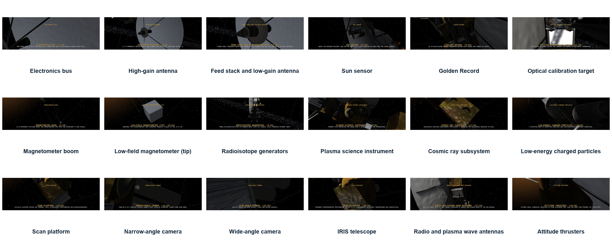

The spacecraft contains 76 assemblies and 5,828 triangles. Its eighteen named inspection targets describe recognizable hardware; one target may contain several primitive meshes. The catalogue above uses the existing real component captures. The [spacecraft reference](../objects/voyager-2.md) links each full-resolution image, dimensions and materials. The detailed construction of every target is also in [slide 4's notes](Presentation_Notes_Source.md).

| Target | Construction from fundamentals |
| --- | --- |
| Electronics bus | Ten-sided capped cylinder; box panels around the apothem; merged launch feet |
| High-gain antenna | Closed parabolic dish; rim-following rods; feed struts |
| Feed stack and low-gain antenna | Aligned cylindrical/frustum feed stages, subreflector disc and cone |
| Sun sensor | Box housing and aperture on the rim |
| Golden Record | Disc cylinder and hub on a selected bus face |
| Optical calibration target | Thin scaled box plate |
| Magnetometer boom | Canister and triangular truss with three rails and bay diagonals |
| Low-field magnetometer | Sensor boxes at sourced boom distances |
| Radioisotope generators | Boom truss, three cylindrical cores, box fins and end flanges |
| Plasma science instrument | Cylinder plus three cup-shaped frustums |
| Cosmic ray subsystem | Box housing and two telescope barrels |
| Low-energy charged particles | Drum cylinder and platform |
| Scan platform | Box platform, actuator and instrument housings |
| Narrow-angle camera | Long barrel cylinder and lens surface |
| Wide-angle camera | Shorter barrel and lens |
| IRIS telescope | Wide barrel and mirror/lens material |
| Radio/plasma-wave antennas | Two long rods in a V, attached to a root housing |
| Attitude thrusters | Four blocks and sixteen shared-mesh copper nozzle frustums |

To place a rod between A and B: length=`|B−A|`, center=`(A+B)/2`, orientation rotates generator +Y onto normalized B−A. Open four-sided rods contain eight triangles; caps hidden inside joints are omitted. A triangular truss uses rails separated by 120° and alternating diagonals per face per bay.

When parts are merged, transform each position by M and its normal by inverse-transpose M, normalize, and add the destination's starting vertex count to its indices. Without rebasing, an appended rod would reference earlier geometry rather than its own vertices. All parts then inherit the root's pose, so manual or historical flight moves one coherent spacecraft.

All dimensions share 0.006 render units/metre. This preserves the craft's internal proportions; it does not make a spacecraft-to-planet distance comparison physically literal. Booms remain deployed, the scan platform is fixed, and surface blanket/louvre detail is primarily texture.

## 5. Annuli, points, lines, fields and comet

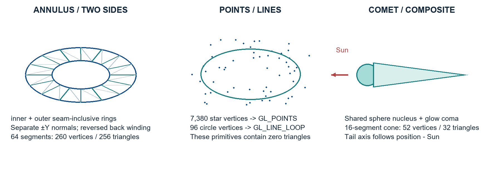

An annulus uses inner/outer circles at y=0. Its top and bottom have separate ±Y normals and reversed winding. At n=64, 4(n+1)=260 vertices yield 4n=256 triangles. Each ring band has flat colour and opacity rather than a nonexistent texture. The planet's axial tilt orients the entire system.

Stars use no triangles: 7,380 deterministic records are interpreted as `GL_POINTS`. Uniform cosφ sampling produces a uniform sphere direction distribution. A 96-record `GL_LINE_LOOP` closes its final edge automatically; there is no duplicate last vertex. Planet orbit guides and Voyager's mission path are sampled curves; heliosphere boundaries use three great circles each. HUD glyphs use screen-space quads, two triangles per glyph.

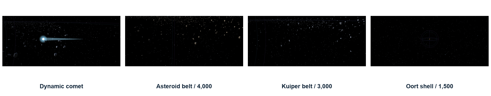

The asteroid/Kuiper/Oort fields use 4,000/3,000/1,500 instances of a 28-vertex, 24-triangle sphere. Instance matrices at vertex attributes 3–6 advance once per instance, while base vertices advance normally. Instancing reduces submission overhead; 8,500×24 still means 204,000 submitted rock triangles. Fields are static.

The comet has a mesh-less moving container, shared-sphere nucleus, larger glow coma and cone tail. Its illustrative 60-AU ellipse has eccentricity .35 and angular rate .008 rad/s. Each update rotates the tail from +Y toward normalized comet−Sun and offsets it by half its length. Anti-sunward direction is independent of the orbital tangent. It is not a dated NASA comet model.

## 6. Transform and motion comparisons

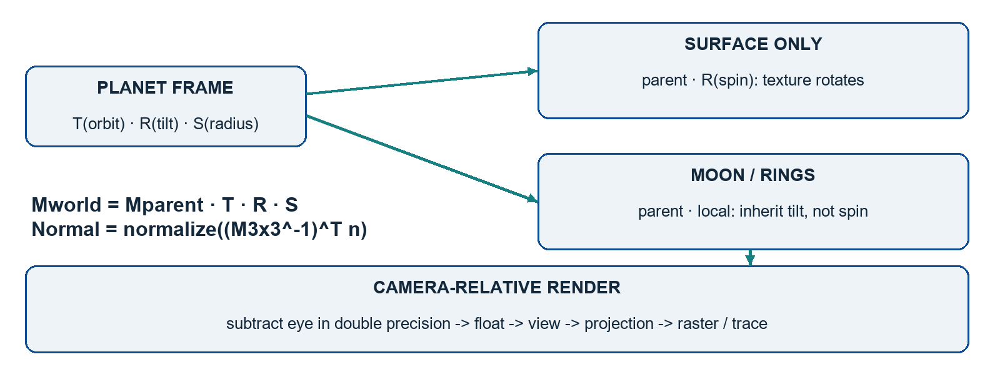

For column vectors, `Mworld=Mparent×T×R×S` acts right to left. Surface-only spin prevents a parent's daily rotation from dragging its moons. Moon local position/scale compensate for parent radius. The camera origin is subtracted in double precision before GPU floats; logarithmic depth handles the different depth-buffer problem.

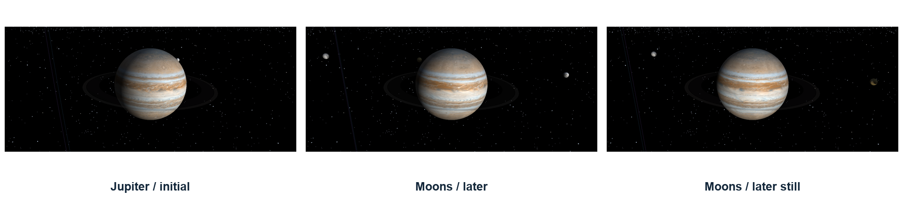

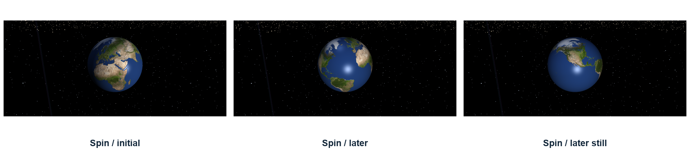

Planets and Voyager use cubic Hermite interpolation at one Julian date. Visual moons use ellipse shape with constant true-anomaly speed, and spin uses a visible hourly rate. Manual quaternion rotation and inertial thrust use real time. P pauses the astronomical/visual clock, not the camera or manual flight. The notes for slides 6/7 derive all of these cases and identify after-2030 prediction limits.

## 7. Lighting, shading, shadows, textures and tracing

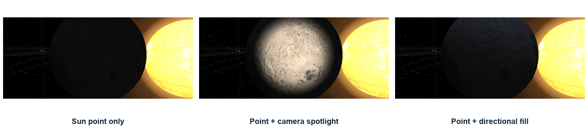

The Sun remains enabled in each matched comparison. The spotlight adds a warm camera-attached cone; directional fill adds a cool constant incident direction. The [light-response plot](figures/technical/light_response.pdf) shows the actual attenuation/cone formulas. It is an equation plot, not a hardware measurement.

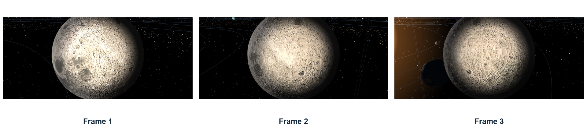

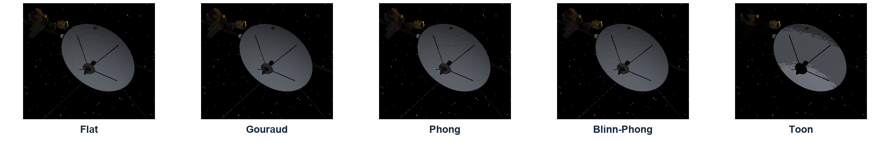

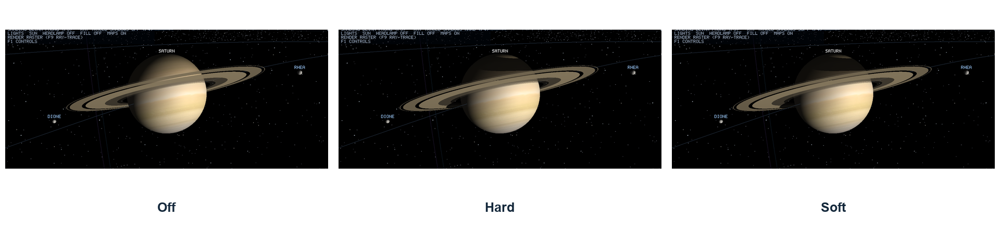

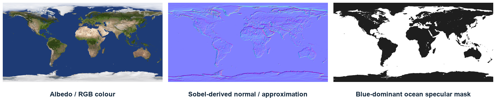

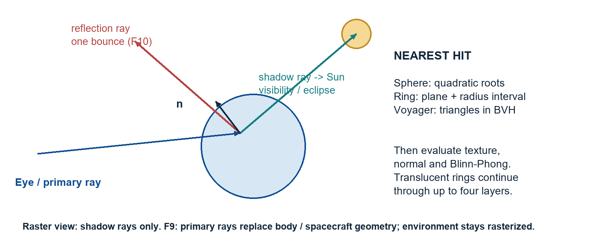

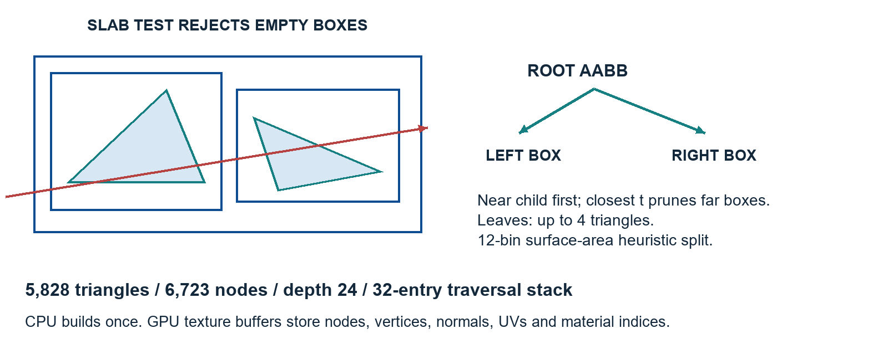

The shading techniques differ in evaluation stage and normal/specular rule; the light types differ in source geometry. Textures modify colour, normals or highlight masks without changing triangles. Shadow rays test visibility; primary rays find a visible surface; reflection rays sample another direction. A BVH rejects groups of triangles through boxes without changing the intersection result. Read [slides 8–12's notes](Presentation_Notes_Source.md) and the [viva guide](Assessment_and_Viva.md) for the equations and worked intersections.

## 8. Evidence and honest boundaries

The [manifest](figures/technical/visual_manifest.json) records source files/hashes. Screenshot plates crop telemetry and add captions; they do not synthesize scene content. Construction diagrams follow the current C++ generators. The Earth-channel illustration derives maps after resizing for display and is labelled as explanatory, while the Moon off/on pictures are runtime captures.

The trace path is a bounded hybrid Whitted renderer: analytic bodies/rings, a triangle spacecraft, up to four ring layers and one mirror bounce. Secondary reflection rays omit Voyager; raster normal/specular maps are not used; environment objects remain rasterized. Only the Sun casts shadows. There is no refraction, diffuse global illumination or physical atmosphere model. Keep these limits in the explanation, rather than claiming that a polished image proves a physically complete renderer.
